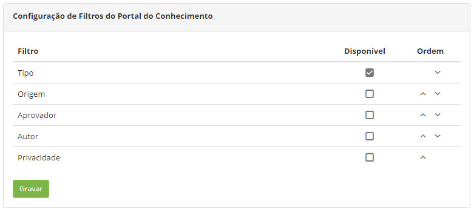

title: Configuração de filtros do portal do conhecimento
Description: Objetivo configurar os filtros que irão aparecer habilitados para pesquisa de um conhecimento.
# Configuração de filtros do portal do conhecimento

Esta funcionalidade tem por objetivo configurar os filtros que irão aparecer habilitados para pesquisa de um conhecimento no Portal 
do Conhecimento.

Como acessar
--------------

1. Acesse a funcionalidade de personalizar os filtros do portal do conhecimento através da navegação no menu principal 
**Sistema > Configurações > Configuração de Filtros do Portal do Conhecimento**.

Pré-condições
---------------

1. Não se aplica.

Filtros
----------

1. Os seguintes filtros possibilitam ao usuário restringir a participação de itens na listagem padrão da funcionalidade, facilitando
a localização dos itens desejados:

    - Privacidade;
    - Aprovador;
    - Autor;
    - Origem;
    - Tipo.
    
2. Nesta tela, são exibidos os filtros que podem ser apresentados para facilitar a pesquisa de um conhecimento no Portal do 
Conhecimento.

    
    
    **Figura 1 - Configuração de filtros do portal do conhecimento**
    
3. Selecione os filtros que deseja que sejam apresentados na pesquisa de um conhecimento;

4. Clique no botão "Gravar" para efetuar o registro, onde a data, hora e usuário serão gravados automaticamente para uma futura 
auditoria.

Listagem de itens
------------------

1. Não se aplica.

Preenchimento dos campos cadastrais
-------------------------------------

1. Não se aplica.

!!! tip "About"

    <b>Product/Version:</b> CITSmart | 7.00 &nbsp;&nbsp;
    <b>Updated:</b>07/23/2019 – Larissa Lourenço
