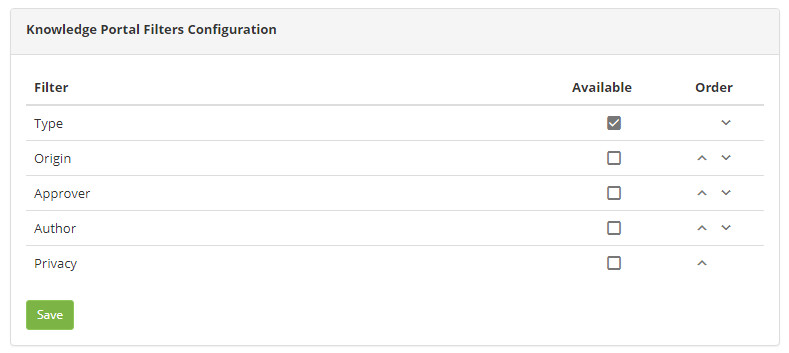

title: Knowledge Portal Filters configuration
Description: This functionality aims to personalize the filters that will appear enabled to search for a knowledge.
# Knowledge Portal Filters configuration

This functionality aims to personalize the filters that will appear enabled to search for a knowledge in the knowledge Portal.

How to access
--------------

1. Access the knowledge portal filter setup feature by navigating through the main menu 
**System > Settings > Knowledge Portal Filters Configuration**.

Preconditions
---------------

1. No applicable.

Filters
----------

1. The following filterS enables the user to restrict the participation of items in the standard feature listing, making it easier 
to find the desired items:

    - Privacy;
    - Approver;
    - Author;
    - Origin;
    - Type.
    
2. On this screen, the filters that can be presented to facilitate the search of a knowledge in the Knowledge Portal are displayed.

    
    
    **Figure 1 - Knowledge portal filters setup**
    
3. Select the filters you want to be presented in the search of a knowledge;

4. Click the *Save* button to register, where the date, time and user will be automatically saved for a future audit.

Items list
------------------

1. No applicable.

Filling in the registration fields
-------------------------------------

1. No applicable.

!!! tip "About"

    <b>Product/Version:</b> CITSmart | 7.00 &nbsp;&nbsp;
    <b>Updated:</b>09/03/2019 – Larissa Lourenço
