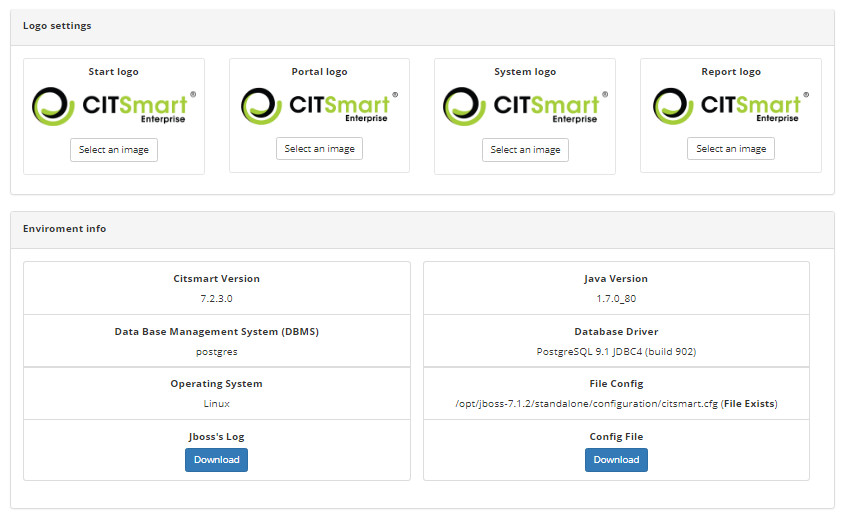

Title: Environment setup guide
Descrição: The Environment Setup feature is intended to facilitate a direct intervention.

# Environment setup guide

The Environment Setup feature is intended to facilitate a direct intervention (correction) in the environment (server) and to change the system logos.

How to access
-----------------

1. Access the main menu **System > Settings > Environment Settings**.

Preconditions
---------------

1. No applicable.

Filters
---------

1. No applicable.

Items list
------------------

1. No applicable.

Filling in the registration fields
------------------------------------

1. No applicable.

Verifying the environment settings
------------------------------------------

1. The **Environment Settings** screen appears, where you can change the system logo, check the environment information and 
download the Jboss Log. The figure below illustrates this screen:

    
    
    **Figure 1 - Environment configuration screen**
    
2. To change the system logos (**logo home** - displayed in the login screen of the system, **logo portal** - displayed in the 
smart portal, **logo system** - displayed in the other screens of the system), just click on the *Select an image* button;

3. To download the Jboss Log, just click the *Download* button for the Jboss Log. The Jboss Log enables a quick fix of a problem.
	
!!! tip "About"

    <b>Product/Version:</b> CITSmart | 7.00 &nbsp;&nbsp;
    <b>Updated:</b>03/09/2019 - Larissa Lourenço
