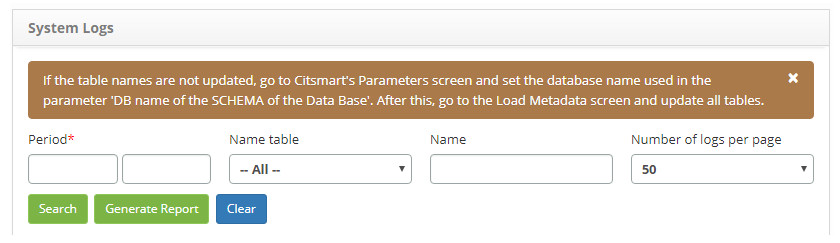
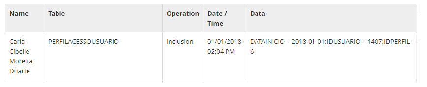

title: System log check
Description: This functionality is intended to check the system log for audit trail.
# System log check

This functionality is intended to check the system log for audit trail.

How to access
----------------

1. Access system logging functionality by navigating the main menu **System > Audit Trail > System Logs**.

Preconditions
---------------

1. No applicable.

Filters
--------

1. The following filter enables the user to restrict the participation of items in the standard feature listing, making it easier 
to find the desired items:

    - **Period**: enter the period you want to check the system log;
    - **Name table**: select a table, if you want to check the log of a specific table of the system;
    
    !!! warning "WARNING"
    
        If the table names are not updated, access the CITSmart Parameters feature and define the name of the database used in the 
        'DB - database SCHEMA name' parameter. After that, access Load Data Meta functionality and update all tables.
        
    - **Name**: enter the name of the user, if you want to check the system log for the user;
    - **Number of logs per page**: select the number of logs that will be displayed per page;
    
2. Click the *Search* button and the system log will be displayed according to the data entered;

3. If you want to generate the system log report, click the *Generate Report* button.

    
    
    **Figure 1 - System log screen**
    
Items list
-------------------

1. The following cadastral fields are available to the user to facilitate the identification of the desired items in the standard 
feature listing: **Name, Table, Operation, Date/Time** and **Data**.

**Figure 2 - System log listing screen**

Filling in the registration fields
--------------------------------------

1. No applicable.

!!! tip "About"

    <b>Product/Version:</b> CITSmart | 7.00 &nbsp;&nbsp;
    <b>Updated:</b>09/03/2019 – Larissa Lourenço
