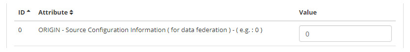

title: Parameter setup
Description: The goal of this feature is to automate processes based on user-defined parameters. 
# Parameter setup

The goal of this feature is to automate processes based on user-defined parameters.

How to access
--------------

1. Access the parameters feature navigating through the main menu **Parameterization > CITSmart Parameters**.

Preconditions
---------------

1. Not applicable.

Filters
----------

1. The following filter enables the user to restrict the participation of items in the standard feature listing, making it easier 
to find the desired items:

    - Search here.
    
    
    
    **Figure 1 - Parameters search screen**
    
2. Perform a parameter search;

    - **CITSmart Parameter**: to filter by name, insert the parameter name;
    - **ID**: to filter by id, insert the parameter identification number;
    
3. Once the parameter is selected, enter the appropriate parameter value to complete the configuration.

Items list
-------------------

1. The following cadastral fields are available to the user to facilitate the identification of the desired items in the standard 
feature listing: **ID, Attribute** and **Value**.

**Figure 2 - Parameters listing screen**

Filling in the registrations fields
---------------------------------------

1. Not applicable.

!!! tip "About"

    <b>Product/Version:</b> CITSmart | 7.00 &nbsp;&nbsp;
    <b>Updated:</b>09/03/2019 - Larissa Lourenço
