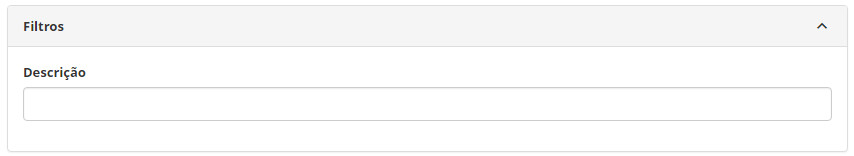
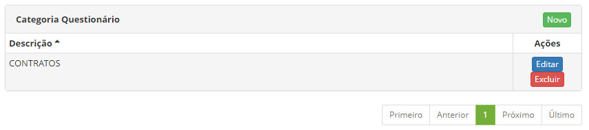
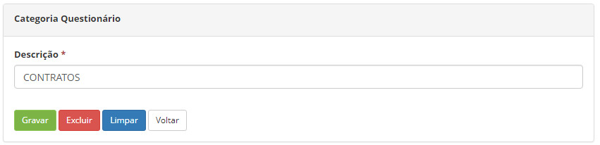

title: Cadastro e pesquisa de categoria de questionários
Description: Disponibiliza ações diversas, tais como, incluir, alterar e excluir categorias de questionários.
# Cadastro e pesquisa de categoria de questionários

Esta funcionalidade tem por objetivo criar categorias de questionários que serão utilizadas para filtragem e organização dos mesmos
registrados na base.  

Como acessar
-------------

1. Acesse a funcionalidade através da navegação no menu principal **Sistema > Visões e Metadados > Categoria Questionário**.

Pré-condições
----------------

1. Não se aplica.
 
Filtros
----------

1. O seguinte filtro possibilita ao usuário restringir a participação de itens na listagem padrão da funcionalidade, facilitando a 
localização dos itens desejados:

    - Descrição
    
    
    
    **Figura 1 - Tela de pesquisa de categoria de questionário**
    
Listagem de itens
-------------------

1. O seguinte campo cadastral está disponível ao usuário para facilitar a identificação dos itens desejados na listagem padrão da
funcionalidade: **Descrição**.

2. Existem botões de ação disponíveis ao usuário em relação a cada item da listagem, são eles: "Editar" e "Excluir".

**Figura 2 - Tela de listagem de categoria de questionário**

Preenchimento dos campos cadastrais
-------------------------------------

1. Nos botões "Novo" e "Editar" estão disponíveis:

    
    
    **Figura 3 - Tela de categoria de questionário**
    
    - **Descrição**: define o título usado nas listas de Categoria Questionário
    
!!! tip "About"

    <b>Product/Version:</b> CITSmart | 7.00 &nbsp;&nbsp;
    <b>Updated:</b>01/24/2019 – Larissa Lourenço
