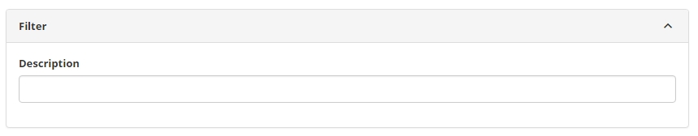
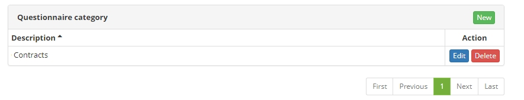
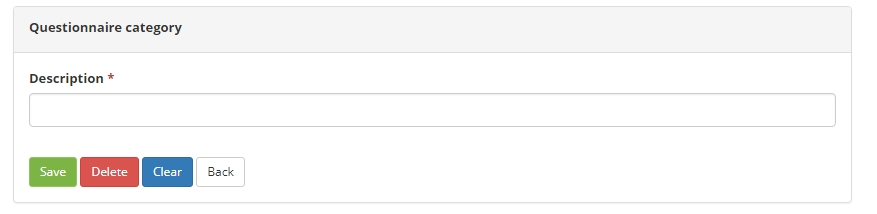

title: Questionnaire Category registration and search
Description: This functionality aims to create categories of questionnaires.
# Questionnaire Category registration and search

This functionality aims to create categories of questionnaires that will be used for 
filtering and organization of the same registered 
in the database.

How to access
------------------

1. Access the functionality through navigation in the main menu **System > Visions and Metadata > Questionnaire Category**.

Preconditions
----------------

1. No applicable.
 
Filters
----------

1. The following filter enables the user to restrict the participation of items in the standard feature listing, making it easier to 
find the desired items:

    - Description
    
    
    
    **Figure 1 - Questionnaire category search screen**
    
Items list
-------------------

1. The following cadastral field is available to the user to facilitate the 
identification of the desired items in the standard feature listing: **Description**.

2. There are action buttons available to the user for each item in the listing, they 
are: *Edit* and *Delete*.

**Figure 2 - Questionnaire category listing screen**

Filling in the registration fields
-------------------------------------

1. The *New* and *Edit* buttons are available:

    
    
    **Figure 3 - Questionnaire category screen**
    
    - **Description**: defines the title used in the Questionnaire Category lists.
    
!!! tip "About"

    <b>Product/Version:</b> CITSmart | 7.00 &nbsp;&nbsp;
    <b>Updated:</b>09/05/2019 – Larissa Lourenço
