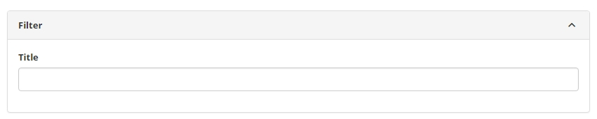
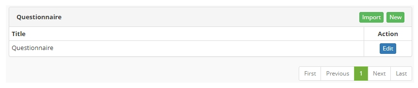
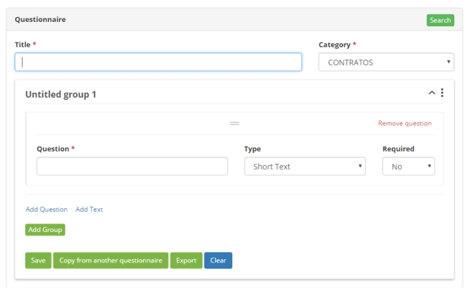

title: Questionnaires registration and search
Description: This feature allows you to create questionnaires (forms) in a very generic.
# Questionnaires registration and search

This feature allows you to create questionnaires (forms) in a very generic, multi-purpose and easy way to be used in other routines of 
the system.

!!! abstract "KNOW MORE"

    This is the second technological generation of this functionality, it appears more powerful and more flexible, but in a very easy 
    way it is possible to import the questionnaires built in the first generation, avoiding rework to the clients and consultants. More 
    detailed explanations are in this document.
    
How to access
------------------

1. Access the functionality through navigation in the main menu **System > Visions and Metadata > Questionnaire**.

Preconditions
---------------

1. Have at least one category of Questionnaire registered in the system ([Questionnaire Category registration and search](/en-us/citsmart-platform-7/plataform-administration/questionnaires/questionnaires-management/questionnaire-category.html)).

Filters
------------

1. The following filter enables the user to restrict the participation of items in the standard feature listing, making it easier to 
find the desired items:

    - Title.
    
    
    
    **Figure 1 - Questionnaire search screen**
    
Items listing
-------------------

1. The following cadastral field is available to the user to facilitate the 
identification of the desired items in the standard listing of the functionality: 
**Title**.

2. There is an action button available to the user in relation to each listing item, 
it is: *Edit*.

**Figure 2 - Questionnaire listing screen**

Filling in the registration fields
------------------------------------

1. By clicking on the *New* and *Edit* buttons, the fill fields of the cadastre are available, as shown below:

    
    
    **Figura 3 - Questionnaire details**
    
    - **Title**: short text that easily identifies the purpose of the questionnaire;
    - **Category**: list of pre-registered categories that help manage Questionnaire 
    sets;
    - **Group**: a Questionnaire organizes its items in a way grouped by some 
    subjective criterion of the consultant or client, there may be more than one group 
    in the questionnaire (as if they were several subjects);
        - **Group Title**: just in front of the word "Group" you can edit and change 
    the expression "without title 1" by a significant title to describe the 
    purpose/criterion of the grouping;
        - A group can have one or more questions, each composed of:
            - **Question**: title of the Question so that it is possible for the 
    reader to understand what he should answer;
            - **Type**: there are several types of questions, each one will cause 
    different behavior when the Questionnaire is executed;
            - **Required**: indicates whether or not the question can be accepted 
    without being completed;
            
2. The *Add Question* button allows you to enter one more question right after the 
last one;

3. The *Add Text* button allows you to edit a content in a text box so that guidelines 
can be shown in the Questionnaire when it is run;

4. The *Add a Group* button adds another Group just after the last to be filled ;

5. The *Export* button allows you to record on a disk an electronic file containing 
all the characteristics of the selected Questionnaire.

!!! note "NOTE"

    To ensure greater productivity, the Copy button of another questionnaire allows 
    the Administrator to import Questionnaires built either in the previous form or in 
    the current form.
    
!!! tip "About"

    <b>Product/Version:</b> CITSmart | 7.00 &nbsp;&nbsp;
    <b>Updated:</b>09/05/2019 – Larissa Lourenço
