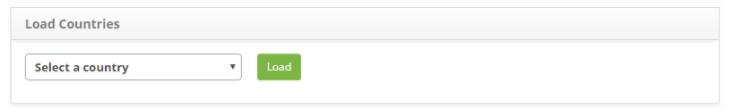
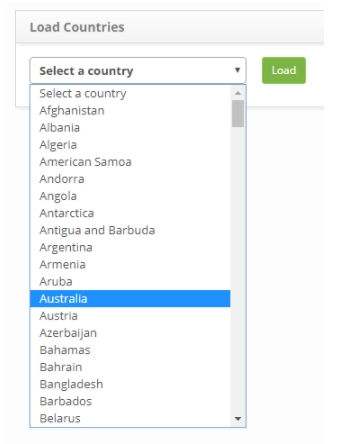
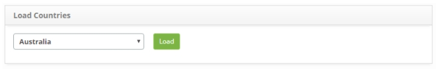
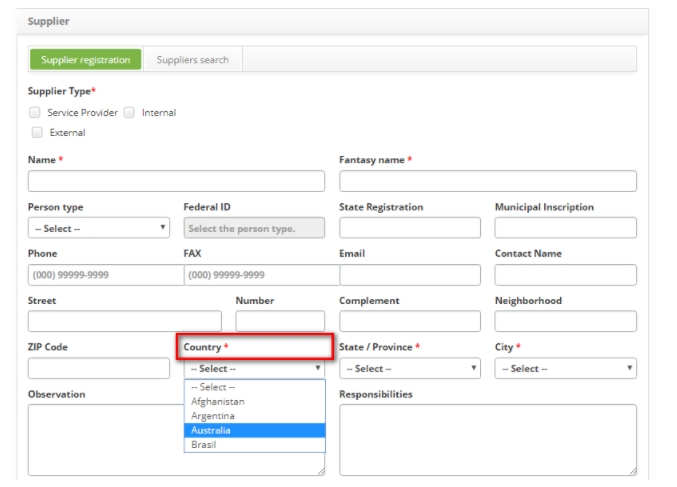

title: Country loading
Description: The goal is to load countries on the Supplier and Unit screens.
# Country loading

The goal is to load countries on the Supplier and Unit screens.

How to access
-----------------

1. Access the country loading feature by navigating the main menu 
**System > Database > Country Load**.

Preconditions
----------------

1. No applicable.

Filters
---------

1. No applicable.

Items list
--------------------

1. No applicable.

Filling in the registration fields
-------------------------------------

1. No applicable.

Country loading
------------------

1. The **Countries Load** screen will be displayed containing a list of countries, as 
shown in the figure below:

    
    
    **Figure 1 - Loading countries screen**
    
2. Select the desired country and click the *Load* button;

3. A message confirming the success of the country charge will be displayed.

Exemplifying a country load
---------------------------------

1. Select the desired country;

    
    
    **Figure 2 - Countries load screen**
    
    
    
    **Figure 3 - Countries load screen**
    
2. Verify if it is found in the Supplier Registration and Unit Registration features.

**Figure 4 - Supplier registration screen**

!!! tip "About"

    <b>Product/Version:</b> CITSmart | 7.00 &nbsp;&nbsp;
    <b>Updated:</b>09/05/2019 - Larissa Lourenço
