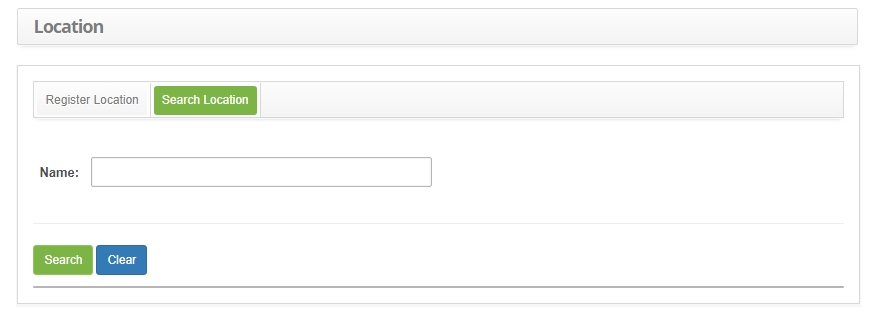
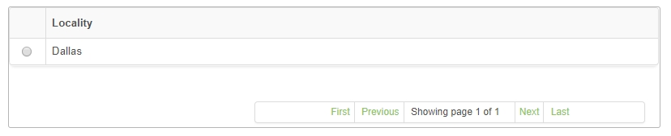
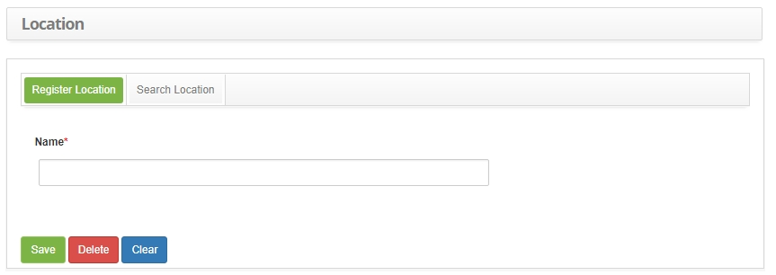

title: Location registration and search
Description: The goal of this feature is to register the location of the service applicants.
# Location registration and search

The goal of this feature is to register the location of the service applicants, it 
could be the name of the unit, city, name of the 
government entitie, etc.

How to access
------------------

1. Access the location feature navigating through the main menu 
**General Registration > Staff Management > Location**.

Preconditions
---------------

1. No applicable.

Filters
---------

1. The following filter enables the user to restrict the participation of items in the 
standard feature listing, making it easier to 
find the desired items:

    - Name.
    
    
    
    **Figure 1 - Location search screen**
    
2. Conduct a location search:

    - Insert the name of the intended location and click on the Search button. 
    Afterwards, the location entry will be displayed according to the description 
    provided;
    
    - To list all location entries, just click directly on the *Search* button, if 
    needed.
    
Items list
------------------

1. The following cadastral field is available to the user to facilitate the 
identification of the desired items in the standard feature 
listing: **Locality**.

    
    
    **Figure 2 - Location listing screen**
    
2. After searching, select the intended entry. Afterwards, they will be redirected to 
the registry screen displaying the selected entry's content.

3. To edit the entry information, just edit the intended fields and click on the 
*Save* button to confirm the changes, at which date, time 
and user will be automatically stored for a future audit.

Filling in the registration fields
-------------------------------------

1. Click on the **Register Location** tab, as illustrated on the image below:

    
    
    **Figure 3 - Location entry screen**
    
2. Fill out the fields as instructed below::

    - **Name**: insert the location's name;
    
3. Click on the *Save* button to confirm the entry, at which date, time and user will 
automatically be stored for a future audit.

!!! tip "About"

    <b>Product/Version:</b> CITSmart | 7.00 &nbsp;&nbsp;
    <b>Updated:</b>09/05/2019 - Larissa Lourenço
