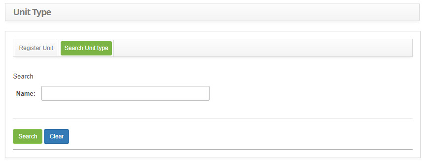

title: Unit type registration and search
Description: The goal of this feature is to register the unit types.
# Unit type registration and search

The goal of this feature is to register the unit types.

How to access
------------------

1. Access the unit type feature navigating through the main menu **General Registration > Staff Management > Unit Type**.

Preconditions
---------------

1. No applicable.

Filters
---------

1. The following filter enables the user to restrict the participation of items in the standard feature listing, making it easier 
to find the desired items:

    - Name.
    
2. Click on the **Search Unit type** tab, the **Unit type Search** screen will be displayed, as illustrated on the image below:

    
    
    **Figure 1 - Unit type search screen**
    
3. Conduct a unit type search:

    - Insert the name of the intended unit type and click on the *Search* button. Afterwards, the unit type entry will be displayed 
    according to the description provided.
    
    - To list all unit types, just click directly on the *Search* button, if needed.
    
Items list
------------------

1. The following cadastral field is available to the user to facilitate the identification of the desired items in the standard 
feature listing: **Name**.

    
    
    **Figure 2 - Unit type listing screen**
    
2. After searching, select the intended entry. Afterwards, they will be redirected to the registry screen displaying the content 
belonging to the selected entry.

3. To edit a unit type entry, just modify the information on the intended fields and click on the *Save* button to confirm the 
changes to the database, at which date, time and user will be stored automatically for a future audit.

Filling in the registration fields
--------------------------------------

1. Click on the **Register Unit** tab, the **Unit Type Registration** screen will be displayed, as illustrated on the image below:

    
    
    **Figure 3 - Unit type entry screen**
    
2. Fill out the fields as instructed below:

    - **Name**: insert the unit type name;
    
3. Click on the *Save* button to create the entry, at which date, time and user will be automatically stored for a future audit.

!!! tip "About"

    <b>Product/Version:</b> CITSmart | 7.00 &nbsp;&nbsp;
    <b>Updated:</b>09/06/2019 - Larissa Lourenço
