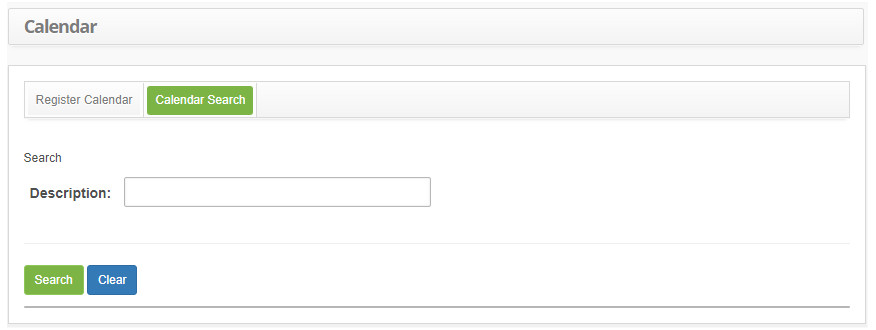
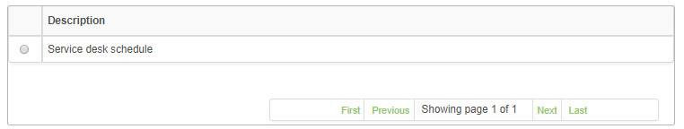
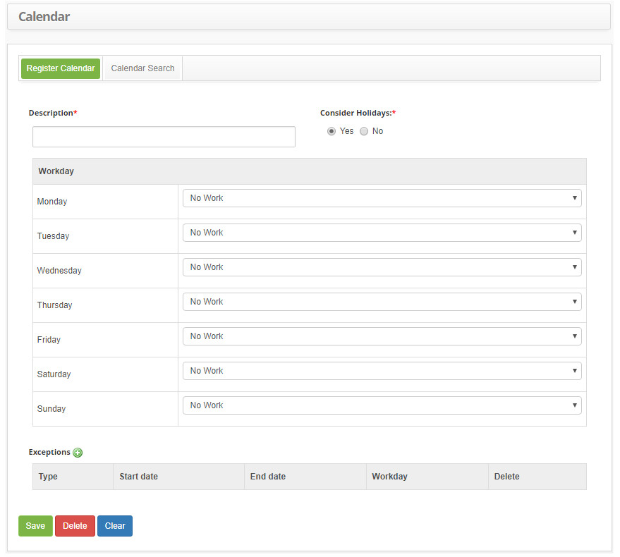
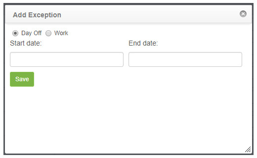

title:  Calendar registration and search
Description: The goal of this feature is to create calendars (schedules) of working hours. 
# Calendar registration and search

The goal of this feature is to create calendars (schedules) of working hours.

How to access 
-------------------

1. Access the feature by navigating through the main menu **General Registration > Staff Management > Calendar**.

Preconditions
---------------

1. Register an access profile (see knowledge [Access profile registration and search](/en-us/citsmart-platform-7/initial-settings/access-settings/profile/user-profile.html));

2. Register working hours (see knowledge [Workday registration and search](/en-us/citsmart-platform-7/plataform-administration/time/create-working-day.html)).

Filters
----------

1. The following filter enables the user to restrict the participation of items in the standard feature listing, making it easier 
to find the desired items:

    - Description.
    
2. Click on the **Calendar Search** tab, the **Calendar Search** screen will be presented, as shown in the figure below:

    
    
    **Figure 1 - Calendar search screen**
    
3. Perform the calendar search:

    - Enter the calendar description (work scale) and click the *Search* button. After that, the calendar record will be displayed 
    according to the data entered;
    
    - To list all the calendar registrations, just click directly on the *Search* button, if needed;
    
Items list
-------------------

1. The following cadastral field is available to the user to facilitate the identification of the desired items in the standard 
feature listing: **Description**.

    
    
    **Figure 2 - Calendar listing screen**
    
2. Conduct a calendar search. After searching, select the intended entry, they will be redirected to the entry screen displaying 
the content belonging to the selected entry;

3. To edit a calendar entry data, just modify the information on the intended fields and click on *Save* to save the changes to the 
entry, at which date, time and user will be automatically stored for a future audit.

Filling in the registration fields
--------------------------------------

1. Click on the **Register Calendar** tab, the Calendar Registration screen will be displayed, as illustrated on the image below:

    
    
    **Figure 3 - Calendar entry screen**
    
2. Fill out the fields as instructed below:

    - **Description**: insert the calendar's description;
    - **Consider Holidays**: insert if holidays will be considered on the calendar;
    - **Workday**: insert for each weekday the working hours which will determine the schedule;
    - **Exceptions**: add the exceptions to the calendar, for example, a day off in the middle of the week. It can be addedd by 
    clicking on the exceptions icon .
    
3. By clicking the exception icon, a screen at which can be added work and day off exceptions will be displayed.

    
    
    **Figure 4 - Exception entry screen**
    
    - Select the exception type: Day Off or Work:

        - **Day Off**: indicates total work disruption.
        - **Work**: indicates partial work disruption.
        
4. Insert the start and finish dates of the exception. If it is a work exception, select the working hours. Click on the *Save* 
button confirm the entry, at which date, time and user will automatically be stored for a future audit.

!!! tip "About"

    <b>Product/Version:</b> CITSmart | 7.00 &nbsp;&nbsp;
    <b>Updated:</b>09/06/2019 - Larissa Lourenço
        
