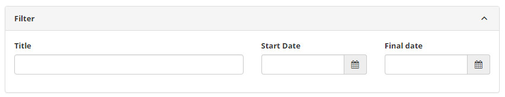
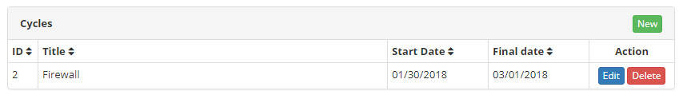
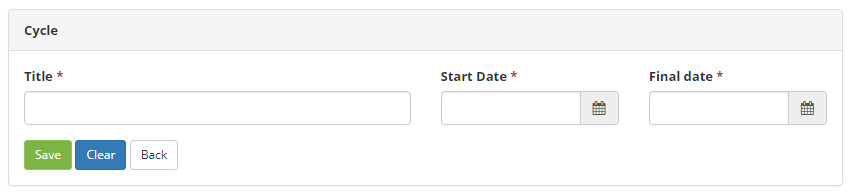

title:  Cycle registration and search
Description: This functionality aims to create period cycles with start and end dates to be used in financial control.
# Cycle registration and search

This functionality aims to create period cycles with start and end dates to be used in financial control.

!!! info "IMPORTANT"

    The system 'Report of Profitability of the attendance by Contract' depends on the registration of cycles.
    
!!! note "NOTE"

    Each item registered in the "Financial Attributes" option within "Business Service" of any Portfolio has as one of its fields 
    the Cycle, a cycle must be selected in a list on that form.
    
How to access
--------------

1. Access the functionality by navigating in the main menu **General Registration > Staff Management > Cycle**.

Preconditions
----------------

1. Not applicable.

Filters
---------

1. The following filter enables the user to restrict the participation of items in the standard feature listing, facilitating the 
search of the desired items:

    - Title;
    - Start Date;
    - Final date.
    
    
    
    **Figure 1 - Cycle search screen**
    
Items list
-------------------

1. The following cadastral field (s) are available to the user to facilitate the identification of the desired items in the 
standard listing of the functionality: **ID, Title, Start date** and **Final date**.

2. There are action buttons available to the user for each item in the listing, they are: *Edit*, and *Delete*.

**Figure 2 - Cycle listing screen**

Filling in the registration fields
-------------------------------------

1. To register click on the *New* button (as shown in the previous figure), fill in the registration fields:

    
    
    **Figure 3 - Cycle registration screen**
    
    - **Title**: sets the title used in the cycles lists;
    - **Start date**: sets the date the cycle starts;
    - **Final date**: sets the date the cycle ends.
    
    !!! warning "WARNING"
    
        Each date range must be unique, even with different titles, and the system takes care to prevent this type of redundancy 
        and inconsistency.
        
    !!! info "IMPORTANT"
    
        It is not allowed to exclude the cycle, if it is linked to some income or expense of the financial control.
        
!!! tip "About"

    <b>Product/Version:</b> CITSmart | 7.00 &nbsp;&nbsp;
    <b>Updated:</b>09/06/2019 - Larissa Lourenço
