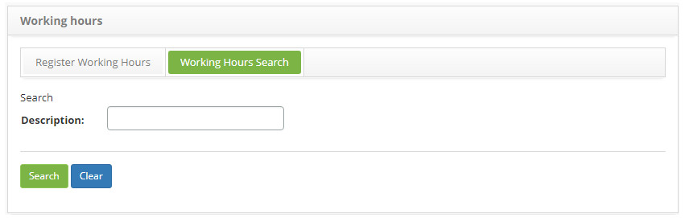
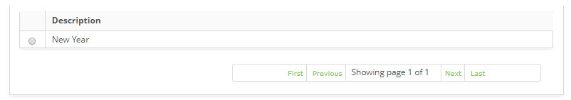
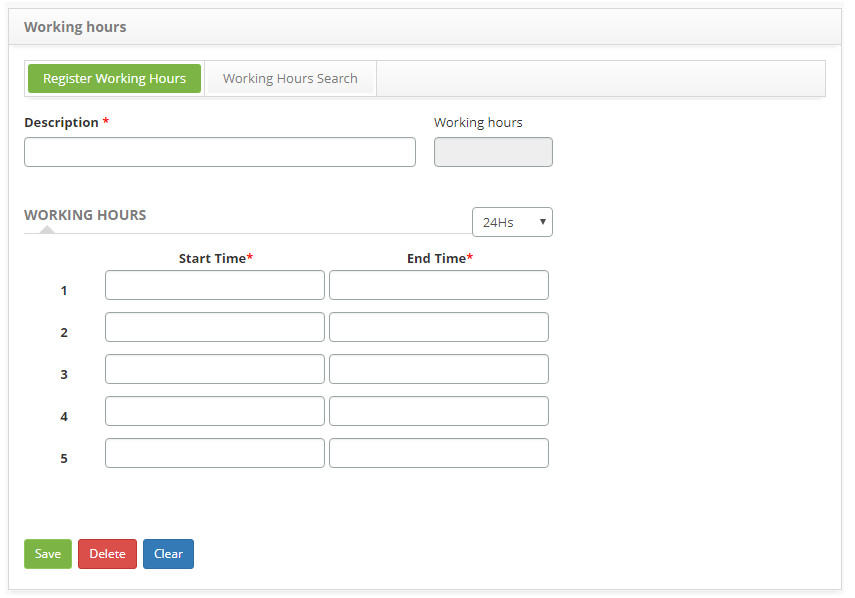

title: Workday registration and search
Description: The goal of this feature is to register the organization's workday schedule.
# Workday registration and search

The goal of this feature is to register the organization's workday schedule.

How to access
------------------

1. Access the Workday feature navigating through the main menu **General Registration > Staff Management > Workday**.

Preconditions
--------------

1. No applicable.

Filters
---------

1. The following filter enables the user to restrict the participation of items in the standard feature listing, making it easier 
to find the desired items:

    - Description.
    
2. Click on the **Working Hours Search** tab, the **Working Hours Search** screen will be presented, as shown in the figure below:

    
    
    **Figure 1 - Working hours search screen**
    
3. Conduct a working hours search:

    - Insert the working hours description intended and click on the *Search* button. Afterwards the working hours entry will be 
    displayed according to the description provided.
    
    - To list all working hours entries, just click directly on the *Search* button, if needed.
    
Items list
-------------------

1. The following cadastral field is available to the user to facilitate the identification of the desired items in the standard 
feature listing: **Description**.

    
    
    **Figure 2 - Day listing screen**
    
2. After searching, select the intended entry. Afterwards, they will be redirected to the registry screen displaying the content 
belonging to the selected entry.

3. To edit the working hours entry, just edit the intended fields and click on the *Save* button to confirm the changes, at which 
date, time and user will be stored for a future audit.

Filling in the registration fields
-------------------------------------

1. Click on the **Register Working Hours** tab, the **Workday Registration** screen will be displayed, as illustrated on the image 
below:

    
    
    **Figure 3 - Workday entry screen**
    
2. Fill out the fields as instructed below:

    - **Description**: insert the description of the new workday schedule;
    - **Working Hours**: this field is for checking purposes only, the system will fill it out with the working hours, after saving 
    the entry. The amount of hours that should be spent will be calculated according to the registered schedule;
    - **Workday**: determine the time format. The time format to be defined are:
        - **24 Hs**: the representation of the hours in an ongoing format, that is, 24 hours per day;
        - **AM/PM**: representation of the hours in a cycle of 0 to 12 hours, differentiating them by AM and PM.
    - **Start Time**: insert the shift start time;
    - **End Time**: insert the shift end time;
    
3. After inserting the information, click on the *Save* button, at which time, date and user will be automatically stored for a 
future audit.

!!! tip "About"

    <b>Product/Version:</b> CITSmart | 7.00 &nbsp;&nbsp;
    <b>Updated:</b>06/09/2019 - Larissa Lourenço
