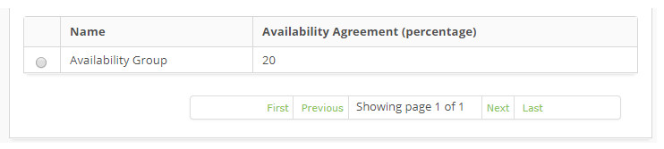

title: Availability group registration and search
Description: The goal of this feature is to group configuration items together to generate availability indicators..
# Availability group registration and search

The goal of this feature is to group configuration items together to generate availability indicators.

How to access
---------------

1. Access the Availability Group feature navigating through the main menu 
**Process Management > Availability Management > Availability Group**.

Preconditions
--------------

1. Register a Calendar (see knowledge [Calendar registration and search][1]).

Filters
----------

1. The following filter enables the user to restrict the participation of items in the standard feature listing, making it 
easier to find the desired items:

    - Name.
 
 2. On the **Availability Group** screen, click on the **Search** tab. The search screen will be displayed as illustrated on 
 the image below:

 
     
     
     **Figure 1 - Availability group search screen**
 
 3. Perform a availability group search;
 
     - Insert the name of the intended availability group and click on the *Search* button. Afterwards, the availability group 
     entry will be displayed according to the description provided.

     - To list all availability groups, just click directly on the *Search* button, if needed.
    
Items list
-------------------

1. The following cadastral fields are available to the user to make it easier to identify the desired items in the standard 
feature listing: **Name** and **Availability Agreement (percentage)**.

    
    
    **Figure 2 - Availability listing screen**
    
2. After searching, select the intended entry. Afterwards, they will be redirected to the registry screen displaying the 
content belonging to the selected entry.

3. To edit a availability group entry, just modify the information on the intended fields and click on the *Save* button to 
confirm the changes to the database, at which date, time and user will be stored automatically for a future audit.

Filling in the registration fields
-------------------------------------

1. The **Availability Group Registration** screen will be displayed, as illustrated on the image below:

    
    
    **Figure 3 - Availability group entry screen**
    
2. Fill out the fields as instructed below:

    - **Name**: name the availability group;
    - **Calendar**: insert the availability group calendar;
    - **Downtime Cost:**: insert the group's downtime cost per hour;
    - **Availability Agreement (Percentage)**: insert the agreed availability percentage;
    - **Configuration Items**: add the configuration items to the availability group:
    
3. Click on the *Configuraton Item Search* button, the CI search screen will be displayed, perform a search and select the CI. 
Then, the CI will be added to the group, as illustrated on the image below:

    
    
    **Figure 4 - Configuration item search**  
    
4. To check the configuration item's information, just click on its *View* button;

    
    
    **Figure 5 - Configuration item description**
    
5. Click on the *Save* button to confirm the changes to the database, at which date, time and user will be stored 
automatically for a future audit.

!!! tip "About"

    <b>Product/Version:</b> CITSmart | 7.00 &nbsp;&nbsp;
    <b>Updated:</b>08/21/2019 – Larissa Lourenço
    
[1]:/en-us/citsmart-platform-7/plataform-administration/time/create-calendar.html
