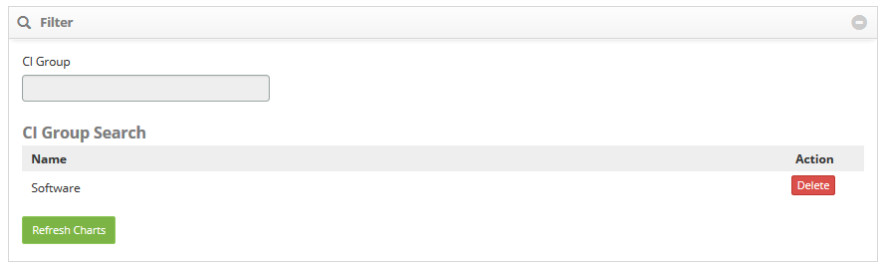

title: Availability management
Description: This functionality is intended to verify the availability of CIs.
# Availability management

This functionality is intended to verify the availability of CIs, IC Group availability, Availability Group availability, and 
Business Service availability.

How to access
--------------

1. Access the Availability Management feature by navigating the main menu 
**ITIL Processes > Availability Management > Availability Management**.

Preconditions
---------------

To check availability graphs, you must first perform the following procedures:

1. Enter the availability group (see knowledge Availability group registration and search);

2. Link calendar, service level agreement of type "availability" and cost per hour of downtime to the Configuration Item (see knowledge Configuration item management);

3. Link the calendar, service level agreement of type "availability" and cost per hour of downtime to the CI Group;

4. Link the calendar, service level agreement of the type "availability" and cost per hour of downtime to the Contract.

Availability management
----------------------------

1. The **Availability Management** screen will be displayed, as shown in the figure below:

    

    **Figure 1 - Availability management screen**

2. In this screen of Availability Management, you can check the availability of CIs, IC Group availability, Availability Group 
availability and Business Service availability. The next few topics will cover how to perform these actions.

Verifying configuration item availability
-------------------------------------------------------

1. On the Availability Management screen, click Configuration Item. Once this is done, the CI filter will be displayed, as shown in the figure below:

    

    **Figure 2 - Availability management - Configuration item**

2. Click on the **Configuration Item** field, it will display the CIs lookup screen. Perform the search and select the desired 
CI. After that, the CI will be added to the screen, as shown in the figure below:

    

    **Figure 3 - CI filters**

    !!! warning "WARNING"
    
        You can add as many items as you like for verification.
        
3. After the filter is set, click the *Refresh Charts* button. Once this is done, the information of the CIs will be displayed 
in graphs, as shown in the figure below:

    

    **Figure 4 - Availability charts by Configuration item**

    - **Availability by Period**: presents the availability per day of each IC, within the period reported;
    - **Total Availability**: displays the total availability of each CI, within the reporting period;
    - **Unavailability Occurrences**: presents the occurrences of downtime of each IC, within the reported period;
    - To download the total availability table and / or downtime occurrences, simply click on the Save table button;
    - To download the image or PDF of the charts, just click on the icon of the chart .
    
Verifying configuration item group availability
----------------------------------------------------------------

1. On the **Availability Management** screen, click **Configuration Item Group**. Once this is done, the IC group filter will 
be displayed, as shown in the figure below:

    

    **Figure 5 - Availability management - Configuration item**

2. Click on the **Group Configuration Item** field, it will display the CI group lookup screen. Perform the search and select 
the CI group you want. After that, the CI Group will be added to the screen as shown in the figure below:

    

    **Figure 6 - CI Group filters**

    !!! warning "WARNING"
    
        You can add as many groups as you like for verification.
        
3. After the filter is set, click the *Refresh Charts* button. Once this is done, the information of the CI group (s) will be 
displayed in graphs, as shown in the figure below:

    

    **Figure 7 - Availability charts by CI group**

    - **Availability by Period**: displays the availability per day of each CI group, within the reported period;
    - **Total Availability**: displays the total availability of each group of CIs within the reporting period;
    - **Unavailability Occurrences**: presents the occurrences of downtime of each group of CIs, within the reported period;
    - To download the total availability table and / or downtime occurrences, simply click on the *Save table* button;
    - To download the image or PDF of the charts, just click on the icon of the chart .

Verifying availability group availability
--------------------------------------------

1. On the **Availability Management** screen, click **Availability Group**. Once this is done, the availability group filter 
will be displayed, as shown in the figure below:

    

    **Figure 8 - Availability management - Availability group**

2. Click the **Availability Group** field, the availability group search screen will be displayed. Perform the search and 
select the availability group you want. After that, the availability group will be added to the screen as shown in the figure 
below:

    

    **Figure 9 - Availability group filters**

    !!! warning "WARNING"
    
        You can add as many groups as you like for verification.
       
3. After the filter is set, click the *Refresh Charts* button. Once this is done, the information of the availability group 
(s) will be displayed in graphs, as shown in the figure below:

    

    **Figure 10 - Availability charts by Availability group**

    - **Availability by Period**: displays the availability per day of each availability group, within the reported period;
    - **Total Availability**: displays the total availability of each availability group within the reported period;
    - **Unavailability Occurrences**: presents the occurrences of downtime of each availability group, within the reported 
    period;
    - To download the total availability table and/or downtime occurrences, simply click on the *Save table* button;
    - To download the image or PDF of the charts, just click on the icon of the chart 

Checking service availability
-------------------------------------------

1. On the **Availability Management** screen, click **Service**. Once this is done, the service filter will be displayed, as shown in the figure below:

    

    **Figure 11 - Availability management - Service**

2. Click the **Service** field, it will display the services search screen. Perform the search and select the desired service. 
After this, the service will be added on the screen as shown in the figure below:

    
    
    **Figure 12 - Service filters**

    !!! warning "WARNING"
    
        Multiple services can be added as many as you like for verification.
       
3. After the filter is set, click the *Refresh Charts* button. Once this is done, the information in the Service (s) will be 
shown in graphs, as shown in the figure below:

    

    **Figure 13 - Availability charts by Service**

    - **Availability by Period**: presents the availability per day of each service, within the period informed;
    - **Total Availability**: shows the total availability of each service, within the reported period;
    - **Unavaibility Occurrences**: presents the occurrences of downtime of each service, within the reported period;
    - To download the total availability table and/or downtime occurrences, simply click on the *Save table* of reference 
    button;
    - To download the image or PDF of the charts, just click on the icon of the chart 

!!! tip "About"

    <b>Product/Version:</b> CITSmart | 7.00 &nbsp;&nbsp;
    <b>Updated:</b>08/21/2019 – Larissa Lourenço
