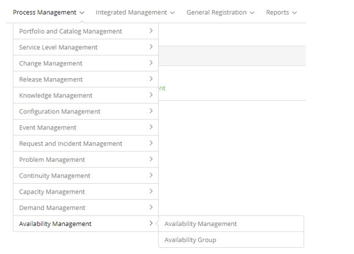

title: Availability Management module
Description: Management and Availability is the process responsible for ensuring that IT services
# Availability Management module

Module objective
---------------------

Management and Availability is the process responsible for ensuring that IT services meet current and future business 
availability needs in a more cost effective manner. The same guarantees that all IT processes, infrastructures, tools, roles, 
etc. requirements for the agreed service level goals for availability.

The primary goal of Availability Management is to provide a certain level of availability of IT services, enabling the 
customer to achieve their goals with cost efficiency.

This functionality is intended to verify the availability of CIs, IC Group availability, Availability Group availability, and 
Business Service availability.

Where are the features
---------------------------------

To access the functionality click on the main menu **Process Management > Availability Management**.

**Figure 1 - Availability Management module menu**

Main feature (In highlight)
------------------------------

In the *See also* section you can access the main functionality(ies) of this module, in order to obtain a more detailed 
knowledge.

See also
-------------

- [Availability management](/en-us/citsmart-platform-7/processes/availability/availability-management.html)

!!! tip "About"

    <b>Product/Version:</b> CITSmart | 7.00 &nbsp;&nbsp;
    <b>Updated:</b>08/21/2019 – Larissa Lourenço
