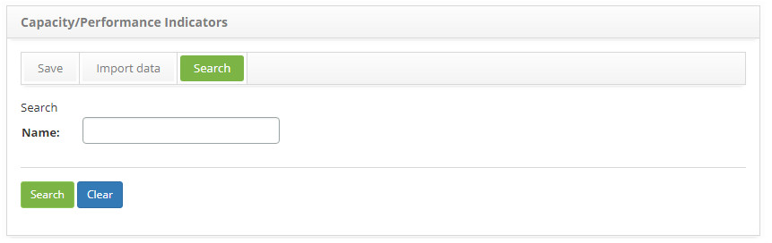
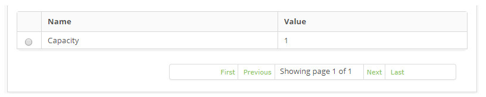
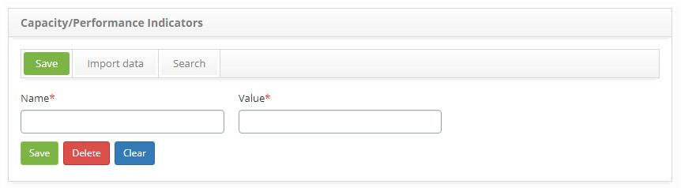

title: Capacity Indicators registration and search
Description: The goal of this feature is to register the capacity/performance indicators 
# Capacity Indicators registration and search

The goal of this feature is to register the capacity/performance indicators which will be linked to the Services and to the 
Configuration Items (CI).

How to access
--------------

1. Access the company feature navigating through the main menu **Process Management > Capacity Management > 
Capacity/PerformanceIndicators**.

Preconditions
----------------

1. No applicable.

Filters
----------

1. The following filter enables the user to restrict the participation of items in the standard feature listing, making it 
easier to find the desired items:

    - Name.

    

    **Figure 1 - Capacity/performance indicators search screen**

2. Perform a capacity/performance indicator search;

    - Insert the name of the intended indicator and click on the *Search* button. Afterwards, the indicator entry will be 
    displayed according to the description provided.

    - To list all indicators, just click directly on the *Search* button, if needed.

Items list
------------------

1. The following cadastral fields are available to the user to facilitate the identification of the desired items in the 
standard feature listing: **Name** and **Value**.

    

    **Figure 2 - List of capacity/performance indicators**

2. After searching, select the intended entry. Afterwards, they will be redirected to the registry screen displaying the 
content belonging to the selected entry;

3. To edit a capacity/performance indicator entry, just modify the information on the intended fields and click on the *Save* 
button

Filling in the registration fields
-------------------------------------

1. The capacity/performance indicators entry screen will be displayed, as illustrated on the image below:

    

     **Figure 3 - Capacity/Performance indicators entry screen**

2. Fill out the fields as instructed below:

    - **Name**: name the capacity/performance indicator;
    - **Value**: insert the value of the capacity/performance indicator.

3. Click on the *Save* the button to confirm the entry, at which date, time and user will automatically be stored for a future 
audit.

!!! tip "About"

    <b>Product/Version:</b> CITSmart | 7.00 &nbsp;&nbsp;
    <b>Updated:</b>08/22/2019 – Larissa Lourenço

