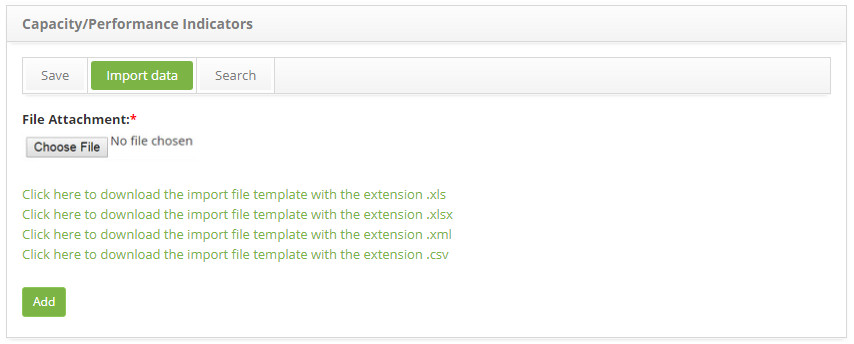

title: Capacity indicator data import
Description: Data import
# Capacity indicator data import

How to access
----------------

1. Access the **Capacity/Performance Indicators** feature navigating through the main menu **ITIL Processes > Capacity Management > Capacity/Performance Indicators**.

Performing a capacity/performance indicator import
---------------------------------------------------------

1. The Capacity/Performance Indicators screen will be displayed,

2. Click, on the **Import Data** tab, then the data import screen will be displayed, as illustrated on the image below:

    

    **Figure 1 - Data import screen**

3. Attach the file for data import:

4. Note that template files are displayed on screen to guide the structure and order the data must be in the file.

5. Therefore, before selecting the file, make sure it is consistent with the template, taking into account the format (.xls, 
.xlsx, .xml or .csv).

6. After checking, click on the *Choose File* button, select the file and click on the *Add* button to perform the import;

7. Then, the data will be successfully imported.

!!! tip "About"

    <b>Product/Version:</b> CITSmart | 7.00 &nbsp;&nbsp;
    <b>Updated:</b>08/22/2019 – Larissa Lourenço

