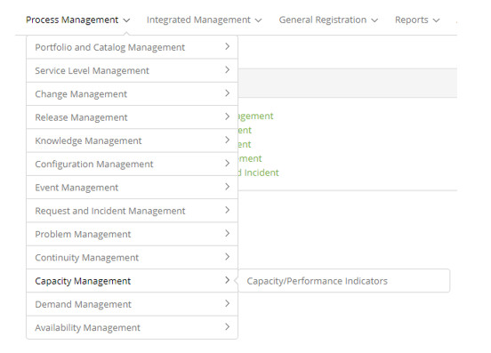

title: Capacity Management module
Description: Capacity Management is the process responsible for making it possible to meet the requirements
# Capacity Management module

Module objective
--------------------

Capacity Management is the process responsible for making it possible to meet the requirements related to the capacity and 
performance of the IT environment within a service agreement. It considers all the resources necessary to deliver IT services, 
plans and business requirements in the short, medium and long term.

The purpose of Capacity Management is to ensure that IT service capabilities and IT infrastructure are able to meet agreed 
capacity and performance requirements in a timely and cost effective manner.

Capacity Management has three subprocesses, in which capacity can be considered:

- **Business Capacity Management**: Ensures that future business needs are considered, planned, and met in a timely manner. 
This can be done through trend analysis, forecasting and modeling. The focus is on current and future business needs;

- **Service capacity management**: manages the performance of IT services in operation. It is your responsibility to ensure, 
monitor and report the performance levels defined in SLAs and SLRs. Its focus is on the current services supported by the 
business;

- **Resource capacity management**: monitors and reports the individual performance levels of IT infrastructure resources 
(components). Its focus is on the technology responsible for sustaining all service provision.

In this module will be defined the capacity indicators (performance/accomplishment), that will be linked to the Services and 
Configuration Items.

Where are the features
---------------------------------

To access the functionality click on the main menu **Process Management > Capacity Management**.

**Figure 1 - Capacity Management module menu**

Main feature (in highlight)
----------------------------------------

In the *See also* section you can access the main functionality(ies) of this module, in order to obtain a more detailed 
knowledge.

See also
--------------

- [Capacity Indicators registration and search](/en-us/citsmart-platform-7/processes/capacity/capacity-indicators.html);
- [Capacity indicator data import](/en-us/citsmart-platform-7/processes/capacity/data-import-capacity.html).

!!! tip "About"

    <b>Product/Version:</b> CITSmart | 7.00 &nbsp;&nbsp;
    <b>Updated:</b>08/22/2019 – Larissa Lourenço

