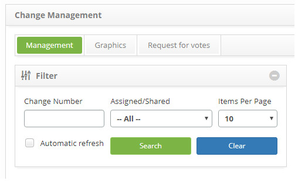
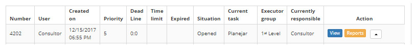
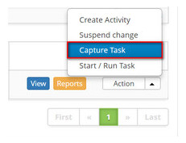

title: Change request capture
Description: This functionality refers to the act of assigning the particular task to the user itself
# Change request capture

This functionality refers to the act of assigning the particular task to the user itself, becoming the current responsible for the request for change.

How to access
-------------

1. Access the change request capture functionality through navigation in the main menu 
**Process Management > Change Management > Change Management**.

Preconditions
----------------

1. Not applicable.

Filters
----------

1. The following filters enable the user to restrict the participation of items in the standard feature listing, making it 
easier to locate the desired items:

    - Change Number;
    - Assigned/Shared;
    - Items per page.
    
    
    
    **Figure 1 - Filters screen**
    
Items list
------------------

1. The following cadastral fields are available to the user to facilitate the identification of the desired items in the 
standard listing of the functionality: **Number, User, Created on, Priority, Dead Line, Time Limit, Expired, Situation, Current task, Executor Group** and **Current responsible**;

2. There are action buttons available to the user in relation to each item in the listing, they are: *View, Reports*, and 
*Action*.

**Figure 2 - Task listing screen**

Filling in the registration fields
-------------------------------------

1. Not applicable.

Capturing task
------------------

1. On the **Management** tab, locate the change request that you want to capture, click the action button and select the 
Capture Task option, as indicated in the image below:

    
    
    **Figure 3 - Capture task**
    
2. A task capture confirmation message will be displayed. Click *OK* to perform the operation;

3. The current responsible for the request for change in the request list will be presented.

!!! tip "About"

    <b>Product/Version:</b> CITSmart | 7.00 &nbsp;&nbsp;
    <b>Updated:</b>08/22/2019 – Larissa Lourenço
