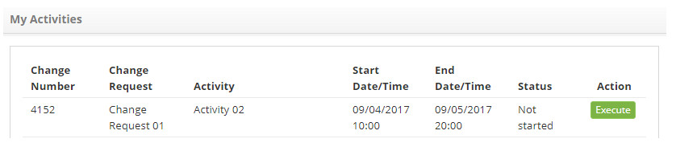
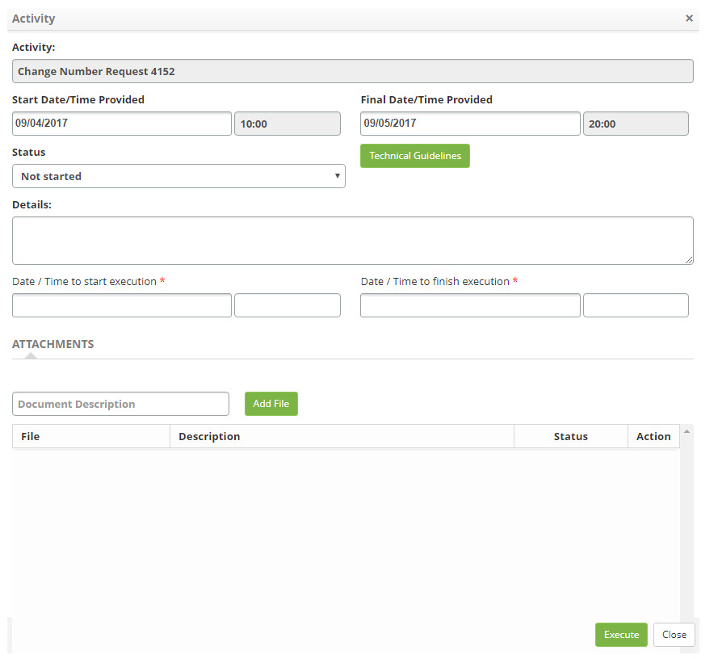

title: Change activity management
Description: This functionality is intended to manage your activities related to change requests.
# Change activity management

This functionality is intended to manage your activities related to change requests.

How to access
---------------

1. Access the functionality of my activities by navigating the main menu 
**Process Management > Change Management > My Activities**.

Preconditions
---------------

1. Have activities assigned to your user.

Filters
--------

1. Not applicable.

Items list
------------------

1. The following cadastral fields are available to the user to facilitate the identification of the desired items in the 
standard feature listing: **Change Number, Change Request, Activity, Start Date/time, Ende Date/Time** and **Status**.

2. There is one action button available to the user for each item in the listing, it is: Execute.

3. Once this is done, the **My Activities** screen will be displayed, as shown in the figure below:

**Figure 1 - My activities**

Filling in the registration fields
------------------------------------

1. To record activity execution information, just click on the *Execute* button and the screen will be displayed, as 
illustrated below:

    
    
    **Figure 2 - Activity execution log**
    
    - **Status**: select the situation of the activity, to facilitate the management of the change;
    
2. Click on the *Technical Guidelines* button to view what was informed of the change request description:

    - **Details**: enter the details about the execution of the activity;
    - **Date/Time to start execution**: enter the start date and time of the activity execution;
    - **Date/Time to finish execution**: enter the date and time of the execution of the activity.

3. To attach a file to the activity, enter the description of the attachment, click the *Add File* button, and select the file 
you want;

4. Click on the *Execute* button to save the completed information regarding the activity.

!!! tip "About"

    <b>Product/Version:</b> CITSmart | 7.00 &nbsp;&nbsp;
    <b>Updated:</b>08/22/2019 – Larissa Lourenço
