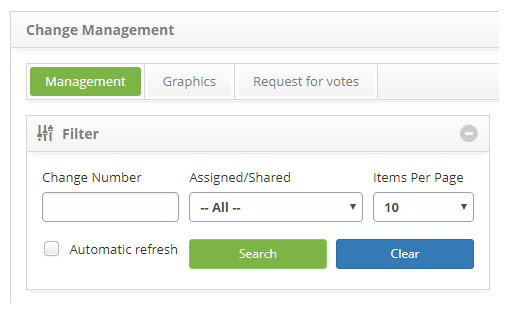
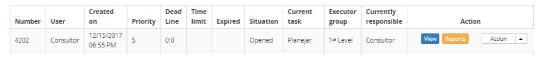
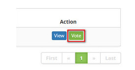
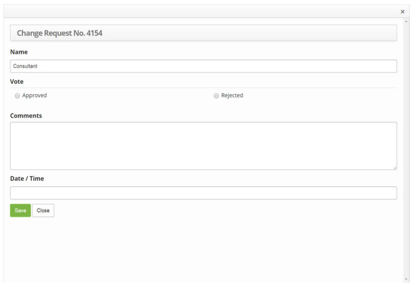
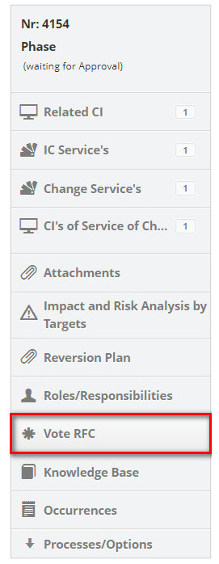
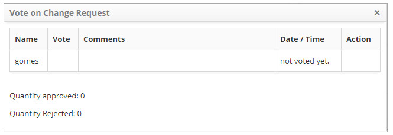

title: Change request approval
Description: This feature allows the approval of the change request.
# Change request approval

This feature allows the approval of the change request.

How to access
---------------

1. Access the change request approval feature navigating through the main menu 
**Process Management > Change Management > Change Management**.

Preconditions
---------------

1. The group to which the user is registered must have the value equal to "YES" of the Advisory Committee of Changes (see knowledge [Group registration and search](/en-us/citsmart-platform-7/initial-settings/access-settings/user/group.html));

2. For non-emergency and non-standard (Normal) flow types, the "Workflow Permissions" of the group to which the user is registered must all be enabled (see Knowledge [Group registration and search](/en-us/citsmart-platform-7/initial-settings/access-settings/user/group.html)).

Filters
--------

1. The following filters enable the user to restrict the participation of items in the standard feature listing, making it 
easier to locate the desired items:

     - Change number;
     - Assigned/Shared;
     - Items per page.

**Figure 1 - Change search screen**

Items list
-------------------

1. The following cadastral fields are available to the user to facilitate the identification of the desired items in the 
standard listing of the functionality: **Number, User, Create on, Priority, Dead line, Time limit, Expired, Situation, Current 
task, Executor Group** and **Current Responsible**.

2. There are action buttons available to the user in relation to each item in the listing, they are: *View* and *Reports*.

**Figure 2 - Change listing screen**

Filling in te registration fields
-------------------------------------

!!! info "IMPORTANTE"

    Only members of the "Change Advisory Board" may approve a change request.To approve a Change Request the parameter 
    configuration must be taken into account: "RFC voting using the rule of absolute majority (50% +1) (Values: "Y" or "N")", 
    at which "Y" determines the approval of the change request when the CAB approval is over 50% and and the "N" value 
    determines the approval of the Change Request when the CAB approval is at 100%.
    
1. On the **Request for votes** tab, locate the change request to be approved, click on its Vote button, as indicated on the 
image below:

    

    **Figure 3 - Vote button**

2. The change request vote screen will be displayed, as indicated on the image below:

**Figure 4 - Approve change request**

- **Name**: it is automatically filled with the name of the CAB member who is voting on the change request;
- **Vote**: select the vote choice for the change request (Approved or Rejected);
- **Comments**: If desired, write a comment regarding the voting on the change request;
- **Date/Time**: it is automatically filled when the voting on the change request is started with the date and time data of 
its approval/rejection.
- Click on the *Save* button to confirm the vote registration.

Checking the approval of the advisory commitee on changes
------------------------------------------------------------

1. To proceed with the approval, the responsible for the change request, which is part of the performer group, must check the 
approval of the Change Advisory Board.

    - On the **Management** tab, locate the change request, click on the *Action* button, select the *Start/Run Task* option 
    and the change request screen with the field filled out will be displayed, showing the content of the selected request.

    - On the right side of the change request screen, click on the **Vote RFC** option;

    

    **Figure 5 - Vote RFC selection**

    - The change request voting screen will be displayed, as illustrated on the image below:

    

    **Figure 6 - Change request voting screen**

    - If the necessary approval has already been obtained, click on the *Save and Forward Flow* button to perform the 
    operation, at which the change request will be approved and sent to the planning phase.

!!! note "NOTE"

    The system allows you to change the Consultative Committee on Change (CCC) at any time, as long as you have not started 
    the voting on the Request for Change. From the moment the Voting for the Change Request begins, even if you change the 
    members of the MCC, the system does not change the voters of the Request.
    
!!! tip "About"

    <b>Product/Version:</b> CITSmart | 7.00 &nbsp;&nbsp;
    <b>Updated:</b>08/22/2019 – Larissa Lourenço
