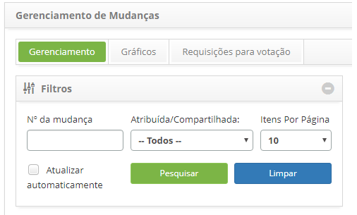
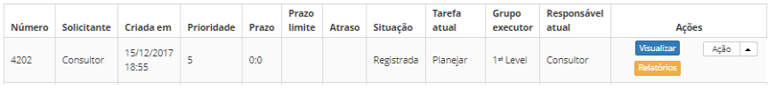
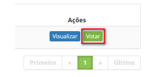
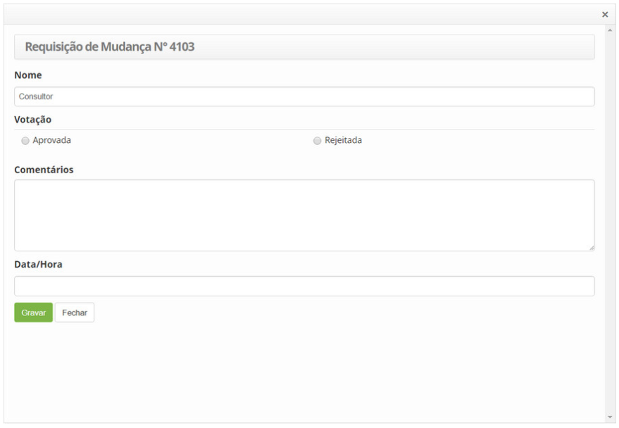
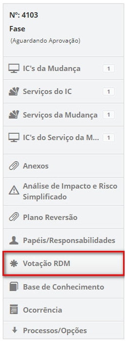
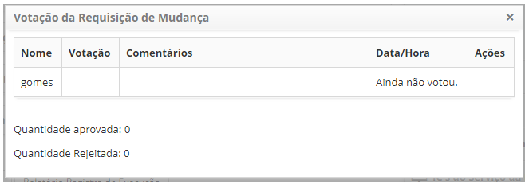

title: Aprovação de requisição de mudança
Description: Essa funcionalidade permite realizar aprovação da requisição de mudança.
# Aprovação de requisição de mudança

Essa funcionalidade permite realizar aprovação da requisição de mudança.

Como acessar
---------------

1. Acesse a funcionalidade de aprovação de requisição de mudança através da navegação no menu 
principal **Processos ITIL > Gerência de Mudança > Gerenciamento de Mudança**.

Pré-condições
---------------

1. O grupo ao qual o usuário está cadastrado deve ter o valor igual a "SIM" do Comitê Consultivo 
de Mudanças (ver conhecimento [Cadastro e pesquisa de grupo](/pt-br/citsmart-platform-7/initial-settings/access-settings/user/group.html));

2. Para tipos de fluxo não emergencial nem padrão (Normal), as "Permissões nos fluxos de trabalho" do
grupo ao qual o usuário está cadastrado devem estar todas ativadas (ver conhecimento [Cadastro e pesquisa de grupo](/pt-br/citsmart-platform-7/initial-settings/access-settings/user/group.html)).

Filtros
--------

1. Os seguintes filtros possibilitam ao usuário restringir a participação de itens na listagem padrão da funcionalidade, 
facilitando a localização dos itens desejados:

     - Número da mudança;
     - Atribuída/Compartilhada;
     - Itens por página.

**Figura 1 - Tela de pesquisa de mudança**

Listagem de itens
-------------------

1. Os seguintes campos cadastrais estão disponíveis ao usuário para facilitar a identificação dos itens desejados
na listagem padrão da funcionalidade: Número, Solicitante, Criada em, Prioridade, Prazo, Prazo limite, Atraso, Situação,
Tarefa atual, Grupo Executor e Responsável atual.

2. Existem botões de ação disponíveis ao usuário em relação a cada item da listagem, são eles: "Visualizar" e "Relatórios".

**Figura 2 - Tela de listagem de mudança**

Preenchimento dos campos cadastrais
-------------------------------------

!!! info "REGRA"

    Somente os membros do "Comitê Consultivo de Mudança (CCM)" podem realizar a aprovação da Requisição de Mudança. Para
    aprovar uma Requisição de Mudança deve se atentar na configuração do parâmetro "Votação da RDM utilizando a regra 
    da maioria absoluta (50% + 1) (Valores: "S" ou "N" Default: "S")", onde o valor "S" define a aprovação da Requisição
    de Mudança quando há mais de 50% de aprovação do CCM e o valor "N" define a aprovação da Requisição de Mudança quando 
    há 100% de aprovação do CCM.
    
1. Na guia **Requisições para votação**, localize a requisição de mudança que deseja aprovar, clique no botão Votar da mesma,
conforme indicado na figura abaixo:

    

    **Figura 3 - Botão votar**

2. Será exibida a tela para votação da requisição de mudança, conforme indicado na figura abaixo:

**Figura 4 - Aprovar requisição de mudanças**

- **Nome**: é preenchido automaticamente com o nome do membro do CCM que está votando da requisição de mudança;
- **Votação**:  selecione a sua escolha de votação para a requisição de mudança, Aprovada ou Rejeitada;
- **Comentários**: se desejar, faça um comentário sobre a votação da requisição de mudança;
- **Data/Hora**: é preenchido automaticamente quando for realizada a consulta da votação da requisição de com a informação
de data e hora da aprovação/rejeição da mesma;
- Clique no botão "Gravar" para efetuar o registro da votação.

Verificação da aprovação do comitê de mudança consultiva
---------------------------------------------------------

1. Para prosseguir com a aprovação, o responsável pela requisição de mudança, que faz parte do grupo executor, deve verificar
a aprovação do Comitê Consultivo de Mudanças.

    - Na aba **Gerenciamento**, localize a requisição de mudança, clique no botão "Ação", selecione a opção "Iniciar/Executar tarefa" e será exibida a tela de requisição de mudança com os campos preenchidos, com o conteúdo referente à requisição selecionada;

    - Ao lado direito da tela de requisição de mudança, clique na opção **Votação RDM**;

    

    **Figura 5 - Seleção de Votação RDM**

    - Será apresentada a tela de consulta de votação da requisição de mudança, conforme exemplo ilustrado abaixo:

    

    **Figura 6 - Consulta de aprovação da requisição de mudança**

    - Caso já tenha obtido a aprovação necessária, clique no botão "Gravar e avançar o fluxo" para efetuar a operação, onde a requisição de mudança será aprovada e encaminhada para fase de planejamento;

!!! note "NOTA"

    O sistema permite alterar o Comitê Consultivo de Mudança (CCM) em qualquer momento, desde que, não tenha sido iniciada a votação da Requisição de Mudança. A partir do momento que se inicia a votação da Requisição de Mudança, ainda que se altere os membros do CCM, o sistema não altera os votantes da Requisição.
    
!!! tip "About"

    <b>Product/Version:</b> CITSmart | 7.00 &nbsp;&nbsp;
    <b>Updated:</b>07/11/2019 – Larissa Lourenço
