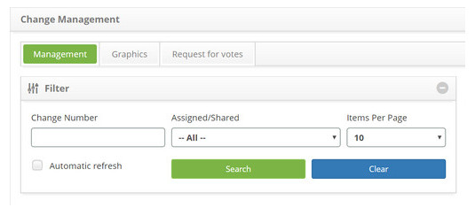
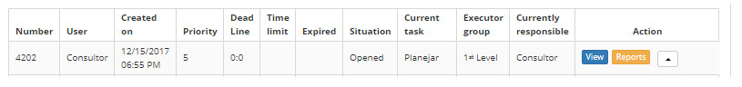
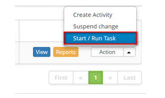

title: Cancelling a change request
Description: This feature allows canceling a change request.
# Cancelling a change request

This feature allows canceling a change request.

How to access
--------------

1. Access the change request cancellation feature navigating through the main menu **Process Management > Change Management > 
Change Management**.

Preconditions
---------------

1. Not applicable.

Filters
---------

1. The following filters enable the user to restrict the participation of items in the standard feature listing, making it 
easier to locate the desired items:

    - Change Number;
    - Assigned/Shared;
    - Items per page.
    
    
    
    **Figure 1 - Filters screen**
    
Items list
--------------------

1. The following cadastral fields are available to the user to facilitate the identification of the desired items in the 
standard listing of the functionality: **Number, User, Create on, Priority, Dead Line, Time limit, Expired. Situation, 
Current Task, Executor Group** and **Current responsible**;

2. There are action buttons available to the user in relation to each item in the listing, they are: *View, Reports* and 
*Action*.

**Figure 2 - Change listing screen**

Filling in the registration fields
-------------------------------------

1. Not applicable.

Cancelling a change request
----------------------------------

1. .On the **Management** tab, locate the change request which will be canceled, click on the *Action* button and select the 
*Start/Run Task* option, as indicated on the image below:

    
    
    **Figure 3 - Cancel a change request**
    
2. The **Change Request Registration** screen will be displayed with the fields filled out with the content of the selected 
request;

    - In the closure area, in the field **Status**, select the **Cancelled** option;
    - No campo **Fechamento**, descreva os detalhes do cancelamento da requisição de mudança;
    - In the **Closure** field, describe the change request cancellation details;
    - After registering the change request cancellation information, click on the *Save and Forward Flow* button to perform 
    the operation, at which the change request will be successfully cancelled;
    - To only save the registered information regarding the change request cancellation and keep the current task, click on 
    the *Save and Keep the Current Task* button;
    - In both previous cases, clicking on the *Save* button automatically stores the date, time and user for a future audit.
    
!!! tip "About"

    <b>Product/Version:</b> CITSmart | 7.00 &nbsp;&nbsp;
    <b>Updated:</b>08/22/2019 – Larissa Lourenço
