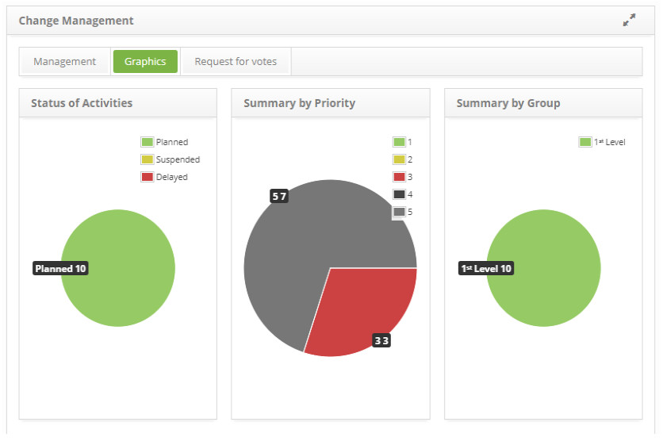

title: Change request graphics
Description: Change request graphics.
# Change request graphics

How to access
-------------

1. Access the change request graphics feature navigating through the main menu 
**Process Management > Change Management > Change Management**.

Viewing graphics
----------------------

1. Click on the **Graphics** tab and the information on request will be displayed by status (In execution, suspended and 
delayed), by priority and by performer group, demonstrated on graphics, as illustrated on the image below:

**Figure 1 - Changes graphics screen**  

!!! tip "About"

    <b>Product/Version:</b> CITSmart | 7.00 &nbsp;&nbsp;
    <b>Updated:</b>08/22/2019 – Larissa Lourenço
