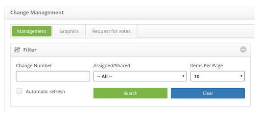
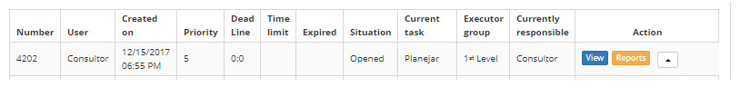

title: Change request view
Description: This feature allows viewing information in the change request registry.
# Change request view

This feature allows viewing information in the change request registry.

How to access
----------------

1. Access the feature navigating through the main menu **Process Management > Change Management > Change Management**.

Preconditions
---------------

1. No applicable.

Filters
---------

1. The following filters enables the user to restrict the participation of items in the standard feature listing, making it 
easier to find the desired items:

    - Change Number;

    - Assigned/Shared;

    - Items Per Page.

**Figure 1 - Filters screen**

Items list
------------------

1. The following cadastral fields are available to the user to facilitate the identification of the desired items in the 
standard feature listing: **Number, User, Created on, Priority, Dead line, Time limit, Expired, Situation, Current task, 
Executor Group** and **Current responsible**.

2. There are action buttons available to the user for each item in the listing, they are: *View, Reports*, and *Action*.

3. In the *Management* tab, locate the change request which will be viewed, and then click the View button:

    
    
    **Figure 2 – View button**
    
4. The Change Request entry screen will be displayed. Click on the *Closure* tab;

    - To generate PDF from the change request information, click the *Generate PDF* button;

    - To generate a change Request Information report, click the report *Generate Report* button.

Filling in the registration fields
------------------------------------

1. Not applicable.

!!! tip "About"

    <b>Product/Version:</b> CITSmart | 7.00 &nbsp;&nbsp;
    <b>Updated:</b>08/22/2019 – Larissa Lourenço

