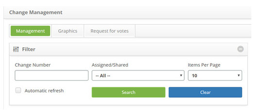
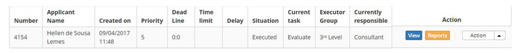
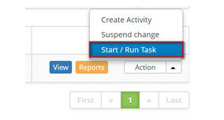

title: Change request evaluating and completing
Description: This feature allows evaluating and completing a change request.
# Change request evaluating and completing

This feature allows evaluating and completing a change request.

How to access
--------------

1. Access the change request evaluation and completion feature navigating through the main menu 
**Process Management > Change Management > Change Management**.

Preconditions
--------------

1. Not applicable.

Filters
---------

1. The following filters enable the user to restrict the participation of items in the standard feature listing, making it 
easier to locate the desired items:

    - Change number;
    - Assigned/Shared;
    - Items per page.

**Figure 1 - Change search screen**

Items list
------------------

1. The following cadastral fields are available to the user to facilitate the identification of the desired items in the 
standard listing of the functionality: **Number, Applicant Name, Created on, Priority, Deadline,Time limit, Delay, Situation, 
Current task,Executor Group** and **Currently Responsible**.

2. There are action buttons available to the user in relation to each item in the listing, they are: *View, Reports* and 
*Action* (Create Activity, Suspend change and Start/Run task).Existem botões de ação disponíveis ao usuário em relação a cada 
item da listagem, são eles: "Visualizar", "Relatórios" e "Ação"(Criar Atividade, Suspender mudança e Iniciar/Executar tarefa)

**Figure 2 - Change listing screen**

Filling in the registration fields
------------------------------------

1. Not applicable.

Evaluating and terminating a request change
-----------------------------------------------

1. On the **Management** tab, locate the change request which will be evaluated and completed, click on the Action button and 
select its Start/Run Task button, as indicated on the image below:

    

    **Figure 3 - Evaluate the change request**

2. The Change Request screen with the field filled out will be displayed, featuring the content of the selected request;

    - Check if the change request was attended as requested;
    - Register the necessary information on the change request closure;
        - Click on the *Add an Execution Register* button;
        - Describe the information the activity execution.
    - On the **Closure** area, insert the completion of the change request, that is, the details of the change request execution completion;
    -  After registering all the information on the evaluation and completion of the change request, click on the *Save and 
    Forward Flow* button to perform the operation, at which the change request and the related problems, incidents and 
    configuration items will be successfully closed as well;
    - To only save the registered information on the evaluation and completion of the change request and keep the current 
    task, click on the *Save and Keep the Current Task* button;
    - In both previous cases, clicking on the *Save* button automatically saves the date, time and user for a future audit.

!!! note "NOTE"

    All "known errors" related to a problem linked to a change wich is being closed will be archived, in case the parameter 
    "Know Error - Archive error when completing Change? (Y or N - Default: 'N') is defined by the "Y" value.
    
!!! tip "About"

    <b>Product/Version:</b> CITSmart | 7.00 &nbsp;&nbsp;
    <b>Updated:</b>08/22/2019 – Larissa Lourenço
