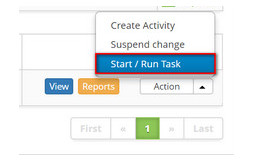
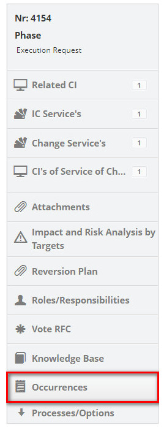

title: Change request execution
Description: This functionality allows you to perform the change request execution.
# Change request execution

This functionality allows you to perform the change request execution.

How to access
--------------

1. Access the change request execution feature by navigating the main menu 
**Process Management > Change Management > Change Management**.

Preconditions
---------------

1. Have registered at least one change request (see knowledge [Change request registration](/en-us/citsmart-platform-7/processes/change/register-change.html)).

Filters
----------

1. The following filters enable the user to restrict the participation of items in the standard feature listing, making it 
easier to locate the desired items:

- Change Number;
    
- Assigned/Shared;
    
- Items per page.
    

    
**Figure 1 - Filters screen**
    
Items list
-------------------

1. The following cadastral fields are available to the user to facilitate the identification of the desired items in the 
standard listing of the functionality: **Number, User, Prioriy, Dead Line, Time Limit, Expired, Situation, Current task, 
Executor Group** and **Current responsible**.

2. There are action buttons available to the user in relation to each item in the listing, they are: **View, Reports** and 
**Action**.

**Figure 2 - Change listing screen**

Fiiling in the registration fields
------------------------------------

1. Not applicable.

Executing change request
---------------------------------

1. On the **Management** tab, locate the change request that you want to record the execution information on, click the Action 
button and select the *Start/Run Task* from it, as shown in the image below:

    
    
    **Figure 3 - Register execution of request for change**
    
2. The *Change Request* screen appears with the fields filled with the content of the selected request;

    - Record the required information about the execution of the change request:
        - Click on the *Closure* tab; 
        - Click the *Add an Execution Register* button;
        - Describe the information about the execution of your activity.
        
Liking problem to change
------------------------------

1. Please state the problem(s) regarding the change:

    - On the right side of the change request screen, click on the **Problem** option;
    
    
    
    **Figure 4 - Problem selection**
    
    - Click on icon  to link a problem;
    - A window for troubleshooting will be displayed. Perform the search and select the problem. Once this has been done, the 
    problem will be;
    
    
    
    **Figure 5 - Problem to change relationship**
    
    - If you wanted to view the problem log that was related to the change, just click on the icon ; 
    - If you want to remove a problem that was related to the change, simply click on the icon .
    
Liking incidents/requests to change
-----------------------------------------------

1. Report incidents/service requests regarding change:

    - On the right side of the change request screen, click the **Incidents/Requests** option;
    
    
    
    **Figure 6 - Incidents/requests selection**
    
    - Click on icone  to link the incident/service request;;
    - A window will appear for Incident search/service request, perform the search and select the incident/request;
    - Will the incident/request be related to the change;
    
    
    
    **Figure 7 - Incident / requests for change relationship**
    
    - If you want to create a new change incident, just click the ;
    - If you want to remove an incident/request that was listed, simply click the .
    
Linking release to change
-------------------------------

1. Inform release regarding change:

    - On the right side of the change request screen, click the **Release** option;
    
    
    
    **Figure 8 - Release selection**
    
    - Click on icon  to link the release;
    - A window for release search appears. Perform the search and select the release. Once this is done, release will be 
    related to change;
    
    
    
    **Figure 9 - Release to change relationship**
    
    - If you want to remove a release that was listed, just click the icon . 
    
Linking knowledge to change
----------------------------------

1. Inform knowledge regarding change:

    - On the right side of the change request screen, click the *Knowledge Base* option;
    
    
    
    **Figure 10 - Knowledge base selection**
    
    - Click the *Add Knowledge* button to add knowledge;;
    - A window for knowledge search will be displayed. Perform the survey and select the knowledge. Once this is done, 
    knowledge will be related to change;
    - If you want to create a new knowledge about the change, just click the *Guideline Registracion* button;
    
    
    
    **Figure 11 - Knowledge relationship to change**
    
    - If you want to remove a related knowledge, simply click on the icon .
    
Linking roles/responsibilities to change
-----------------------------------------------

1. Inform the roles/responsibilities, the people involved in executing the change request:

    - On the right side of the change request screen, click the **Roles/Responsibilities** option;
    
    
    
    **Figure 12 - Roles/responsibilities selection**
    
    - A window will be displayed to perform the search of the people involved in executing the change request;
    
    !!! note "NOTE"
    
        Those responsible for the CI linked to the change request will already be presented automatically.
        
    - Perform the search and select the employee involved in executing the change request;
    - Inform the employee's role in the execution of change;
    - Select the responsibility and click *Add* to carry out the operation;
    
    
    
    **Figure 13 - Relationship of role/responsibilities to change**
    
    - If you want to delete the information about the person involved in the execution of the change request that was added, 
    just click on the change request icon  da mesma. With the exception of those responsible 
    who were automatically brought in from the bond with the CI.
    
Linking occurrences to change
---------------------------------

1. If you want to insert an occurrence to the change request, proceed as follows:

    - On the right side of the change request screen, click on the **Occurrences** option;
    
    
    
    **Figure 14 - Occurrences selection**
    
    - The **Occurrence** screen will be displayed containing two tabs, one for visualizing the relation of the recorded 
    occurrences and another for recording the occurrence;
    - Click on the **Registered Occurrence List** tab, the registration screen will be displayed as shown in the figure below:
    
    
    
    **Figure 15 - Record of occurrence**
    
    - Fill in the fields as indicated below:
        - **Category**: select the category of the occurrence. If the category is not found, it is possible to perform a quick 
        registration by clicking on the icon ;
        - **Origin**: select the source of the occurrence. If the source is not found, you can perform a quick registration by 
        clicking on the icon;
        - **Spent time (min)**: enter the time spent (in minutes);
        - **Registered by**: inform by whom the occurrence is being recorded;
        - **Description**: report the description of the occurrence;
        - **Occurrence**: describe the details of the occurrence;
        - **User Information**: describe the contact information;
        - After entering all the data of the occurrence, click on the *Save* button to carry out the operation, where the 
        date, time and user will be automatically stored for a future audit.
    - After recording the information about the execution of the change request, click on the button *Save and Forward Flow* 
    to carry out the operation, where the release will be sent to the evaluation phase;
    - If you want to save only the logged information of the execution of the change request and keep the current job, click 
    the *Save and Keep the Current Task* button;
    - In both previous cases, when you click on the *Save* button the date, time and user will be stored automatically for a 
    future audit.
    
!!! tip "About"

    <b>Product/Version:</b> CITSmart | 7.00 &nbsp;&nbsp;
    <b>Updated:</b>08/22/2019 – Larissa Lourenço
