title: Change request planning
Description: This functionality allows you to carry out the execution planning of the change request.
# Change request planning

This functionality allows you to carry out the execution planning of the change request.

Preconditions
-----------------

1. Have registered a change request (see the knowledge [Change request registration](/en-us/citsmart-platform-7/processes/change/register-change.html)).

Planning change request
-----------------------------------

!!! note "NOTE"

    Only "Normal" Type Change Requests are planned.
    
1. Access the change request planning functionality by navigating the main menu 
**Process Management > Change Management > Change Management**.

2. On the **Management** tab, locate the change request you want to register the schedule, click the *Action* button, and then 
click *Create Activity* as shown in the figure below:

    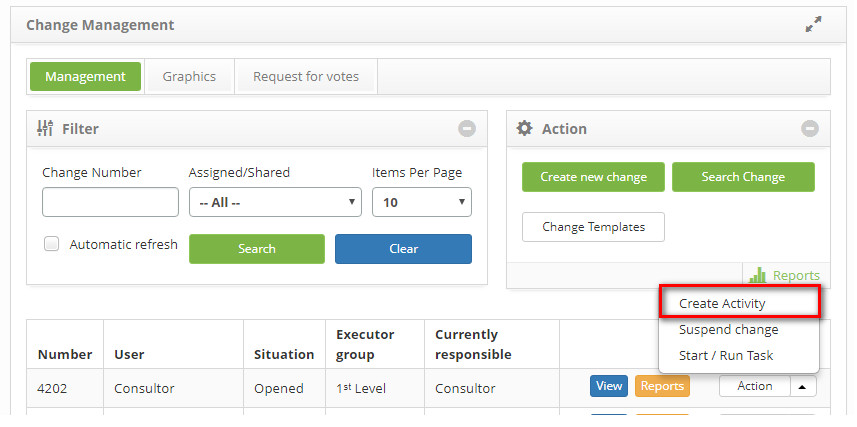
    
    **Figure 1 - Plan execution of request for change**
    
3. The following screen will appear:

    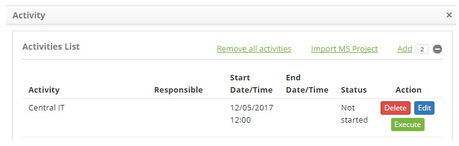
    
    **Figure 2 - Activities list**
    
    - To remove an activity from the list of activities, simply click the *Delete* button;
    - To edit the activity information, simply click the *Edit* button;
    - To record activity execution information, just click the *Execute* button;
    
    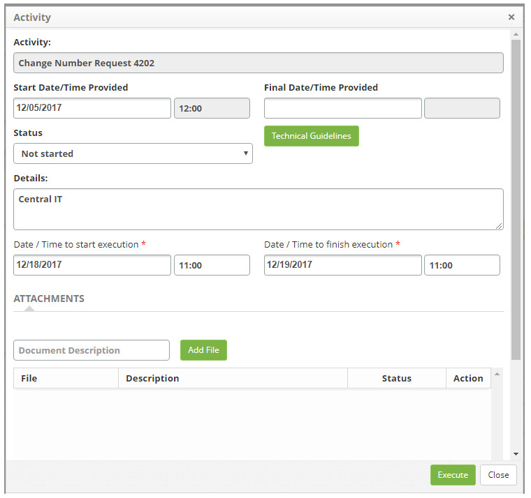
    
    **Figure 3 - Activity execution screen**
    
    !!! info "IMPORTANT"
    
        The person responsible for the activity must fill in the activity execution information.
        
    - **Status**: select the situation of the activity, to facilitate the management of the change;
    - Click on the *Technical Guidelines* button to view what was informed of the change request description;
    - **Details**: enter the details about the execution of the activity;
    - **Date/Time to start execution**: enter the start date and time of the activity execution;
    - **Date/Time to finish execution**: enter the date and time of the execution of the activity;
    - To attach a file to the activity, enter the description of the attachment, click the *Add File* button, and select the file 
    you want;
    - Click the *Execute* button to save the completed information about the activity.​​​​
    
4. To remove all activities from the activities list, simply click the *Remove all activities* button

5. To import activities from a standard MS Project file, simply click the *Import MS Project* button (access section Importing 
MS-Project Schedules for Change Activities in this knowledge);

6. To register the activities manually, click *Add*, the screen to register the activity will be displayed:

    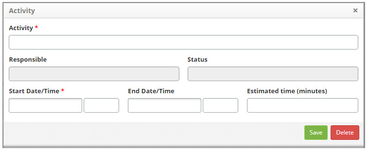
    
    **Figure 4 - Add activity**
    
    - **Activity**: enter the name of the activity;

    - **Responsible**: inform the person responsible for the activity;

    - **Status**: this field will be filled according to the progress of the activity;

    - **Start Date/Time**: enter the planned date and time to start the activity;

    - **End Date/Time**: enter the planned date and time for the end of the activity execution;

    - **Estimated time (minutes)**: enter the planned time to execute the activity, in minutes;

Importing MS-Project schedules for change activities
--------------------------------------------------------------

1. In the "Activities List" you can register the activities manually or by using the Microsoft Project application;

    - To import registered activities into the Microsoft Project application, click *Import MS Project*;
        - The screen to import the MS Project file will be displayed:
        
    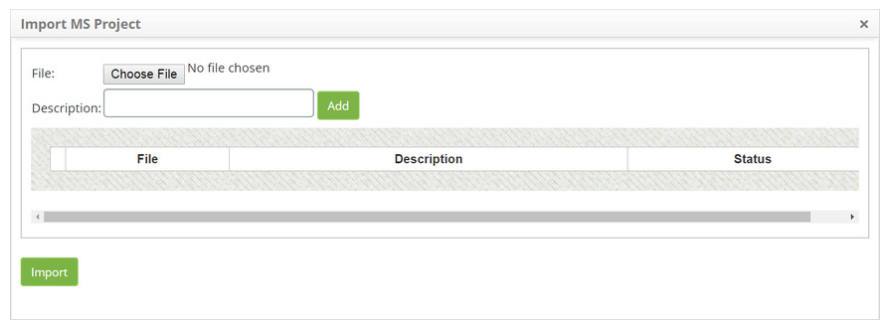
    
    **Figure 5 - Import MS Project**
    
    - Click on the *Choose File* button. A window will appear, where you can select the desired file;
    - Select the file;
    - Enter the description of the file and click the *Add* button;
    - After adding the file, click the *Import* button and confirm the import run;

Attaching reverse plan
--------------------------

1. On the **Change Management** list screen > **Action button > Start/Run task**;

    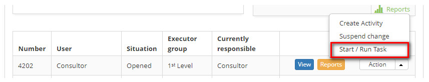
    
    **Figure 6 - Change management screen**
    
2. Inform the change reversion plan, on the right side of the change request screen, click the **Reversion Plan** option;

    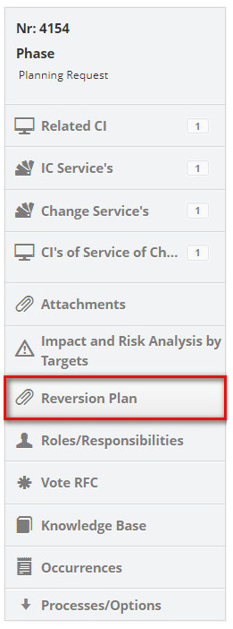
    
    **Figure 7 - Reversion plan selection**
    
3. The rollback plan attachments screen will be displayed, as shown in the figure below.:

    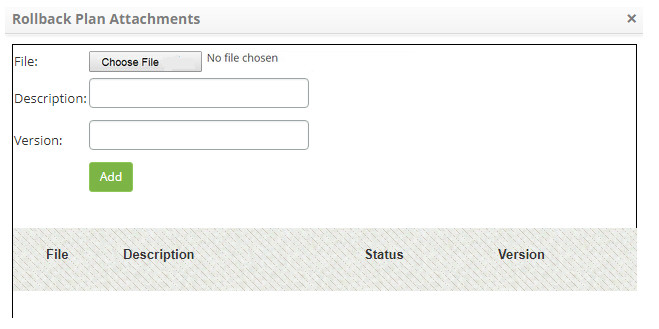
    
    **Figure 8 - Reversal Plan Attachments screen**
    
    - Click on the *Choose File* button. A window will appear, where you can select the file (reversion plan);
    - Select the file, enter the description and the version of the file. After that, click the *Add* button.
    
Projects list
------------------

1. On the **Change Management > Action button > Start/Run task**;

2. On the "Planning" guide, click on icon ;

3. Click on Add:

    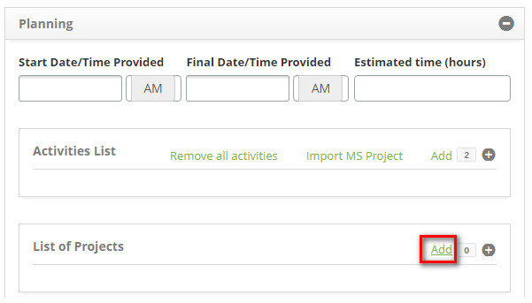
    
    **Figure 9 - Add project to change request**
    
    - Enter the project linked to the change request:
    - The window will be displayed to register and search project;
    - On the **Project** screen, in the **Register** tab, the respective registration screen appears, as illustrated below:
    
    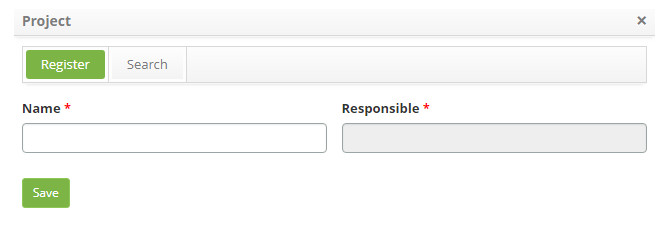
    
    **Figure 10 - Link a project**
    
    - **Name**: enter the name of the project;
    - **Responsible**: enter the name of the manager;
    - Click the *Save* button to register and it will appear in the "List of Projects".
    
4. On the **Project** screen, click the **Search** tab, the search screen will be displayed as shown in the figure below:

    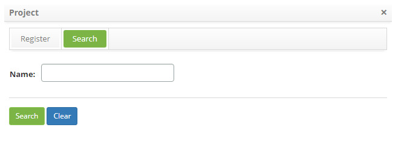
    
    **Figure 11 - Search project**
    
    - Enter the name of the project you want to search and click the *Search* button. After this, the project registration will 
    be displayed according to the name entered;
    - If you want to list all the project records, simply click the *Search* button directly;
    - Select the project you want and it will be displayed in the "Project List";
    - The *Clear* button when triggered, clears the search, preparing the environment for a new search.
    
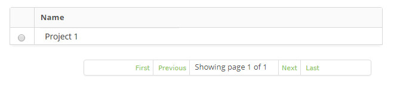

**Figure 12 - Projects list**

Planning analysis of impact and risk by targets
---------------------------------------------------

Preconditions
--------------

1. It depends on the type registered in type of change (see knowledge [Change type registration and search](/en-us/citsmart-platform-7/processes/change/change-type.html));

2. Inform the "impact and risk analysis" involved in the change, which may be "targeted" or "simplified".

Impact and risk analysis by targets
--------------------------------------

1. On the **Change Management** list screen > **Action button > Start/Run task**;

    - On the right side of the change request screen, click on the "Impact and Risk Analysis by Targets" option:
    
    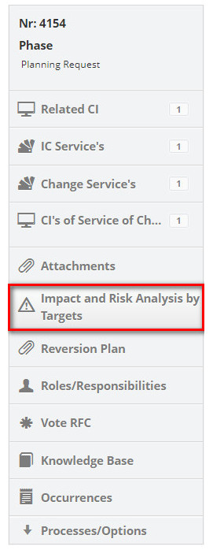
    
    **Figure 13 - Selection of impact and risk analysis by targets**
    
    - In the **Targets** tab, inform the targets of the change that will be considered for impact analysis and risk assessment. 
    The targets can be Configuration Item, Service and Vital Function.

    
    !!! info "IMPORTANT"
    
         In order to add a Vital Function type target, it is necessary to link a service of the change that has a business 
         process with the vital function type.
        
    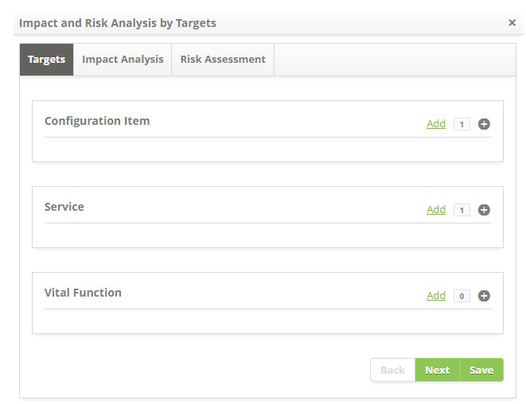
    
    **Figure 14 - Targets**
    
    - Click on *Add*;
    - The window for searching the target (s) will be displayed;
    - Select the desired target (s) and click the *Add* button;
    - If you want to attach a file to the target, click the icon , search and add file;
    - To save the completed information and proceed, click *Save*.
    
    !!! warning "WARNING"
    
        It is mandatory to inform at least one target to proceed with the impact analysis and risk assessment, remembering that 
        the "vital function" type target (s) will be presented according to the service (s) of the change that was linked to the 
        request for change.
        
    - On the **Impact Analysis tab**, do the impact analysis for the change targets;
    
    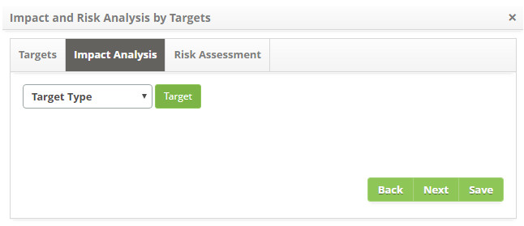
    
    **Figure 15 - Impact analysis**
    
    - Select the target type and click the *Target* button to search the targets according to the type of target chosen;
    - Only the target (s) that were informed in advance in the "Targets" tab will be displayed;
    - Select the desired target to complete the impact analysis of the same, as indicated in the image below:
    
    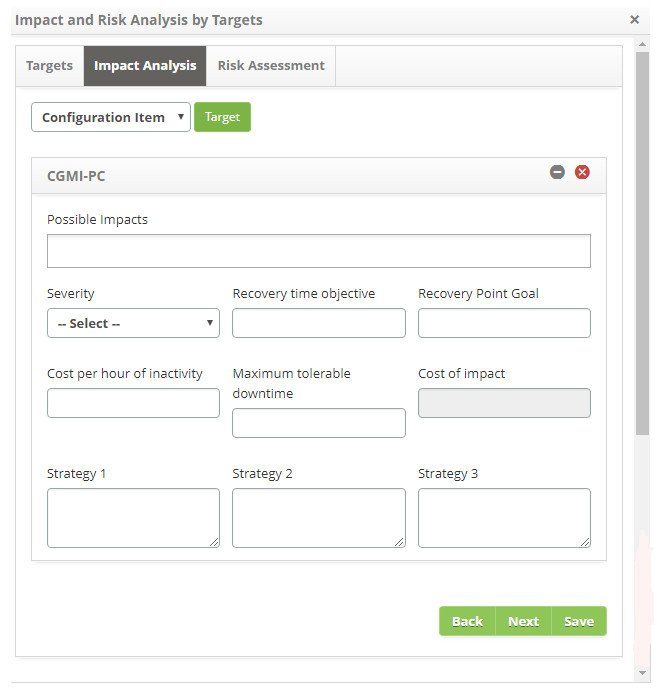
    
    **Figure 16 - Target selection**
    
    - **Possible Impacts**: inform the potential impacts of the target for the change;
    - **Severity**: report the severity of the target for the change;
    - **Recovery time objective**: enter the expected time for recovery of the target during the move;
    - **Recovery Point Goal**: enter the time that the recovery of the target will begin during the move;
    - **Cost per hour of inactivity**: set the cost per hour when this target is unavailable; Of this vital function;
    - **Maximum tolerable downtime**: enter the maximum time that the target may be inactive;
    - **Cost of impact**: define cost per impact when this target is unavailable, this vital function;
    - **Strategy 1**: describe the first strategy for service continuity;
    - **Strategy 2**: describe the second strategy for service continuity;
    - **Strategy 3**: describe the third strategy for service continuity;
        
    - On the **Risk Assessment** tab, do the risk assessment for the change targets;
    
    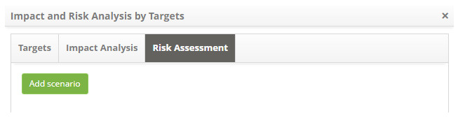
    
    **Figure 17 - Risk assessment**
    
    - Click on the **Add scenario** button to populate risk scenario information;
    
    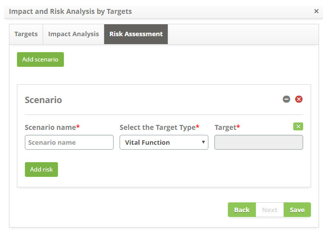
    
    **Figure 18 - Add scenario**
    
    - **Scenario name**: enter the name of the scenario;
    - **Select the Target Type**: select target type;
    - **Target**: select target. If you want to clear the data entered in the field, click the icon ;
    - Add risk to evaluation:
        - Click on the *Add risk* button and the risk register and/or search screen will be displayed, as shown in the figure 
        below:
            
    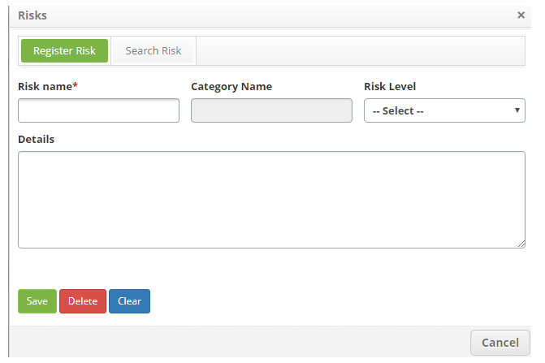
    
    **Figure 19 - Register and risk survey screen**
    
     - Perform the search and select the desired risk. After that, the risk will be added to the screen, as shown in the figure 
     below:
      
    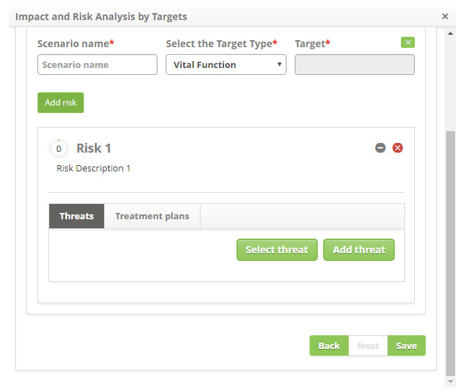
    
    **Figure 20 - Threats**
    
    - Click on the *Select threat* button to add the risk threat. The field to report the threat will be displayed. After 
    selecting the threat click on the icon to expand the screen and inform the probability, the impact of the threat and 
    justification about the risk;

    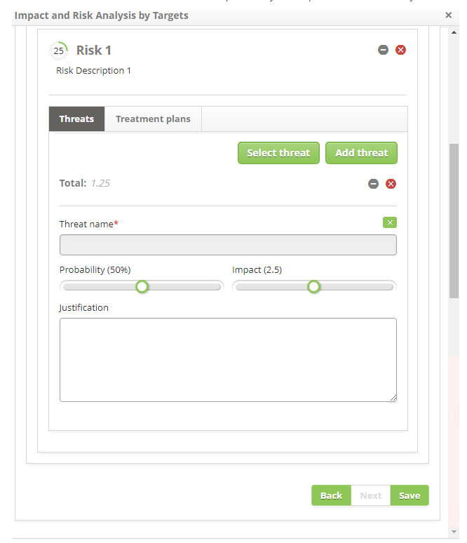
    
    **Figure 21 - Threats**
    
    - After reporting the threats, click the **Treatment Plans** tab. It will be presented the treatment plan screen as shown in 
    the figure below:
        
    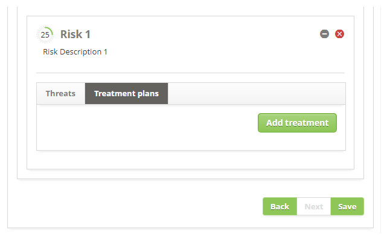
    
    **Figure 22 - Treatment plans**
    
    - Click on the Add treatment button to record the threat handling. The field will be displayed to inform the description of 
    the treatment plan. After entering the name of the plan click on the icon  to expand the 
    screen and inform the probability and the impact of the treaty on the threat;
        
    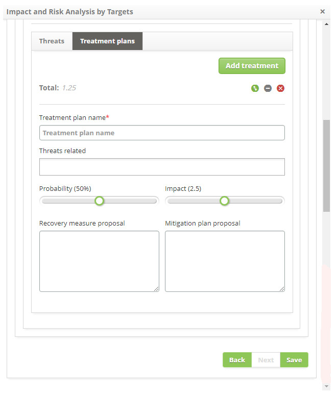
    
    **Figure 23 - Trafficking plans**
    
    - **Treatment plan name**: inform in the name of the plan of treatment of the threats;
    - **Threats related**: Report risk-related threats;
    - **Probability**: report the probability of threat handling;
    - **Impact**: report the impact of trafficking on threats;
    - **Recovery measure proposal**: describe the proposal for the recovery measure;
    - **Mitigation plan proposal**: describe the proposed mitigation plan;
        
    !!! note "NOTE"
    
        It is possible, after recording the data of the treatment plan, to check the risk assessment chart (see Knowledge [Change 
        Request Execution][1]), in the section Monitoring Risk Development.
         
Impact and simplified risk analysis
----------------------------------------

- On the right side of the change request screen, click on the Simplified Risk and Impact Analysis option;
    
    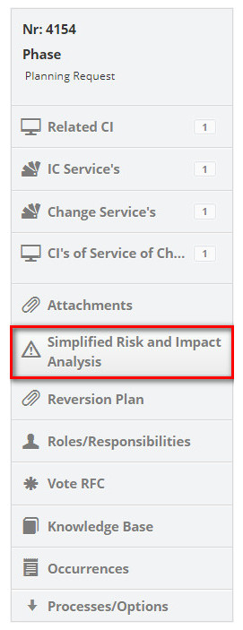
    
    **Figure 24 - Impact and simplified risk analysis**
    
- Click on the icon  to relate the risks to the change request;
    - A window for risk search will be displayed. Perform the search and select the risk pertaining to the change. Once this is 
    done, the risk will be related to the request for change;
        
    
    
    **Figure 25 - Record of Risks involved in change**
    
- If you want to record a new risk from this screen, click the icon ;
    
    - **Change Reason**: describe the reason for the change;
    - **Impact Analysis**: describe the impacts that the change will have;
    - **Risk analysis**: describe the analysis of the risks involved in the change.  
    
[1](/en-us/citsmart-platform-7/processes/change/change-execution.html)
        
!!! tip "About"

    <b>Product/Version:</b> CITSmart | 7.00 &nbsp;&nbsp;
    <b>Updated:</b>07/12/2019 – Larissa Lourenço
    
 
