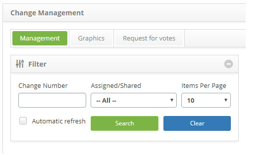
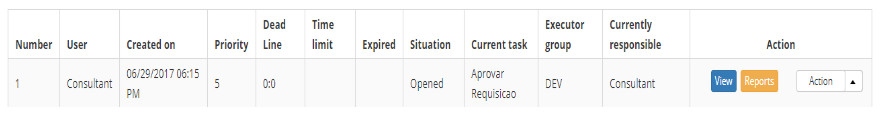
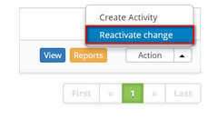

title: Change request reactivation
Description: This functionality allows you to reactivate a change request that has been suspended.
# Change request reactivation

This functionality allows you to reactivate a change request that has been suspended.

How to access
--------------

1. Access the change request reactivation feature by navigating the main menu 
**Process Management > Change Management > Change Management**.

Preconditions
---------------

1. Have registered at least one change request (see knowledge [Change request registration](/en-us/citsmart-platform-7/processes/change/register-change.html)).

Filters
---------

1. The following filters enable the user to restrict the participation of items in the standard feature listing, making it easier 
to locate the desired items:

    - Change Number;

    - Assigned/Shared;

    - Items per page.

    

    **Figure 1 - Change Search Screen**

Items list
------------------

1. The following cadastral fields are available to the user to facilitate the identification of the desired items in the standard 
listing of the functionality: **Number, User, Create on, Priority, Dead Line, Time limit, Expired, Situation, current task, Executor 
Group** and **Current responsible**.

2. There are action buttons available to the user in relation to each item in the listing, they are: *View* and *Reports*.

**Figure 2 - Change listing screen**

Filling in the registration fields
-------------------------------------

1. Not applicable.

Reactivating request for change
---------------------------------

1. On the **Management** tab, locate the change request that is suspended and you want to reactivate it, click on the Action button 
and select the option *Reactivate change*.

    
    
    **Figure 3 - Reactivate change button**
    
    - A message will be displayed to confirm reactivation;
    - Click *OK* to perform the operation;
    - The change request situation will be updated in the list of change requests.
    
!!! tip "About"

    <b>Product/Version:</b> CITSmart | 7.00 &nbsp;&nbsp;
    <b>Updated:</b>08/23/2019 – Larissa Lourenço
