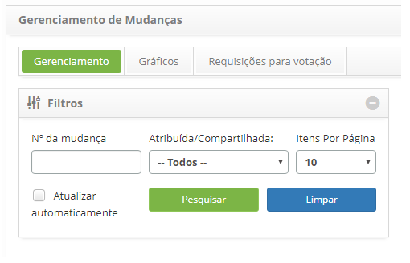
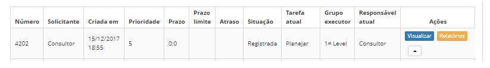
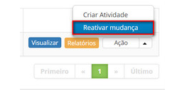

title: Reativação de requisição de mudança
Description: Esta funcionalidade permite reativar requisição de mudança que foi suspensa.
# Reativação de requisição de mudança

Esta funcionalidade permite reativar requisição de mudança que foi suspensa.

Como acessar
--------------

1. Acesse a funcionalidade de reativação de requisição de mudança através da navegação no menu principal 
**Processos ITIL > Gerência de Mudança > Gerenciamento de Mudança**.

Pré-condições
---------------

1. Ter ao menos uma requisição de mudança cadastrada. (ver o conhecimento [Cadastro de requisição de mudança](/pt-br/citsmart-platform-7/processes/change/register-change.html)).

Filtros
---------

1. Os seguintes filtros possibilitam ao usuário restringir a participação de itens na listagem padrão da funcionalidade, 
facilitando a localização dos itens desejados:

    - Número da mudança;

    - Atribuída/Compartilhada;

    - Itens por página.

    

    **Figura 1 - Tela de pesquisa de mudança**

Listagem de itens
------------------

1. Os seguintes campos cadastrais estão disponíveis ao usuário para facilitar a identificação dos itens desejados na listagem 
padrão da funcionalidade: Número, Solicitante, Criada em, Prioridade, Prazo, Prazo limite, Atraso, Situação, Tarefa atual, 
Grupo Executor e Responsável atual.

2. Existem botões de ação disponíveis ao usuário em relação a cada item da listagem, são eles: "Visualizar" e "Relatórios".

**Figura 2 - Tela de listagem de mudança**

Preenchimento dos campos cadastrais
-------------------------------------

1. Não se aplica.

Reativando requisição de mudança
---------------------------------

1. Na guia **Gerenciamento**, localize a requisição de mudança que está suspensa e deseja reativar, clique no botão "Ação"
e selecione a opção "Reativar mudança", conforme indicado na imagem abaixo:

    
    
    **Figura 3 - Botão reativar mudança**
    
    - Será exibida uma mensagem para confirmação da reativação.
    - Clique em "OK" para efetuar a operação.
    - A situação da requisição será atualizada na lista de requisições de mudança.
    
!!! tip "About"

    <b>Product/Version:</b> CITSmart | 7.00 &nbsp;&nbsp;
    <b>Updated:</b>07/12/2019 – Larissa Lourenço
