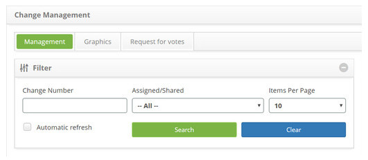
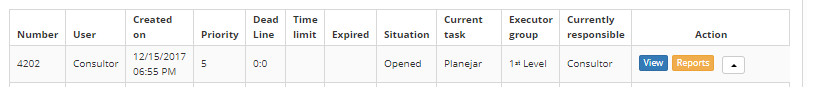
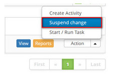
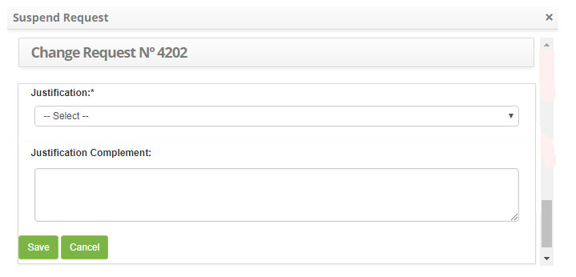
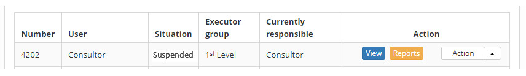

title: Change request suspension
Description: This feature allows you to suspend a change request.
# Change request suspension

This feature allows you to suspend a change request.

How to access
--------------

1. Access the change request suspension feature by navigating the main menu 
**Process Management > Change Management > Change Management**.

Preconditions
---------------

1. Have the justification for change request registered (see knowledge [Reason for change request registration and search](/en-us/citsmart-platform-7/processes/change/change-justification.html))

Filters
----------

1. The following filters enable the user to restrict the participation of items in the standard feature listing, making it easier to 
locate the desired items:

    - Change Number;

    - Assigned/Shared

    - Items per page

    

    **Figure 1 - Change search screen**

Items list
-------------------

1. The following cadastral fields are available to the user to facilitate the identification of the desired items in the standard 
listing of the functionality: **Number, User, Created on, Priority, Deadline, Time limit, Expired, Situation, Current task, Executor Group** and **Current responsible**.

2. There are action buttons available to the user in relation to each item in the listing, they are: *View, Reports* and *Action*.

**Figure 2 - Change listing screen**

Filling in the registration fields
------------------------------------

1. Not applicable.

Suspending change request
-----------------------------------

1. On the **Management** tab, locate the change request you want to suspend, click the *Action* button and select the *Suspend change* option, as indicated in the image below:

    
    
    **Figure 3 - Suspend change button**
    
2. A window will appear to record the justification for suspending the change request:

    
    
    **Figure 4 - Request for suspension record of change**
    
    - **Justification**: Select the reason for the suspension of the change request;
    - **Justification Complement**: inform the complement of the justification of suspension of the request for change;
    - After reporting the data, click the Save button and a message is displayed to confirm the suspension, click *OK* to perform 
    the operation, where the date, time, and user will be automatically written to a future audit;
    - The *Cancel* button, when clicked, cancels the operation and returns to the change management screen.
    
3. After the suspension of the change request, it will be updated in the list of change requests, changing the situation to 
**Suspended**, as indicated in the image below:

**Figure 5 - Request for suspended change**

!!! tip "About"

    <b>Product/Version:</b> CITSmart | 7.00 &nbsp;&nbsp;
    <b>Updated:</b>08/23/2019 – Larissa Lourenço
