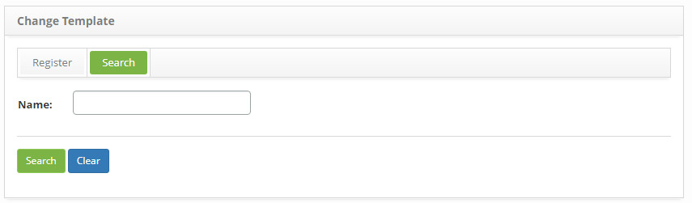
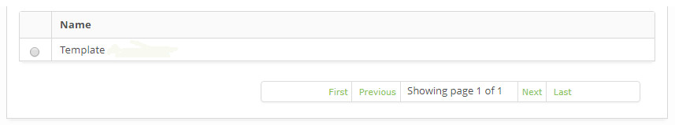
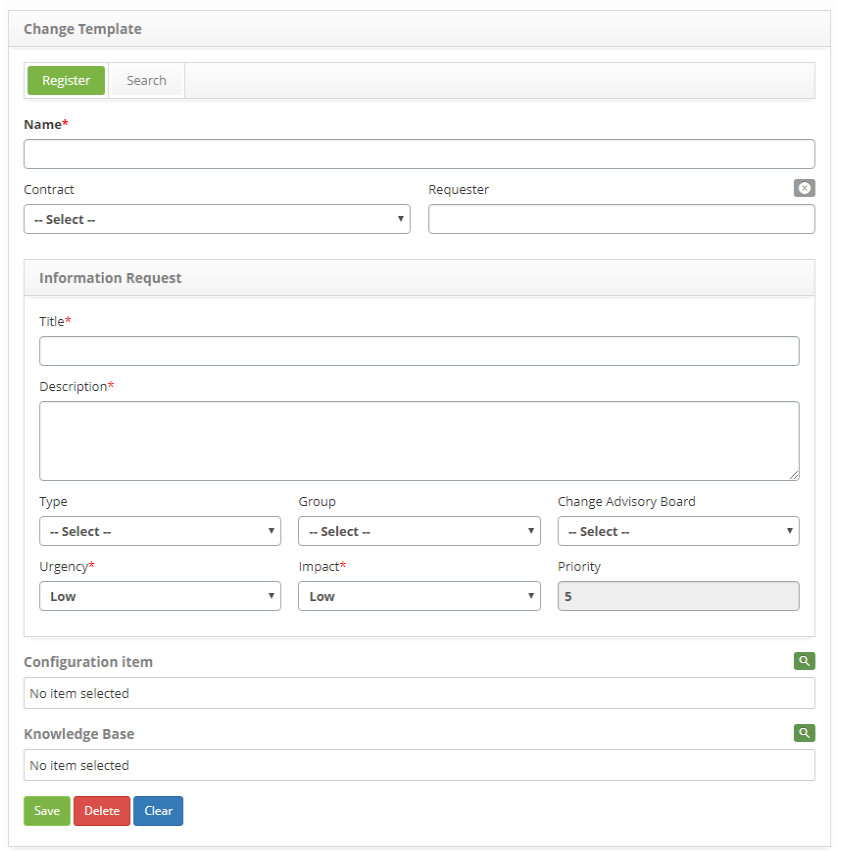

title: Change request template registration and search
Description: The goal of this feature is to create a template to facilitate opening a new change request.
# Change request template registration and search

The goal of this feature is to create a template to facilitate opening a new change request.

How to access
-----------------

1. Access the change template functionality by navigating in the main menu 
**Process Management > Change Management > Template Change**.

Preconditions
-----------------

1. No applicable.

Filters
---------

1. The following filter enables the user to restrict the participation of items in the standard feature listing, making it easier to 
find the desired items:

    - Name.
    
    
    
    **Figure 1 - Change template search screen**
    
2. Search the change template:

    - Inform the name of the template being searched and click on the *Search* button;
    
    - In case all entries are intended to be listed, just click directly on the *Search* button.
    
Items list
-------------------

1. The following cadastral field is available to the user to facilitate the identification of the desired items in the standard 
feature listing: **Name**.

2. On the **Change template** screen, click on the *Search* tab. A search screen will appear as illustrated below:

    
    
    **Figure 2 - Change template listing**
    
3. After searching, select the intended entry; then, the user will be redirected to the registry screen displaying the content of 
the selected entry;

4. To edit the data of the change template entry, just modify the information of the intended fields and click on the *Save* button 
in order to register the change made to the database, where the date, time and user will be saved automatically for a future audit.

Filling in the registration fields
--------------------------------------

1. The **Change Template Registration** screen will appear, as illustrated below:

    
    
    **Figure 3 – Change Template entry screen**
    
2. Fill out the fields according to the guidelines below:

    - **Name**: insert the name of the change request template;
    
    - **Contract**: select the contract for which will be made the change request;
    
    - **Requester**: insert the petitioner’s name, that is, the name of the person opening a change request;
    
    - **Title**: insert the title of the change request;

    - **Description**: insert the description of the change request;
    
    - **Type**: select the change type;
    
        - **Standard Change**: it is a change which has been previously pre-approved by the Change Management and already has 
        accepted and established procedures;
        
        - **Normal Change**: it is a change that follows a regular process of evaluation, approval and endorsement;
        
        - **Emergency Change**: it is a change in a service with the purpose of urgently repairing an IT service error.
        
    - **Group**: Select the group performing the task, which will be responsible for fulfilling the change request. If no group is 
    informed, it will be established according to the specified standard of the type of change per workflow;
    
    - **Change Advisory Board (CAB)**: select the Change Advisory Board, group responsible for assessing, performing risk assessment 
    and ensuring all fields related to the changes are involved, approving or not its execution;
    
    - **Urgency**: select the urgency of the change;
    
    - **Impact**: select the impact of the change;
    
    - **Priority**: the system will establish the priority, after informing the urgency and impact;
    
    - **Configuration Item**: select the configuration item (s) regarding the request;
    
    - **Knowledge Base**: select the knowledge regarding the request;
    
    - Click on the *Save* button to create the entry, which date, time and user will be automatically stored for a future audit.
    
!!! tip "About"

    <b>Product/Version:</b> CITSmart | 7.00 &nbsp;&nbsp;
    <b>Updated:</b>08/23/2019 – Larissa Lourenço
      
    
    
