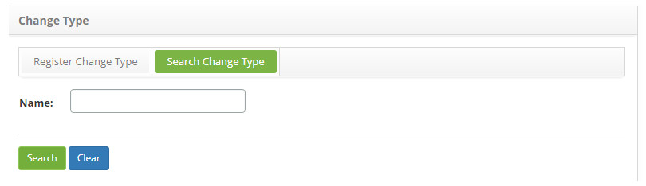
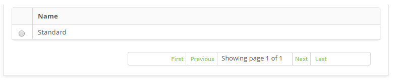
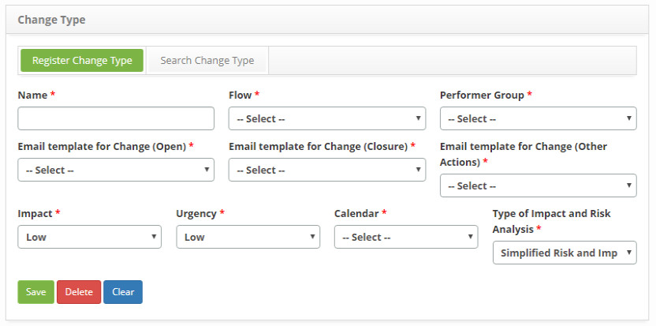

title: Change Type registration and search
Description: The goal of this feature is to register the change type used to determine all the workflow
# Change Type registration and search

The goal of this feature is to register the change type used to determine all the workflow structure followed by the request.

How to access
----------------

1. Navigate to the change type feature through the main menu **Process Management > Change Management > Change Type**.

Preconditions
-----------------

1. Have the change management workflow registered (see knowledge [Workflow maintenance](/en-us/citsmart-platform-7/workflow/workflow-management.html))

2. Configure the e-mail templates (see knowledge [E-mail template configuration registration and search](/en-us/citsmart-platform-7/plataform-administration/email-settings/configure-email-template.html))

3. Have the performer group registered (see knowledge [Group registration and search](/en-us/citsmart-platform-7/initial-settings/access-settings/user/group.html))

4. Have the calendar registered (see knowledge [Calendar registration and search](/en-us/citsmart-platform-7/plataform-administration/time/create-calendar.html))

Filters
---------

1. The following filter enables the user to restrict the participation of items in the standard feature listing, making it easier to 
find the desired items:

    - Name.
    
    
    
    **Figure 1 - Change type search screen**
    
2. Search the change type.Insert the intended change type name and click on the Search button. Afterwards, the change type entry 
will be displayed according to the inserted name;

    - In case the user intends to list all change type entries, just click directly on the *Search* button.
    
Items list
-------------------

1. The following cadastral field is available to the user to facilitate the identification of the desired items in the standard 
feature listing: **Name**.

    
    
    **Figure 2 - Change Type listing**
    
2. Afterwards, select the intended entry. Thereafter, the user will be redirected to the registry screen displaying the content 
related to the selected entry;

3. To edit the change type entry data, just modify the information on the intended forms and click on the *Save* button in order to 
save the changes in the registry, in which date, time and user will be stored for a future audit.

Filling in the registration fields
-------------------------------------

1. The **Type of Change** entry screen will appear, as illustrated below:

    
    
    **Figure 3 - Change type entry screen**
    
2. Fill out the fields according to the instructions below:

    - **Name**: insert the name of the change type;
    
    - **Flow**: select the flow in order to associate it to the change type being registered;

    - **Performer Group**: insert the group in charge of the task, which will be the standard group for the change type;
    
    - **E-mail template for Change (Open)**: select the change request e-mail template which will notify the plaintiff that the 
    change request has been registered;
    
    - **E-mail template for Change (Closure)**: select the change request conclusion e-mail template which will notify the plaintiff 
    that the change request has been finished;
    
    - **E-mail template for Change (Other Actions)**: select the change request progress e-mail template which will notify the 
    plaintiff on the progress of the change request;
    
    - **Impact**: insert the impact of the change type;
    
    - **Urgency**: insert the urgency of the change type;
    
    - **Calendar**: insert the calendar of the change type;
    
    - **Type of Impact and Risk Analysis**: select the type of risk and impact analysis, simplified or targeted;
    
    - Click on the *Save* button to register, as date, time and user will be automatically recorded for a future audit.
    
!!! tip "About"

    <b>Product/Version:</b> CITSmart | 7.00 &nbsp;&nbsp;
    <b>Updated:</b>08/23/2019 – Larissa Lourenço
