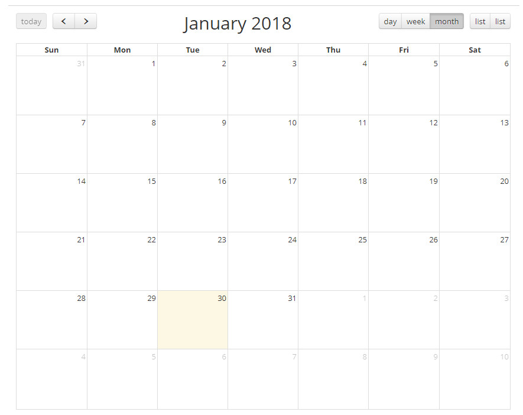
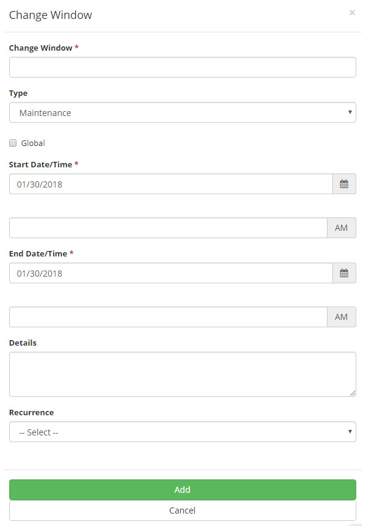

title: Change window
Description: Manage the periods in which the organization goes through a maintenance and thus help in planning a change.
# Change window

Manage the periods in which the organization goes through a maintenance or blackout time and thus help in planning a change.

How to access
---------------

1. Access the change window functionality through navigation in the main menu 
**ITIL Processes > Change Management > Change Window**.

Preconditions
---------------

1. Not applicable.

Filters
---------

1. Not applicable.

Items list
------------

1. Not applicable.

Filling in the registration fields
-------------------------------------

1. After that, the change window screen will appear in calendar format, where you can see maintenance periods and blackouts, as 
shown in the figure below:

    
    
    **Figure 1 - Change window calendar**
    
2. To register a new change window, click on the date you want the change window registration screen to be displayed, as shown 
below:

    
    
    **Figure 2 - Change window**
    
    - **Change Window**: enter the description to identify the change window;
    - **Type**: select the type of change window:
        - **Blackout**: establish periods of time when changes in the CI should not occur.
        - **Maintenance**: establish periods of time in which changes in the IC will occur.
    - **Global**: this field must be marked for a maintenance window that can not have associated IC's;
    
    !!! info "IMPORTANT"
    
        This field should only be marked for change window type "Maintenance".
        
    - **Start Date/Time**: enter the start date and time of interruption to run the change window;
    - **End Date/Time**: enter the date and the final time of interruption for execution of the change window;
    - **Details**: enter the details of the change window, for example root cause, purpose etc.;
    - **Recurrence**: if there is, inform the recurrence of this change window, so you can automatically reprogram the change window 
    with the following recurrences:
        - **Daily**: inform the deadline for daily recurrence;
        - **Weekly**: inform the deadline for the weekly recurrence and select the days of the week you wish, in addition to the day 
        of the week that the change window is being registered;
        - **Monthly**: inform the deadline for the monthly recurrence;
        - **Yearly**: inform the deadline for annual recurrence.
        
!!! tip "About"

    <b>Product/Version:</b> CITSmart | 7.00 &nbsp;&nbsp;
    <b>Updated:</b>08/23/2019 – Larissa Lourenço
       
