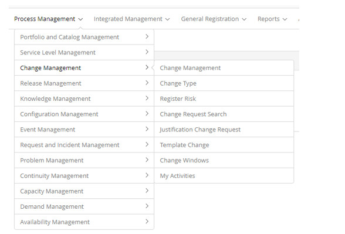

title: Change Management module
Description: Change Management module
# Change Management module

Module objective
--------------------

Change Management is the process responsible for evaluating, coordinating, and deciding on making proposed changes to Configuration 
Items (CIs).

According to ITIL, the main goal of the process is to ensure that changes are made in a controlled way, and are evaluated, 
prioritized, planned, tested, deployed and documented.

Changes can be categorized as follows: Standard Change, Normal Change, and Emergency Change.

- **Standard Change**: pre-authorized low-risk, occurs frequently. It is initiated by a defined trigger that follows a procedure or work instruction to carry out the activities - well known - have a pre-determined budget. Eg: Install a standard desktop application package.

- **Normal Change**: any service change other than emergency or standard. It follows the policies, deadlines and procedures defined 
by the organization.

- **Emergency Change**: change that needs to be accomplished as soon as possible. Eg: Change to resolve a Serious Incident or 
implement a security fix. The Change Management process usually has a specific procedure to handle emergency changes.

Where are the features
---------------------------------

To access the functionality click on the main menu **Process Management > Change Management**.

**Figure 1 - Change Management module menu**

Main feature (in highlight)
---------------------------------------

In the *See also* section you can access the main functionality(ies) of this module, in order to obtain a more detailed knowledge.

!!! note "NOTE"

    Depending on your access permission, you can perform a series of actions on the existing change requests, such as: viewing the 
    change request information, scheduling activities for the change request, suspending the request for change, reactivating Change 
    request that has been suspended for service, capture change request for execution, execute change request, and so on.
    
See also
------------

- [Change request registration](/en-us/citsmart-platform-7/processes/change/register-change.html).

!!! tip "About"

    <b>Product/Version:</b> CITSmart | 7.00 &nbsp;&nbsp;
    <b>Updated:</b>08/26/2019 – Larissa Lourenço
