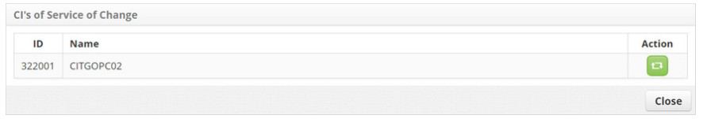

title: Change request registration
Description: This functionality is intended to record a change request.
# Change request registration

This functionality is intended to record a change request.

How to access
--------------------

1. Access the change request registration feature by navigating the main menu **Process Management > Change Management > Change 
Management**. On the **Management** tab, click the *Create new change* button.

Preconditions
---------------

1. Have the contract registered (see knowledge [Contract registration and search](/en-us/citsmart-platform-7/additional-features/contract-management/use/register-contract.html))

2. Have the unit registered (see knowledge [Unit registration and search](/en-us/citsmart-platform-7/plataform-administration/region-and-language/register-unit.html))

3. Have the collaborator registered (see knowledge [Staff registration and search](/en-us/citsmart-platform-7/initial-settings/access-settings/user/employee.html))

4. Have the "Advisory Committee on Change" registered (see knowledge [Group registration and search](/en-us/citsmart-platform-7/initial-settings/access-settings/user/group.html))

5. Have the type of change registered, which should have the link with the flow referring to the request for change (see knowledge 
[Change Type registration and search](/en-us/citsmart-platform-7/processes/change/change-type.html))

6. Set the parameters bellow (see knowledge [Parameterization rules - change](/en-us/citsmart-platform-7/plataform-administration/parameters-list/parametrization-change.html)):

    - Parameter 47;
    - Parameter 279;
    - Parameter 280.
   
7. Have the group linked to the contract, associating the Applicants (collaborators) already registered to this group. If it is 
necessary to create a new employee, it must be included in the Applicant Group in which it is related to the contract (see knowledge 
[How to relate group to contract?](/en-us/citsmart-platform-7/processes/tickets/relate-group.html));

8. Have the unit linked to the contract (see knowledge [How to relate unit to contract?](/en-us/citsmart-platform-7/processes/tickets/relate-unit.html))

9. Have the change registered;

10. Have the questionnaire registered (see knowledge [Questionnaires registration and search](/en-us/plataform-administration/questionnaires/questionnaires-management/register-questionnaire.html))

Filters
----------

1. Not applicable.

Items list
-------------------

1. Not applicable.

Filling in the registration fields
---------------------------------------

1. To get a better view of the functionality options, follow the image:

    

    **Figure 1 - Change management screen**

      : extends the Change Management screen;

     **Management**: the records of change Requests for service and management are presented;

     **Graphs**: graphs the information of the Requests of changes by situation (in progress, suspended and delayed), by priority and by group;

     **Voting Requests**: records of change Requests submitted for approval;

     **Filters**: displays filters for search of change Requests;

     **Actions**: allows you to register new change requests and perform a quick change request lookup;

     **Reports**: displays the dynamic reports for change management.

2. After accessing functionality, the corresponding change register screen will be displayed, containing a series of steps to follow 
to perform the registration:

    - Record the information of the requester, as indicated below:
    
    
    
    **Figure 2 - New change registration screen**
    
    - **Contract**: inform the contract regarding the request for change;
    - **Applicant Name**: inform the applicant, that is, the person requesting the change;
        - Click the requester field. After that, a screen will be displayed to search for the requester, perform the search and 
        select the requester;
        - If you do not find the requester's registration, you can perform a quick registration by clicking on the icon .
    - **Username**: enter the name of the contact;
    - **E-mail**: inform the requestor's e-mail address for contact;
    - **Phone**: report the area code and the telephone number of the requestor, for contact;
    - **Extension**: enter the extension number of the requestor for contact;
    - **Unit**: select the unit of the applicant;
    - **Location**: state the physical location of the applicant;
    - **Observation**: describe the observations about the contact, if necessary.
    
    - Record the request information, as indicated below:
    
    
    
    **Figure 3 - New change registration screen**
    
    - **Title**: enter the title of the change request;
    - **Type**: enter the type of change being requested;
        - **Standard Change**: it is a change that is previously pre-approved by Change Management and already has accepted and 
        established procedures;
        - **Normal Change**: it is a change that follows a normal flow of evaluation, approval and authorization;
        - **Emergency Change**: this is a change in a service that purports to urgently repair an error in the IT service.
       
    !!! note "NOTE"
       
        Standard Change and Emergency Change does not require category information and change advisory committee because they do not 
        participate in Change Request Voting.
           
    - If the reported change request type is "Normal", enter the **Category**.
    - **Impact**: report the impact of the change;
    - **Urgency**: inform the urgency of the change;
    - **Priority**: priority will be established by the system, after informing the impact and urgency;
    - **Description**: enter the description of the change being requested. The description must be objective, including all the 
    information necessary to carry out the change;
    - **Executor Group**: inform the executing group, which will be responsible for meeting the request for change. If the group is 
    not informed, it will be established as defined in the type of change register according to the
    - **Change Advisory Board**: report to the Change Advisory Committee, which is responsible for assessing, performing risk 
    analysis and ensuring the involvement of all areas related to change, whether or not to approve its implementation;
   
3. Click on the *Save* button to register the change request, where the date, time and user will be saved automatically for a future 
audit;

4. A message confirming the successful registration of the change request will be displayed.

**Figure 4 - Change request record confirmation**

Linking related CI
----------------------------

1. Inform the configuration items (CI) regarding the change:

    - On the right side of the change request screen, click **Related CI**;
    
    
    
    **Figure 5 - Related CI selection**
    
    - The configuration item addition screen will be displayed. Click the icon  to add the 
    configuration items.
    - The window for searching for configuration items will be displayed. Perform the search, select the configuration item for the 
    change;
    - The message "Do you really want to link the CI?" appears, click *OK*;
    - You will see the message "Do you want to report what will be changed?". If you wish to make any changes to the CI, click the 
    *Yes* button and you will be directed to the screen containing general information, characteristics and items related to the 
    selected CI. Make the necessary changes and click *Save*. If you do not want to make any changes to the selected CI, click the 
    *No* button;
    - You will see the message that the configuration item was successfully saved, click *OK* to perform the operation. Once this is 
    done, the configuration item will be related to the change request;

    
    
    **Figure 6 - Configuration item relationship to change request**
    
    - To edit the configuration item information, simply click the icon  
    - To view the configuration item information, simply click the icon 
    - If you want to remove a configuration item that was related to the change request, simply click the icon
    .
    
    !!! note "NOTE"
    
        Configuration items related to the change will be automatically related and presented in the Impact and Risk Analysis by 
        Targets
        
Linking IC service's
--------------------------

1. If there are services related to the CI chosen in the change request, to consult it, proceed as follows:
    
    - On the right side of the change request screen, click **IC Services**;
    
    
    
    **Figure 7 - CI services selection**
    
    - The CI service inquiry screen will be displayed, as shown in the figure below:
    
    
    
    **Figure 8- Service relationship to configuration item**
    
    - Click the button , if you want to link this service to the change request;
    - Click the *Close* button to return to the Change Request Record screen;
    
Liking change service's
-------------------------------

1. Please inform the service regarding the change:

    - On the right side of the change request screen, click on the **Change Services** option;
   
    
   
    **Figure 9 - Change services selection**
   
    - Click the icon  to add the service;
    
    - A window will appear for service search. Perform the search and select the service. Once this is done, the service will be;
   
   
   
   **Figure 10 - Service to change relationships**
   
   - If you want to see the service map design, simply click on the icon  ;
   - If you want to remove a service that was related to the change, simply click the icon .
   
!!! note "NOTE"

    The services related to the change will be automatically related and presented in the Impact and Risk Analysis by Target
    
Linking CI'S of service change
---------------------------------------

1. If there are ICs related to the service of the chosen change in the request for change, for consultation, proceed as follows:

    - On the right side of the change request screen, click **CIs of Service of Change**;
 
    
 
    **Figure 11 - CI's of service of change selection**
 
    - The Change Service CI's query screen will be displayed, as shown in the figure below:
 
 
 
 **Figure 12 - CI's of the change service**
 
 - Click the button  if you want to link the IC to the change;
 - Click the *Close* button to return to the Change Request Record screen.
 
Liking attachments
------------------

1. If you want to attach a file to the change request, proceed as follows:

    - On the right side of the change request screen, click **Attachments**;
  
    
  
    **Figure 13 - Attachments selection**
  
    - The file attachment screen will be displayed as shown below:
  
  
  
  **Figure 14 - Attachments screen**
  
  - Click the *Choose File* button. A window will appear, where you can select the desired files;
  - Select the file;
  - Enter the description of the file and click the *Add* button;
  - After adding the file, click the *Close* button to return to the Change Request Log screen;
 
Linking checklist
---------------------

1. If you want to add a Checklist to the change, proceed as follows:

     - On the right side of the change request screen, click **Checklist**;
  
    
  
     **Figure 15 -Checklist selection**
  
    - The checklist screen will be displayed as shown below:
  
  
  
  **Figure 16 - Checklist screen**
  
  - Select a questionnaire linked to the registered change. Answer the fields it contains. Once this is done, the checklist will be 
  linked to the change.
  
Linking knowledge base
---------------------------------

1. If you want to consult the Knowledge Base, proceed as follows:

    - On the right side of the change request screen, click **Knowledge Base**;
 
    
 
    **Figure 17 - Knowledge base selection**
 
    - The Knowledge Base query screen will be displayed, as shown in the figure below:
  
  
  
  **Figure 18 - Knowledge base query screen**
  
  - Perform the search of the desired knowledge;
  - After the search, close the window to return to the Change Request Log screen.
  
!!! tip "About"

    <b>Product/Version:</b> CITSmart | 7.00 &nbsp;&nbsp;
    <b>Updated:</b>08/23/2019 – Larissa Lourenço
