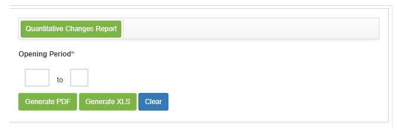

title:  Report generation - Change Management
Description: This report aims to present the amount of change request.
# Report generation - Change Management

Generating quantitative change report
-----------------------------------------------

This report aims to present the amount of change request.

*How to access*

1. Access the Quantitative Change Report feature by navigating the main menu **Reports > Change Management > Quantitative Change**.

*Preconditions*

1. Not applicable.

*Filters*

1. The following filter enable the user to restrict the participation of items in the standard feature listing, making it easier to 
locate the desired items as shown in the figure below:

    - **Opening Period**: enter the desired period;
    
2. The **Quantitative Change Report Generation** screen will be displayed, as shown in the following figure:

    
    
    **Figure 1 - Generation report of the quantitative change report**
    
3. Set the filters as needed.

4. Click the *Generate PDF* button to generate the quantitative report of changes in PDF format.

5. Click the *Generate XSL* button to generate the quantitative report of changes in Excel format.

*Items list*

1. Not applicable.

*Filling in the registration fields*

1. Not applicable.

!!! tip "About"

    <b>Product/Version:</b> CITSmart | 7.00 &nbsp;&nbsp;
    <b>Updated:</b>08/23/2019 - Larissa Lourenço
