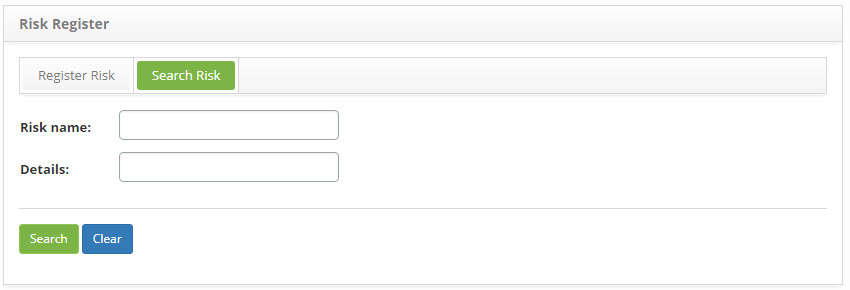
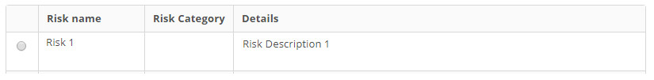
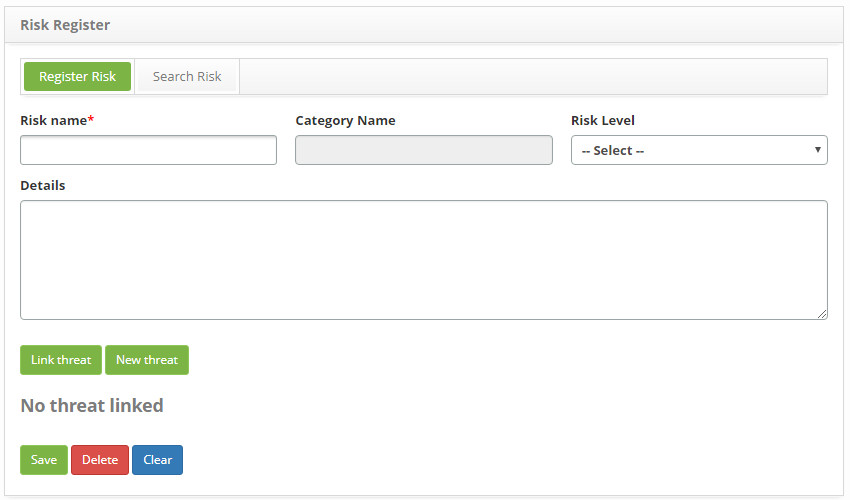
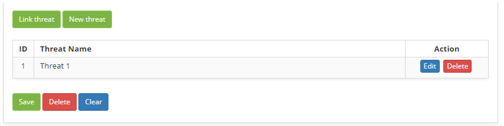

title: Risk of change registration and search
Description: This functionality is intended to record the risks involved in the change that will be used in other system routines.
# Risk of change registration and search

This functionality is intended to record the risks involved in the change that will be used in other system routines.

How to access
----------------

1. Access risk functionality through navigation in the main menu **Process Management > Change Management > Register Risk**.

Preconditions
-----------------

1. Have the risk category registered (see knowledge [Risk category registration and search](/en-us/citsmart-platform-7/processes/continuity/risk-category.html));

2. Have the threat registered (see knowledge [Threat registration and search](/en-us/citsmart-platform-7/processes/continuity/threat-registration.html)).

Filters
---------

1. The following filters enable the user to restrict the participation of items in the standard feature listing, making it easier to 
locate the desired items as shown in the figure below:

    - Risk name;

    - Details.

2. On the **Risk** screen, click the **Search Risk** tab. The search screen will be displayed as shown in the figure below:

    
    
    **Figure 1 - Risk search screen**
    
3. Conduct risk search:

    - Enter the name and/or description of the risk you want to search and click the *Search* button. After that, the risk register 
    will be displayed according to the name entered;
    - If you wish to list all the risk registers, simply click the *Search* button directly.
    
Items list
------------------

1. The following cadastral fields are available to the user to facilitate the identification of the desired items in the standard 
listing of the functionality: **Risk Name, Risk Category** and **Details**.

    
    
    **Figure 2 - Items screen**
    
2. After searching, select the desired record. Once this is done, it will be directed to the registration screen displaying the 
contents of the selected registry;

3. To change the data of the risk register, simply modify the information of the desired fields and click the *Save* button to save 
the change made in the registry, where the date, time and user will be saved automatically for a future audit.

Filling in the registration fields
-------------------------------------

1. The **Risk Register** screen will be displayed, as shown in the figure below:

    
    
    **Figure 3 - Risk register screen**
    
2. Fill in the fields as shown below:

    - **Risk Name**: state the name of the risk;
    
    - **Category Name**: select the risk category;
    
    - **Risk Level**: select the level of risk;
    
    - **Details**: report the description of the risk.
    
Linking threats to risk
-----------------------------

1. Link risk threat(s):

    - Click the *Link Threat* button. Once this is done, the threat search screen will be displayed. Perform the search, select the 
    desired threat (s), and click the *Add* button to perform the operation. If you do not find the threat record and need to 
    register a threat to link to the risk, you can register it from this screen by simply clicking the *New Threat* button;
    
    - After the link of the threat (s) to the risk, the same (s) will be presented on the risk recording screen, as shown in the 
    figure below:
    
    
    
    **Figure 4 - Threats related to risk**
    
    - To exclude the link from the threat to the risk, simply click the *Delete* button from it.
    
2. After the data is entered, click on the *Save* button to register, where the date, time and user will be saved automatically for 
a future audit.

!!! tip "About"

    <b>Product/Version:</b> CITSmart | 7.00 &nbsp;&nbsp;
    <b>Updated:</b>08/23/2019 – Larissa Lourenço
