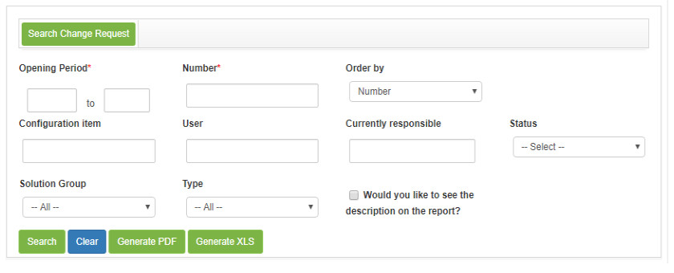
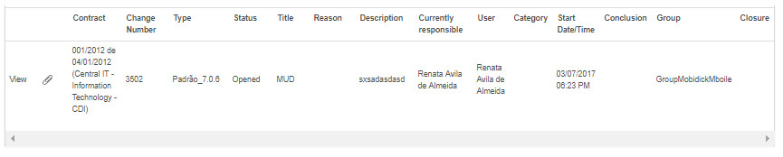

title: Change request search
Description: Perform search for change requests according to user-defined filters.
# Change request search

Perform search for change requests according to user-defined filters.

How to access
----------------

1. Access the change request search functionality by navigating the main menu **Process Management > Change Management** and click 
the **Change Request Search** option or **Process Management > Change Management > Change Management** and click the *Search Change* 
button.

Preconditions
---------------

1. Not applicable.

Filters
---------

1. The following filters enable the user to restrict the participation of items in the standard feature listing, making it easier to find the desired items:

    - **Opening Period**: enter the desired period;
    - **Number**: enter the ID number of the change request;
    - **Order by**: select sorting;
    - **Configuration item**: enter the configuration item for the change request you want to search;
    - **User**: inform the requestor about the change request you wish to search;
    - **Currently responsible**: inform the responsible for the change request that you want to search;
    - **Status**: select the status for the change request you want to search;
    - **Solution group**: select the solver group for the change request you want to search;
    - **Type**: select the type of change;
    - If you want the description of the change request to be displayed in the report, check the option **Would you like to see the 
    description on the report?**.
    
2. The change request search screen will be displayed containing fields where you can define the necessary filters for your search, as shown below:

    
    
    **Figure 1 - Request for change search screen**
    
3. Fill in the fields and click the *Search* button to perform the operation;

    - Change request records will be listed, depending on the filters chosen, below the *Search, Clear*, and *Generate* buttons.
    - Next to each list change request record, there are icons that allow you to perform the following actions: view the information 
    and attachments of the change request;io".
        - To view the change request information, click *View*;
            - The registration screen of the given request for change to preview is displayed.
        - To view attachments for the service request, click the icon ;
            - A window will be opened displaying the attachments of the request for change to preview.
    - If necessary, click the *Generate (PDF)* button to generate the change request report in PDF format;
    - If necessary, click the *Generate (XLS)* button to generate the change request report in Excel format.

Items list
------------------

1. The following registration fields are available to the user to facilitate the identification of the desired items in the standard 
list of functionality: **Contract, Change Number, Type, Status, Title, Reason, Description, Current Responsible, User, Category, Start Date/Time , Conclusion, Group** and **Closure**.

2. There are action buttons available to the user for each item in the listing, they are: *View* and *View Attachments*.

**Figure 2 - Items screen**

Filling in the registration fields
------------------------------------

1. Not applicable.

!!! tip "About"

    <b>Product/Version:</b> CITSmart | 7.00 &nbsp;&nbsp;
    <b>Updated:</b>08/23/2019 – Larissa Lourenço
