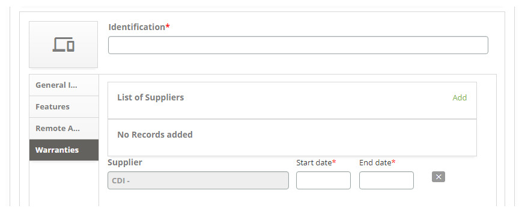
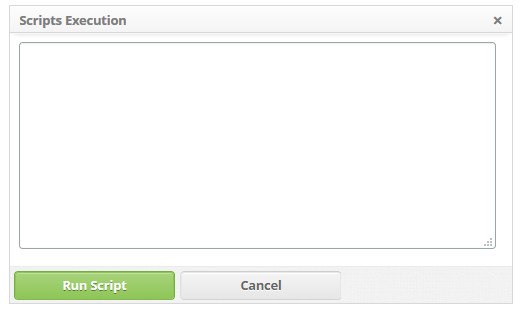
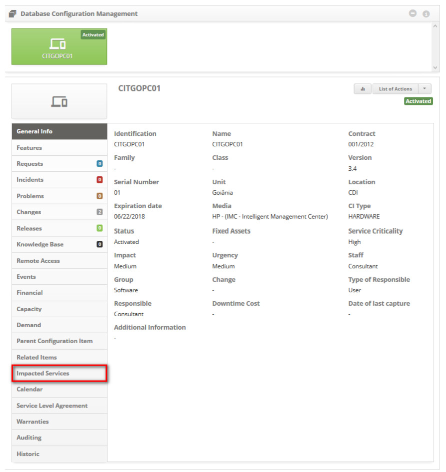
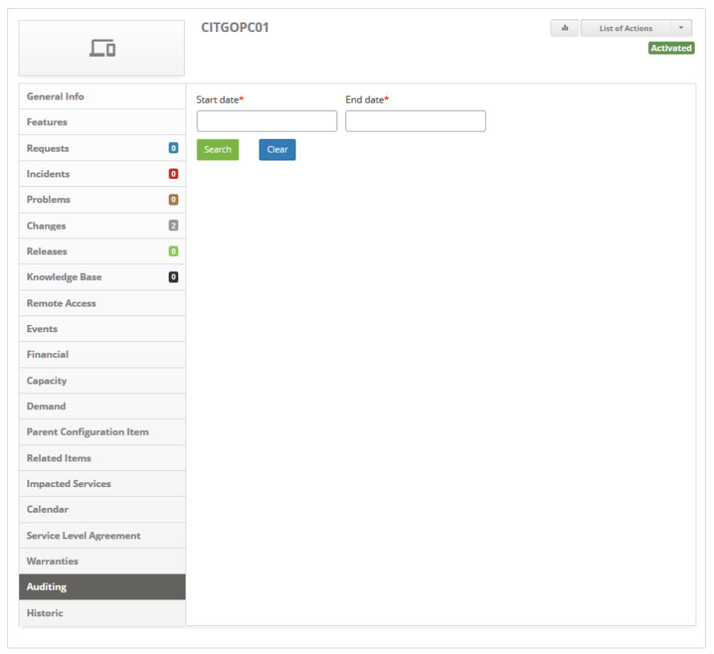
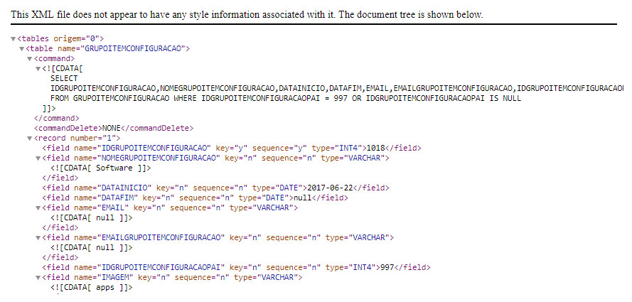

title: Configuration item management
Description: This functionality allows you to identify, register, and manage the Configuration Items in your organization.
# Configuration item management

This functionality allows you to identify, register, and manage the Configuration Items in your organization.

Preconditions
--------------

1. Enter Service Level Agreement (General) of type "Availability" (see knowledge [General service level agreement registration and search](/en-us/citsmart-platform-7/processes/service-level/register-sla.html));

2. Enter locality (see knowledge [Location registration and search])(/en-us/citsmart-platform-7/plataform-administration/region-and-language/register-locations.html));

3. Register employee (see knowledge [Staff registration and search](/en-us/citsmart-platform-7/initial-settings/access-settings/user/employee.html));

4. Group membership (see knowledge [Group registration and search])(/en-us/citsmart-platform-7/initial-settings/access-settings/user/group.html));

5. Register contract (see knowledge [Contract registration and search](/en-us/citsmart-platform-7/additional-features/contract-management/use/register-contract.html));

6. Enter Configuration Item type (see knowledge [Configuration item type registration and search](/en-us/citsmart-platform-7/processes/configuration/IC-type.html));

7. Register at least one Main Configuration Item if you need to create another related Configuration Item (see section "Registering 
configuration item related to a configuration item).  

How to access
--------------

1. Access the Configuration Item Management feature by navigating through the main menu 
**ITIL Processes > Configuration Management > Configuration Management**.

Configuration item management
----------------------------------------

1. The Configuration Item Management screen will be displayed, as shown in the figure below:

    
    
    **Figure 1 - Configuration items management screen**
    
     : expands the Configuration Items Management screen;
    
     : allows you to view the inventory execution status;
    
     **Dashboard**: displays the configuration items related to the Incident, Problem, Change, and Release 
    processes;
    
     **Reports**: displays the dynamic reports for Configuration Management and Service Assets;
    
     **Filters**: presents the other filters for searching the Configuration Items;
    
     **Actions**: allows you to register new Configuration Item, create, change, and delete Configuration 
    Item group, calendar link, service level agreement, and cost per hour of downtime to the Configuration Item group, and export 
    CMDB;
    
     **Database Configuration Management**: repository used to store the records of Configuration Items 
    organized into groups.
    
2. In this **Configuration Items Management** screen, you can create a new CI group, register a new configuration item, consult the 
existing configuration items (IC), and select an existing configuration item and you can also edit its information, create related 
items, check related items, and other actions. In the next topics will be discussed on how to carry out these actions.

Creating a new configuration item group
-----------------------------------------------

!!! abstract "KNOW MORE"

    There is another way to register and search a Configuration Item Group presented in knowledge Configuration item group 
    registration and search.".
    
1. On the Configuration Items Management screen, under **Action**, click the *Create New Group* button;

    
    
    **Figure 2 - Create new group button**
    
2. The configuration item group registration screen will be displayed, as shown in the figure below:

    
    
    **Figure 3 - Configuration item group registration**
    
    - **Name**: enter the name of the new CI group;
    - **Parent group**: inform the parent group, that is, the upper group to which the group being created is part;
    - **Icon**: select an icon to represent the new CI group;
    - **Background Color**: this function allows you to set the background color of the CI group. To select a color, simply position 
    the mouse on the desired color and click on it;
    - **Icon/Text Color**: this function allows you to set the color of the CI group icon and text. To select a color, simply 
    position the mouse on the desired color and click on it;
    - Once this is done, click the *Save* button to register.
    
    
    
    **Figure 4 - Configuration item groups**
    
Changing configuration item group
-----------------------------------------

1. Click the desired group and in the **Actions** area, click the *Change group* button;

    
    
    **Figure 5 - Change group button**
    
2. The registration screen of the selected CI group will be displayed;

3. Change the group's data and click *Save* to make the change, where the date, time and user will be saved automatically for a 
future audit.

Deleting configuration item group
-----------------------------------------

!!! info "IMPORTANT"

     You can only delete the group that does not item related (groups and/or configuration items).
    
1. Click the desired group and in the **Action** area click the *Remove group* button;

    
    
    **Figure 6 - Delete group button**
    
2. Click *do you confirm?* button to perform the operation;

3. Clique em "Confirmar" para efetuar a operação;

4. The exclusion of the CI group will be successfully performed.

Linking calendar to the CI Group
----------------------------------------

1. On the **Configuration Item Management** screen, select the Group you want to link the calendar to. Once done, under **Action**, 
click the *Link Calendar* button, as indicated in the figure below:

    
    
    **Figure 7 - Calendar link button**
    
2. The calendar link screen will be displayed, as shown in the figure below:

    
    
    **Figure 8 - Calendar link screen**
    
3. Browse and select the calendar you want to link, and then click the *Add* button to link the calendar with the CI Group.

Linking service level agreement to the CI Group
--------------------------------------------------------

1. On the **Configuration Item Management** screen, select the Group that you want to link the service level agreement to. Once 
done, under **Action**, click the *Link SLA* button, as shown in the figure below:

    
    
    **Figure 9 - Link service level agreement button**
    
2. The screen for linking the service level agreement of type "availability" will be displayed, as shown in the figure below:

    
    
    **Figure 10 - SLA link screen**
    
3. Browse and select the service level agreement that you want to link, and then click the *Add* button to link the service level 
agreement with the CI Group.

Registering cost per hour of downtime of the CI Group
------------------------------------------------------------------

1. On the Configuration Item Management screen, select the desired Group. Once this is done, under **Action**, click the *Cost per 
hour downtime* button, as indicated in the figure below:

    
    
    **Figure 11 - Cost button**
    
2. The cost-per-hour downtime screen will be displayed, as shown in the figure below:

    
    
    **Figure 12 - Recording of cost per hour of downtime**
    
3. Enter the value of the CI group downtime. After that, click the Add button to register.

Registering a new configuration item
------------------------------------------

1. On the **Configuration Item Management** screen, under **Action**, click the *Create New CI* button;

    
    
    **Figure 13 - Create new configuration item button**
    
2. The **Configuration Item Master Data** screen is displayed, as shown in the figure below:

    
    
    **Figure 14 - Configuration item registration (IC) screen**
    
3. Fill in the fields as directed below:

    - **Identification**: inform the identification of the new configuration item;
    - **Name**: enter the name of the new configuration item;
    - **Contract**: select the contract to which the configuration item belongs;
    - **Family**: inform the family to which the configuration item belongs;
    - **Class**: enter the class name of the configuration item;
    - **Version**: enter the version of the configuration item;
    - **Serial Number**: enter the serial number of the configuration item;
    - **Unit**: enter the business unit/department/stock in which the configuration item is allocated;
    - **Location**: enter the location where the configuration item is located;
    - **Expiration Date**: enter the expiration date of the configuration item license;
    - **Media**: inform the definitive media (where the definite and authorized versions of software CIs are securely stored) of the 
    CI, if necessary. If you want to clear the data entered in the field, click on the icon ;
    - **CI Type**: enter the type of configuration item;

    !!! abstract "KNOW MORE"
    
        When the configuration item type is informed, the characteristics listed in the characteristics tab will be displayed, where 
        the value for each characteristic can be registered.
        
    - **Status**: select the status of the configuration item;
    - **Fixed Assets**: if the CI is a fixed asset (tangible business asset that has a long-lived service life, for example, a 
    server or a software license), inform the asset's identification of the asset;
    - **Service Criticality**: inform the importance that the CI has for the organization;
    - **Impact**: report the impact of the lack of operation of the CI within the organizational environment;
    - **Urgency**: report the urgency of reestablishing the CI within the organizational environment;
    - **Staff**: inform the employee who uses or will use the configuration item;
    - **Group**: inform the CI group to which the CI will join;
    - **Mudanças**: relacione uma mudança ao IC, quando for necessário. Caso queira limpar o dado informado no campo, clique
    no ícone ;
    - **Type of Responsible**: select the type of responsible: user or group;
    - **Responsible**: inform the person in charge of the configuration item, according to the type of person in charge. If you want 
    to clear the data entered in the field, click the ;
    - **Parent Configuration Item**: if the CI being registered is part of another CI, inform it. If you want to clear the data 
    entered in the field, click the ;
    - **Downtime Cost**: inform the value of the time of downtime of the CI;
    - **Additional Information**: describe the other information about the configuration item, if it is important.
        
4. After entering all the data, click the *Save* button to register the Configuration Item, where the date, time and user will be 
saved automatically for a future audit.

Registering configuration item warranty
----------------------------------------------

1. On the **Configuration Item Master Data** screen, click the **Warranties** tab, as shown in the figure below:

    
    
    **Figure 15 - Warranty registration screen**
    
2. Click the *Add* button. The Supplier search screen will be displayed, search and select it, and fill fields will be displayed, as 
shown in the figure below:

    
    
    **Figure 16 - Warranty registration screen**
    
    - **Start dat**e: enter the start date of the guarantee;
    - **End date**: please inform the end date of the guarantee;
    - If you want to exclude the warranty, just click on the warranty icon .
    
3. After the data is entered, click the *Save* button.

Consulting the configuration items
--------------------------------------

1. On the **Configuration Items Management** screen, you can perform CI queries in the following ways:

    - **By process**: allows you to view the configuration items related to the processes: Incident, Problem, Change and Release;
    - **By group**: allows you to view the configuration items of a particular group;
    - **By filters**: allows you to view the configuration items according to the filter you have entered..

Consulting CIS by process
-------------------------------

1. In the **Dashboard** area the quantity of related CIs is presented in each process, as shown in the figure below:

    
    
    **Figure 17 - Dashboard**
    
2. Click a process to check the related CIs. Once this is done, the CIs will be presented, which are related to the given process. 
The figure below illustrates an example:

    
    
    *Figure 18 - CI (Configuration Item) related to the incident process**
    
3. It is also allowed to check the CIs related to two or more processes, just select the processes you want and then the CIs that 
are related to the processes will be presented. The following figure illustrates an example:

!!! warning "WARNING"

    Only the CIs that are related to the selected processes will be presented, for example: if you have selected two processes and 
    no CI is displayed, this means that there is no process-related CI.
    

**Figure 19 - CI related to incident and problem processes**

Consulting CIS by group
----------------------------

1. In the Configuration Management Database area, three CI groups are displayed by default: **Development, Homologation** and 
**Production**. These groups have as their children other Groups of CIs and/or Configuration Items;

2. Click on the desired group (s) to view the CIs. Once this is done, the CIs of the given group will be presented, according to the 
example shown in the following figure;

3. After entering an CI group and if you want to go back to the previous group, that is, the top group, click on the group 
description in the navigation bar at the top of the screen.

**Figura 20 - Configuration items by group**

Consulting CIS by filters
-----------------------------

1. In the **Filters** area, click the  to expand the area. Once this is done, the filters will 
be presented to consult the CI according to your needs, as shown in the figure below:

    
    
    **Figure 21 - CI query filters**
    
    - **Status**: report the status of the CI for consultation of CIs regarding status;
    - **Criticality**: report the criticality for consultation of CIs regarding criticality;
    - **Identification**: inform the identification of the CI for consultation of a specific CI;
    - **Search only in the current group**: if you want to see only the CIs of the current group, that is, the group you are 
    currently accessing, enable the filter;
    - **Show Related Items**: if you want to view child CIs, enable the filter.
    
2. After the filters are set, click the *Filter* button to perform the operation. Once this is done, the CIs will be displayed 
according to the filters defined. The figure below illustrates an example:

**Figure 22 - Configuration items**

Changing the configuration item data
--------------------------------------------
   
1. Perform the query for the Configuration Item you want, as described in the **Consulting CI's By Filters** item. After the query, 
click on the configuration item, the information screen of the given Configuration Item will be displayed, as shown in the following 
figure:

    
    
    **Figure 23 - Configuration item information screen**
    
2. Click the *Actions List* button and then click Edit as shown in the figure below:

    
    
    **Figure 24 - Edit action selection"**
    
3. The Setup Item registration screen will be displayed;

    
    
    **Figure 25 - Configuration item record screen**
    
4. Change the data you want and click the *Save* button to save the change made to the CI record, where the date, time and user will 
be saved automatically for a future audit.

!!! abstract "KNOW MORE"

    Changes to configuration items are recorded in a history. Every time the item is modified, a new version is inserted with the 
    changes.
    
Registering configuration item related to a configuration item
------------------------------------------------------------------------

1. Perform the query for the Configuration Item you want, as described in the **Consulting CI's By Filters** item. After the query, 
click on the configuration item. The information screen for the given Configuration Item will be displayed;

2. Click the Action List button and then click *Create related configuration item* as shown in the following figure:

    
    
    **Figure 26 - Action selection "Create related configuration item"**
    
3. The Configuration Item Master screen will be displayed to record related CI information. Record the information according to the 
guidelines contained in the item **Registering a new Configuration Item**.

!!! warning "WARNING"

    The fields "Identification", "Name" and "Contract" will not be filled as their content differs from the parent IC. This 
    automatic filling extends to the "Features" option (left side menu).
    
Running script regarding configuration item
-----------------------------------------------------

1. Perform the query for the Configuration Item you want, as described in the **Consulting CI's By Filters** item. After the query, 
click on the configuration item. The information screen for the given Configuration Item will be displayed;

2. Click on the *Actions List* button and then click on *Execute scritp*, as indicated in the figure below:

    
    
    **Figure 27 - Action selection "Create related configuration item"**
    
3. The **Script Execution** screen will be displayed as shown in the figure below:

    
    
    **Figure 28 - Scripting screen**
    
4. Describe the scripts you want to run and click the *Run Script* button to perform the operation.

Verifying processes (request, incident, problems, changes, release and knowledge base)
----------------------------------------------------------------------------------------------------------------------------

1. Perform the query for the Configuration Item you want, as described in the Consulting CI's By Filters item. After the query, 
click on the Configuration Item. The information screen for the given Configuration Item will be displayed. This screen shows the 
number of requests, incidents, problems, changes, releases and knowledge related to the CI, according to the example shown in the 
figure below:

    
    
    **Figure 29 - Configuration item information screen**
    
2. To verify CI-related requests, simply click on the **Requests** tab;

3. To check for CI-related incidents, simply click on the **Incidents** tab;

4. To check for CI related problems, simply click on the **Problems** tab;

5. To check for CI-related change requests, simply click on the **Changes** tab;

6. To check CI-related releases, simply click the **Releases** tab;

7. To verify or relate knowledge to the CI, simply click on the **Knowledge Base** tab.

Checking CI event occurrences
------------------------------------------

1. Perform the query for the Configuration Item you want, as described in the **Consulting CI's By Filters** item. After the query, 
click on the configuration item. The information screen for the given Configuration Item will be displayed;

2. Click the **Events** tab, as shown in the figure below:

    
    
    **Figure 30 - Events guide**
    
3. The filters to search for events that were generated for the CI will be presented, as shown in the figure below:

    
    
    **Figure 31 - CI event occurrence survey**
    
4. Define the filters according to your needs and click the *Search* button. This will display the events that occurred.

Recording the financial value of the CI
-----------------------------------------

1. Perform the query for the Configuration Item you want, as described in the **Consulting CI's By Filters** item. After the query, 
click on the configuration item. The information screen for the given Configuration Item will be displayed;

2. Click the **Financial** tab, as shown in the figure below:

    
    
    **Figure 32 - Financial guide**
    
3. The fields to fill in with the information of the financial value of the Configuration Item will be presented, as shown in the 
figure below:

    
    
    **Figure 33 - CI's financial value record screen**
    
    - **Start date**: enter the start date of the CI value;
    - **End Date**: enter the end date of the CI value;
    - Value of the configuration item: enter the value of the CI.;
    
4. After the data is entered, click the *Save* button. Once this is done, the financial value of the Setup Item will be saved and 
displayed on the screen;

5. If you want to change the data the financial value of the CI, just click the Icon .

6. If you want to exclude the financial value of the CI, just click on the Icon .

Checking capacity/performance indicators for CI
---------------------------------------------------------

1. Perform the query for the Configuration Item you want, as described in the **Consulting CI's By Filters item. After the query, 
click on the configuration item. The information screen for the given Configuration Item will be displayed;

2. Click the **Capacity** tab as shown in the figure below:

    
    
    **Figure 34 - Capacity guide**
    
3. The screen for linking capacity indicators to the Configuration Item will be displayed, as shown in the figure below:

    
    
    **Figure 35 - Link of CI capacity indicators**
    
4. Click the Link Performance/Capacity Indicators button. Once this is done, the capacity indicators search screen will be 
displayed. Perform the search, select the bookmarks, and click the Add button to perform the operation;

5. If you want to exclude the link from a capacity indicator with the CI, simply click on the icon
.

Linking demand attributes to the CI
---------------------------------------

1. Perform the query for the Configuration Item you want, as described in the **Consulting CI's By Filters** item. After the query, 
click on the configuration item. The information screen for the given Configuration Item will be displayed;

2. Click on the **Demand** tab, as indicated in the figure below:

    
    
    **Figure 36 - Demand guide**
    
3. The screen for linking demand attributes to the Configuration Item will be displayed, as shown in the figure below:

    
    
    **Figure 37 - Link of demand attributes to CI**
    
4. Click the *Link Demand Attributes* button. Once this is done, the attribute search screen will be displayed. Perform the search, 
select the attributes and click the *Add* button to perform the operation;

5. If you want to exclude the link from a demand attribute with the CI, just click on the Icon .

Checking configuration item parent
--------------------------------------

1. Perform the query of the Configuration Item of the Parent that you want, as described in the item **Consulting CI's By Filters**. 
After the query, click on the configuration item. The information screen for the given Configuration Item will be displayed;

2. Click the **Parent Configuration Item** tab, as shown in the figure below:

    
    
    **Figure 38 - Parent configuration item guide**
    
3. The Parent Configuration Item that is related to the Configuration Item will be displayed.

    
    
    **Figure 39 - Configuration item parent**
    
Checking configuration items related to a configuration item
--------------------------------------------------------------------------

1. Perform the query for the Configuration Item you want, as described in the **Consulting CI's By Filters** item. After the query, 
click on the configuration item. The information screen for the given Configuration Item will be displayed;

2. Click the **Related Items** tab, as shown in the figure below:

    
    
    **Figure 40 - Related items guide**
    
3. The Configuration Items that are related to the Configuration Item will be displayed;

    
    
    **Figure 41 - Related items**
    
4. To check the related CI information, just click *Preview*;

5. One of the types of relationship between CI is made using knowledge about the [Service Map][1] . Here is an example of two types 
of relationships that CI can have:

**Figure 42 - Details of the two sections visible in related items (IC-children and service-map related)**

Performing configuration item impact analysis
-------------------------------------------------------

1. Perform the query for the Configuration Item you want, as described in the **Consulting CI's By Filters** item. After the query, 
click on the configuration item. The information screen for the given Configuration Item will be displayed;

2. Click the **Impact Services** tab, as shown in the figure below:

    
    
    **Figure 43 - Impacted services guide**
    
3. A screen will be displayed showing the services that use the CI, as shown in the figure below:

    
    
    **Figure 44 - Impacted services**
    
4. If you want to check the map of the service asset map, just click the *Map* button of the service you want.

Linking calendar to configuration item
-----------------------------------------------

1. Perform the query for the Configuration Item you want, as described in the **Consulting the Configuration Items** item. After the 
query, click on the configuration item. The information screen for the given Configuration Item will be displayed;

2. Click the **Calendar** tab, as shown in the figure below:

    
    
    **Figure 45 - Calendar guide**
    
3. The calendar link screen will be displayed, as shown in the figure below:

    
    
    **Figure 46 - Calendar link screen**
    
4. Enter the calendar you want to link to and then click the *Add* button to link the calendar to the CI.

Liking service level agreement to configuration item
---------------------------------------------------------------

1. Perform the query for the Configuration Item you want, as described in the **Consulting the Configuration Items** item. After the 
query, click on the configuration item. The information screen for the given Configuration Item will be displayed;

2. Click the **Service Level Agreement** tab, as shown in the figure below:

    
    
    **Figure 47 - Service level agreement guide**
    
3. The screen for linking the service level agreement of type "availability" will be displayed, as shown in the figure below:

    
    
    **Figure 48 - SLA link screen**
   
4. Enter the service level agreement you want to link, and then click the *Add* button to link the service level agreement to the 
CI.

Verifying warranties related to a configuration item
---------------------------------------------------------------

1. Perform the query for the Configuration Item you want, as described in the **Consulting the Configuration Items** item. After the 
query, click on the configuration item. The information screen for the given Configuration Item will be displayed;
 
2. Click the **Warranties** tab, as shown in the figure below:

    
    
    **Figure 49 - Related items guide**
    
3. The Warranties that are related to the Setup Item will be displayed.

    
**Figure 50 - Guarantees**
    
Performing configuration item audit
----------------------------------------------

1. Perform the query for the Configuration Item you want, as described in the **Consulting the Configuration Items** item. After the 
query, click on the configuration item. The information screen for the given Configuration Item will be displayed;

2. Click the **Audit** tab, as shown in the figure below:

    
    
    **Figure 51 - Audit guide**
    
3. It will display a screen for information of the period you want to check the data of the configuration item for auditing. The 
figure below illustrates this screen:

    
    
    **Figure 52 - Configuration item audit**
    
    - **Start date**: report the initial audit reference date;
    - **End Date**: Report the end date of the audit reference.
    
4. After the given period, click the *Search* button. Once this is done, the History of the Configuration Item will be displayed 
according to the reporting period, allowing you to perform the audit.

Checking the configuration item history
-------------------------------------------------

1. Perform the query for the Configuration Item you want, as described in the **Consulting the Configuration Items** item. After the 
query, click on the configuration item. The information screen for the given Configuration Item will be displayed;

2. Click the **History** tab, as shown in the figure below:

    
    
    **Figure 53 - History guide**
    
3. The configuration item history screen will be displayed, as shown in the figure below:

    
    
    **Figure 54 - Configuration item history (CI)**
    
4. The configuration item may have one or more restore points (baselines) generated;

5. And to generate a restore point, simply click the *Generate Restore Point* button;

6. To restore the Configuration Item to a particular version, ie retrieve the known CI configuration back, simply click the 
*Restore* button.

Checking the CI inventory execution status
------------------------------------------------------

This feature lets you view the current status of inventory execution through the CITSmart Inventory application.

1. On the **Configuration Item Management** screen, click the . Once this is done, the 
respective inventory execution check screen will be displayed, as shown below:

    
    
    **Figure 55 - Inventory execution status screen**
    
2. To perform a specific search, enter the filter as required:

    - CITSmart Inventory Connection;
    - CI Identification;
    - IP
    - Status, and can assume the following values:
        - **Inventoried**: the system captured the CI information successfully;
        - **Ignored**: the system could not inventory the machine, it may be without a network, for example, and the agent could not 
        establish a connection to capture the data;
        - **Unreachable**: in the inventory connection, if the user has chosen to Ignore Inventoried Machines, the system goes 
        through a period without inventorying it and assigns this Status;
        - **In Execution**: inventory is currently in progress;
        - **Not Inventoried**: the system has not yet captured the CI information.
        
3. Click the *Filter* button. After that, the screen with the inventory data will be displayed according to the filter entered;

4. If you want to inventory a specific configuration item, click the *Inventory Now* button.

Exporting CMDB
-----------------

1. On the **Configuration Items Management** screen, select the CI Group that you want to export the information to. Click on the 
*Export CMDB* button, as shown in the figure below:

    
    
    **Figure 56 - Export CMDB button**
    
2. The system will export the database information in XML format.

**Figure 57 - Export XML**

See also
-------------

- How do I design the assets that make up my service?

!!! tip "About"

    <b>Product/Version:</b> CITSmart | 7.00 &nbsp;&nbsp;
    <b>Updated:</b>08/26/2019 – Larissa Lourenço

[1]:/en-us/citsmart-platform-7/processes/portfolio-and-catalog/configure-service-attribute.html
