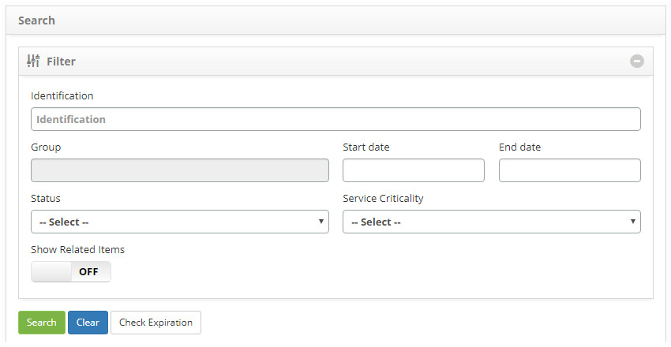
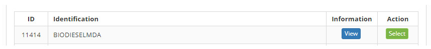

title: Configuration items search
Description: The goal of this feature is to perform searches for Configuration Items according to the determined filters.
# Configuration items search

The goal of this feature is to perform searches for Configuration Items according to the determined filters.

How to access
----------------

1. Access the configuration item search feature navigating through the main menu 
**Process Management > Configuration Management > Search Configuration Item**

Preconditions
---------------

1. Not applicable.

Filters
---------

1. The following filters enable the user to restrict the participation of items in the standard feature listing, making it easier 
to locate the desired items as shown in the figure below:

    - **Identification**: insert the identification number of the intended CI;
    - **Group**: insert the CI group which will be searched;
    - **Start Date**: insert the CI entry start date;
    - **End Date**: insert the IC end date
    - **Status**: insert the CI status to search by status;
    - **Service Criticality**: insert the criticality to search CIs by criticality
    - **Show Related Items**: to view related CIs, turn on the filter.
    
2. Access functionality, afterwards, the **Configuration Item Search** screen will be displayed, as illustrated on the image below:

    
    
    **Figure 1 - Filter screen**
    
3. Determine the filters as needed;

4. After determining the filters, click on the *Search* button to search for CIs;

5. The *Check Expiration* button, when pressed, check the expiration date of CI licenses and sends a notification e-mail to their 
assigned staff members.

Items list
-------------------

1. The following registration fields are available to the user to facilitate the identification of the desired items in the 
standard listing of the functionality: **ID** and **Identification**.

2. There are action buttons available to the user in relation to each item in the listing, they are: *View and *Select* as 
illustrated below:  

    
    
    **Figure 2 - Items screen**
    
Filling in the registration Fields
-----------------------------------

1. Not applicable.

!!! tip "About"

    <b>Product/Version:</b> CITSmart | 7.00 &nbsp;&nbsp;
    <b>Updated:</b>08/26/2019 - Larissa Lourenço
