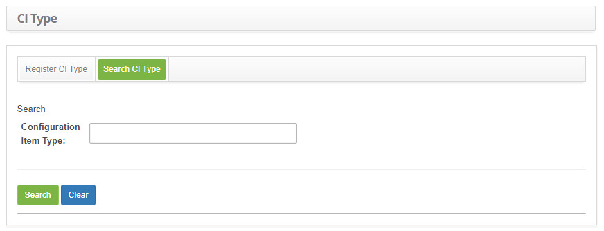
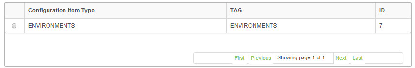
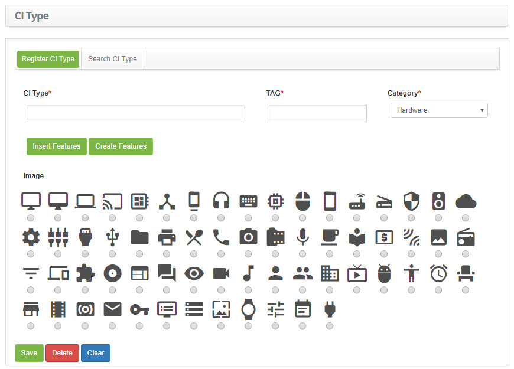

title: Configuration item type registration and search
Description: The goal of this feature is to register the Configuration Item (CI) types.
# Configuration item type registration and search

The goal of this feature is to register the Configuration Item (CI) types.

How to access
----------------

1. Access the configuration item type feature navigating through the main menu 
**Process Management > Configuration Management > Configuration Item Type**.

Preconditions
---------------

1. Register a feature (see knowledge [Feature registration and search](/en-us/citsmart-platform-7/processes/configuration/characteristics.html)).

Filters
---------

1. The following filter enables the user to restrict the participation of items in the standard feature listing, making it easier 
to find the desired items:

    - Configuration Item Type.
    
2. On the **Configuration Item Type** screen, click on the **Search CI Type** tab. The search screen will be displayed as 
illustrated on the image below:

    
    
    **Figure 1 - Configuration item type search screen**
    
3. Perform a configuration item type search:

    - Insert the name of the intended CI type and click on the *Search* button. Afterwards, the CI type entry will be displayed 
    according to the description provided;
    - To list all CI types, just click directly on the *Search* button, if needed.
    
Items list
-------------------

1. The following cadastral fields are available to the user to make it easier to identify the desired items in the default list of 
functionality: **Configuration Item Type, Tag** and **ID**;

**Figure 2 - Items list screen**

Filling in the registration fields
-------------------------------------

1. Afterwards, the configuration item type entry screen will be displayed, as illustrated on the image below:

    
    
    **Figure 3 - Configuration item type entry screen**
    
2. Fill out the fields as instructed below:

    - **CI Type**: insert the configuration item type name;
    - **TAG**: insert the TAG which will identify the configuration item type;
    - **Category**: select the category of the configuration item;
    - If needed, add features to the configuration item types;
    - Click on the *Insert Features* button. A feature search screen will be displayed;
    - Search and select the feature consistent with the configuration item. Then, the feautre will be added to the entry;
    - If the feature cannot be found, a quick entry can be created on this screen, just click on the *Create Features* button;
    - **Image**: select an image to represent the configuration item type.
    
3. Click on the *Save* the button to confirm the entry, at which date, time and user will automatically be stored for a future 
audit.

!!! tip "About"

    <b>Product/Version:</b> CITSmart | 7.00 &nbsp;&nbsp;
    <b>Updated:</b>08/26/2019 – Larissa Lourenço
