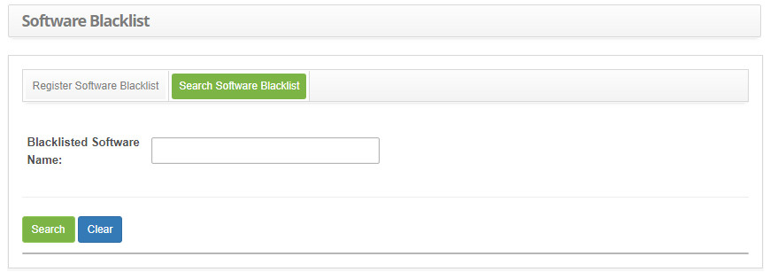
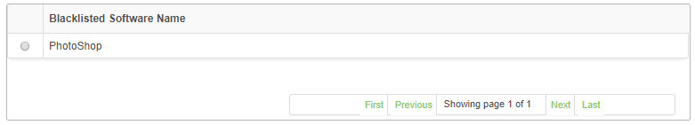
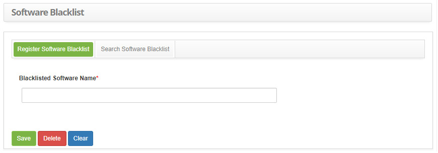

title: Software blacklist registration and search
Description: The goal of this feature is to allow the creation of a Software Blacklist to notify the responsible staff members
# Software blacklist registration and search

The goal of this feature is to allow the creation of a Software Blacklist to notify the responsible staff members everytime one of 
them is installed in a networked computed, at which it will be detected the moment it generates an inventory.

How to access
----------------

1. Access the software blacklist feature navigating through the main menu 
**Process Management > Configuration Management > Software Blacklist**.

Preconditions
---------------

1. Not applicable.

Filters
---------

1. The following filter enable the user to restrict the participation of items in the standard feature listing, making it easier to 
locate the desired items as shown in the figure below:

    - Blacklisted Software Name.
    
2. On the **Software Blacklist** screen, click on the **Search Software Blacklist** tab. The search screen will be displayed as 
illustrated on the image below:

    
    
    **Figure 1 - Software blacklist search screen**
    
 3. Perform a blacklisted software search:
 
    - Insert the name of the intended software and click on the *Search* button. Afterwards, the software entry will be displayed 
    according to the description provided;
 
    - To list all blacklisted software, just click directly on the *Search* button, if needed.
 
Items list
-------------------

1. The following cadastral field is available to the user to facilitate the identification of the desired items in the standard 
listing of the functionality: **Blacklisted Software Name**, as shown in the figure below:

    
    
    **Figure 2 - Items screen**
    
2. After searching, select the intended entry. Afterwards, they will be redirected to the registry screen displaying the content 
belonging to the selected entry;

3. To edit a blacklisted software entry, just modify the information on the intended fields and click on the Save button to confirm 
the changes to the database, at which date, time and user will be stored automatically for a future audit.

Filling in the registration fields
-------------------------------------

1. Access functionality, afterwards, the software blacklist entry screen will be displayed, as illustrated on the image below:

    
    
    **Figure 3 - Software blacklist entry screen**
    
2. Fill out the fields as instructed below:

    - **Blacklisted Software Name**: insert the software name;
    
3. Click on the *Save* the button to confirm the entry, at which date, time and user will automatically be stored for a future 
audit.

!!! tip "About"

    <b>Product/Version:</b> CITSmart | 7.00 &nbsp;&nbsp;
    <b>Updated:</b>08/26/2019 – Larissa Lourenço
