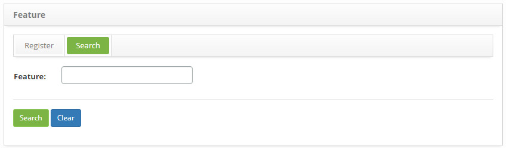
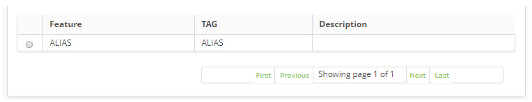
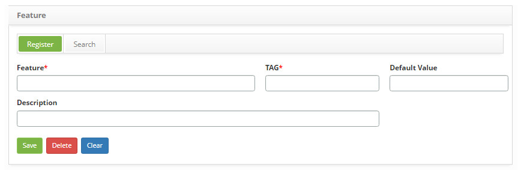

title: Feature registration and search
Description: The goal of this option is to register the features of the Configuration Item (CI).
# Feature registration and search

The goal of this option is to register the features of the Configuration Item (CI).

How to access
--------------

1. Access the feature option navigating through the main menu **Process Management > Configuration Management > Feature**.

Preconditions
---------------

1. Not applicable.

Filters
---------

1. The following filters enable the user to restrict the participation of items in the standard feature listing, making it easier 
to locate the desired items as shown in the figure below:

    - Feature.
    
2. On the **Feature** screen, click on the **Search** tab. The search screen will be displayed as illustrated on the image below:

    
    
    **Figure 1 - Feature search screen**
    
3. Perform a feature search:

    - Insert the name of the intended feature and click on the *Search* button. Afterwards, the feature entry will be displayed 
    according to the description provided;
    
    - To list all features, just click directly on the *Search* button, if needed.
    
Items list
-------------------

1. The following cadastral fields are available to the user to facilitate the identification of the desired items in the standard 
listing of the functionality: **Feature, Tag** and **Description**, as shown in the figure below:

    
    
    **Figure 2 - Items screen**
    
2. After searching, select the intended entry. Afterwards, they will be redirected to the registry screen displaying the content 
belonging to the selected entry;

3. To edit a company entry, just modify the information on the intended fields and click on the *Save* button to confirm the 
changes to the database, at which date, time and user will be stored automatically for a future audit.

Filling in the registration fields
-------------------------------------

 1. Access the functionality, afterwards, the feature entry screen will be displayed, as illustrated on the image below:
 
     
     
     **Figure 3 - Feature entry screen**
     
 2. Fill out the fields as instructed below:
 
     - **Feature**: name the feature;
     - **TAG**: insert a TAG to identify the feature;
     - **Default Value**: enter a value for identification of the characteristic;
     
    !!! abstract "KNOW MORE"
     
        The default value allows you to specify some quantity with equal characteristics of several types of configuration items.
         
     - **Description**: describe the feature.
     
 3. Click on the *Save* the button to confirm the entry, at which date, time and user will automatically be stored for a future 
 audit.
 
!!! tip "About"

    <b>Product/Version:</b> CITSmart | 7.00 &nbsp;&nbsp;
    <b>Updated:</b>08/26/2019 – Larissa Lourenço
