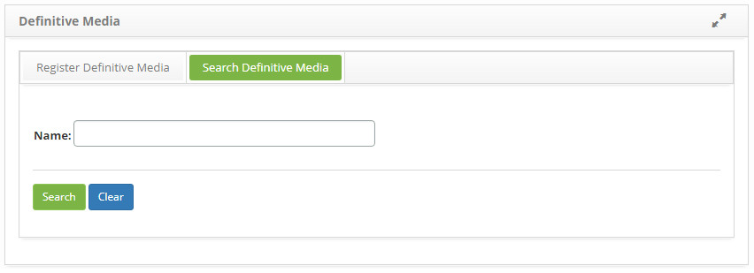
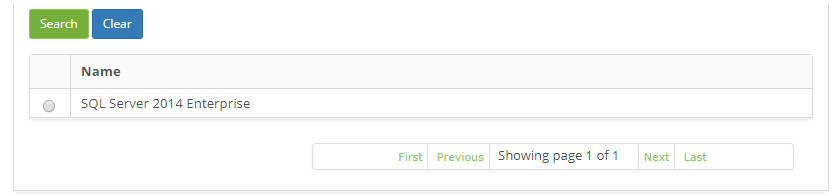
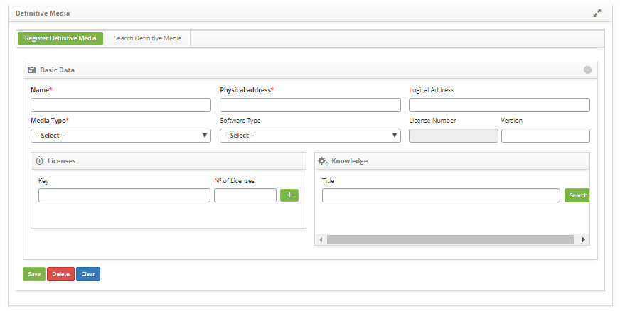

title: Definitive media registration and search
Description: The goal of this feature is to register the definitive and authorized versions
# Definitive media registration and search

The goal of this feature is to register the definitive and authorized versions if all software Configuration Items (CIs) in a 
secure manner.

May contain configuration items associated to licenses or credentials.

How to access
----------------

1. Access the Media Software feature navigating through the main menu 
**Process Management > Configuration Management > Media Software**.

Preconditions
----------------

1. No applicable.

Filters
---------

1. The following filters enable the user to restrict the participation of items in the standard feature listing, making it easier 
to locate the desired items as shown in the figure below:

    - Name.
    
2. On the **Media Software** screen, click on the **Search Definitive Media** tab. The search screen will be displayed as 
illustrated on the image below:

    
    
    **Figure 1 - Definitive media search screen**
    
3. Perform a definitive media search:

    - Insert the name of the intended definitive media and click on the *Search* button. Afterwards, the definitive media entry 
    will be displayed according to the description provided;
    
    - To list all definitive medias, just click directly on the *Search* button, if needed.

Items list
-------------------

1. The following cadastral field is available to the user to make it easier to identify the desired items in the default listing of 
the functionality: **Name**.

    
    
    **Figure 2 - Definitive media items screen**
    
2. After searching, select the intended entry. Afterwards, they will be redirected to the registry screen displaying the content 
belonging to the selected entry;

3. To edit a definitve media entry, just modify the information on the intended fields and click on the *Save* button to confirm 
the changes to the database, at which date, time and user will be stored automatically for a future audit.

Filling in the registration fields
-------------------------------------

1. Access the feature, afterwards, the media software entry screen will be displayed, as illustrated on the image below:

    
    
    **Figure 3 - Media software entry screen**
    
2. Fill out the fields as instructed below:

    - **Name**: name the media software;
    - **Physical Address**: insert the media physical address;
    - **Logical Address**: insert the media logical address;
    - **Media Type**: select the media type;
    - **Software Type**: insert the software type;
    - **License Number**: this field is for checking purposes only, the amount of licenses will be displayed, after adding their 
    respective keys (licenses)
    - **Version**: insert the media software version;
    - Add the media software definitive licenses;
    - **Key**: insert the definitive media key;
    - **Nº of Licenses**: insert the allowed usage of the media key;
    - Click on the  icon to add the license.
    
3. Link a knowledge to a definitive media:

    - Inser the name of the intended knowledge and click on the button *Search* to search it. A screen featuring the results will 
    be displayed, just click on the button *Select* of the knowledge to link it to the media
    
4. Click on the *Save* the button to confirm the entry, at which date, time and user will automatically be stored for a future 
audit.

!!! tip "About"

    <b>Product/Version:</b> CITSmart | 7.00 &nbsp;&nbsp;
    <b>Updated:</b>08/26/2019 – Larissa Lourenço

