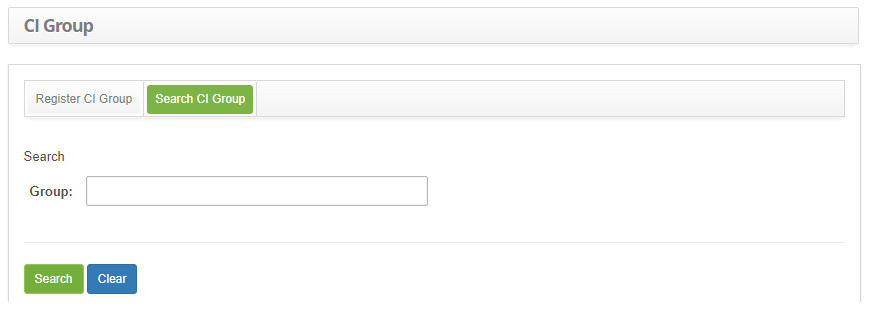
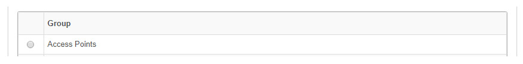
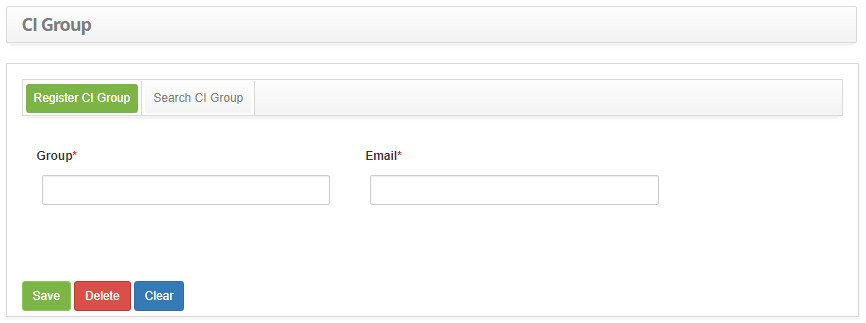

title: Configuration Item group registration and search
Description: The goal of this feature is to register configuration item group (CI Group)
# Configuration Item group registration and search

The goal of this feature is to register configuration item group (CI Group)

How to access
----------------

1. Access the configuration item group feature navigating through the main menu 
**Process Management > Configuration Management Configuration Item Group**.

Preconditions
----------------

1. No applicable.

Filters
----------

1. The following filter enables the user to restrict the participation of items in the standard feature listing, making it easier 
to find the desired items:

    - Group.
    
    
    
    **Figure 1 - Configuration item group search screen**
    
2. Perform a configuration item group search:

    - Insert the name of the intended CI group and click on the *Search* button. Afterwards, the CI group entry will be displayed 
    according to the description provided;
    - To list all CI groups, just click directly on the *Search* button, if needed.

Items list
--------------------

1. The following cadastral field is available to the user to facilitate the identification of the desired items in the standard 
feature listing: **Group**;

    
    
    **Figure 2 - Group listing configuration item**
    
2. After searching, select the intended entry. Afterwards, they will be redirected to the registry screen displaying the content 
belonging to the selected entry;

3. To edit a CI group entry, just modify the information on the intended fields and click on the *Save* button to confirm the 
changes to the database, at which date, time and user will be stored automatically for a future audit.

Filling in the registration fields
------------------------------------

1. The configuration item group entry screen will be displayed, as illustrated on the image below:

    
    
    **Figure 3 - Configuration item group entry screen**
    
2. Fill out the fields as instructed below:

    - **Group**: name the configuration item group;
    - **E-mail**: insert the configuration item group e-mail;
    
3. Click on the *Save* the button to confirm the entry, at which date, time and user will automatically be stored for a future 
audit.

!!! tip "About"

    <b>Product/Version:</b> CITSmart | 7.00 &nbsp;&nbsp;
    <b>Updated:</b>08/26/2019 – Larissa Lourenço
