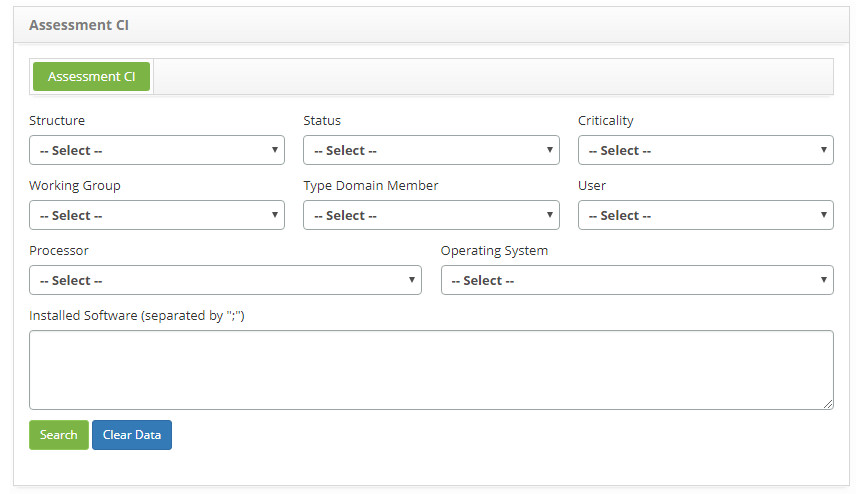
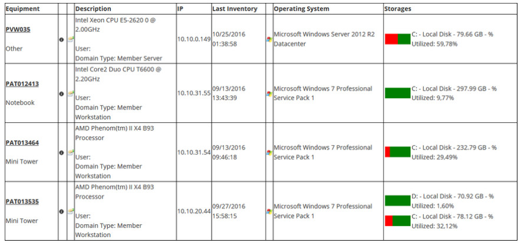

title: Checking configuration Items captured by inventory agent
Description: The goal of this feature is to display the configuration items collected during inventory routines.
# Checking configuration Items captured by inventory agent

The goal of this feature is to display the configuration items collected during inventory routines.

How to access
----------------

1. Access the Asset View feature navigating through the main menu **ITIL Processes > Configuration Management > Asset View**.

Preconditions
---------------

1. No applicable.

Filters
---------

1. The following filters enables the user to restrict the participation of items in the standard feature listing, making it easier 
to find the desired items:

    - Structure;
    - Status;
    - Criticality;
    - Working Group
    - Type Domain Member;
    - User;
    - Processor;
    - Operating System;
    - Installed Software.
    
2. The Assessment CI screen will be displayed. This screen contains filters to be selected, as needed, in order to search for the 
Configuration Items which were captured during inventory routine. Determine the filter and click on the *Search* button. It is 
illustrated on the image below:

**Figure 1 - Configuration items collected during inventory routine search screen**

Items list
------------------

1. The following cadastral fields are available to the user to facilitate the identification of the desired items in the standard 
feature listing: **Equipament, Description, IP, Last Inventory, Opeating System** and **Storages**;

2. All CIs will be displayed as illustrated on the image below:

    
    
    **Figure 2 - configuration items captured during inventory routine**
    
3. To check the information on the CI network, click on its  icon;

4. To check the CI software, click on its  icon.

Filling in the registration fields
------------------------------------

1. No applicable.

!!! tip "About"

    <b>Product/Version:</b> CITSmart | 7.00 &nbsp;&nbsp;
    <b>Updated:</b>08/26/2019 – Larissa Lourenço
