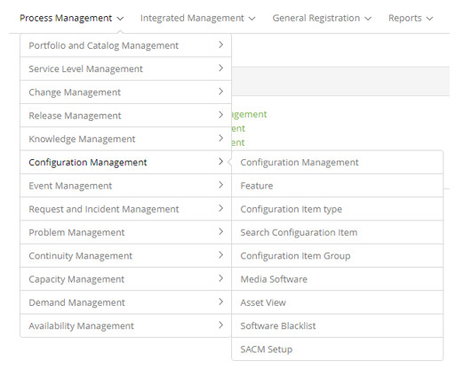

title: Configuration and Service Asset Management module
Description: Configuration and Service Asset Management is the process responsible for ensuring that the assets.
# Configuration and Service Asset Management module

Module objective
--------------------

Configuration and Service Asset Management is the process responsible for ensuring that the assets required to deliver services are 
properly controlled and that accurate and reliable information about those assets is available when and where they are needed. This 
information includes details on how the assets were configured and the relationships between the assets.

This process identifies, controls, and accounts for service assets and configuration items protecting and ensuring their integrity 
throughout the life cycle. Includes non-IT assets and service provider assets when needed.

One of the main goals of the Configuration and Service Asset Management process is to support Service Management processes by 
providing accurate configuration information, thus enabling more assertive and timely decision making - for example, for change 
authorization And releases or resolve incidents and issues.

Where are the features
---------------------------------

To access the functionality click on the main menu **Process Management > Configuration Management**.

**Figure 1 - Configuration Management module menu**

Main feature (in highlight)
---------------------------------------

In the *See also* section you can access the main functionality(ies) of this module, in order to obtain a more detailed knowledge.

!!! abstract "KNOW MORE"
  
    From this Configuration Items Management screen, you can create a new Configuration Item group, register a new 
    Configuration Item, perform a Configuration Item search, and select an existing Configuration Item is also possible Edit your 
    information, create related items, view related items, and other actions.
    
See also
------------

- [Configuration item management](/en-us/citsmart-platform-7/processes/configuration/IC-management.html)

!!! tip "About"

    <b>Product/Version:</b> CITSmart | 7.00 &nbsp;&nbsp;
    <b>Updated:</b>08/26/2019 – Larissa Lourenço
